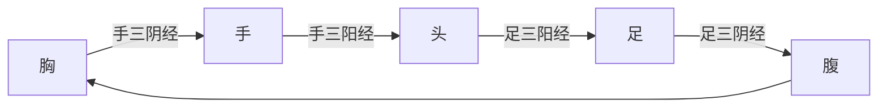
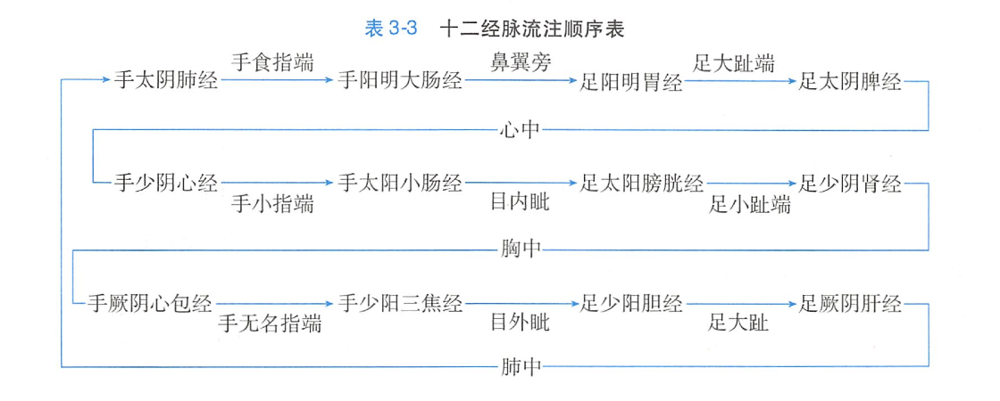

# 《中医学》作业

> **说明**：
>
> 1. 以 word 或 PDF 格式发送至邮箱：<a href="mailto:lw_lu@fudan.edu.cn">lw_lu@fudan.edu.cn</a>，文件名为「班级+姓名+学号」
> 2. 截止日期为 5 月 31 日

## 简述《黄帝内经》、《伤寒杂病论》、《神农本草经》的内容及意义

### 《黄帝内经》

《黄帝内经》是我国现存较早的一部古医籍，大约成书于战国至秦汉时期。《黄帝内经》以问答体的形式，托名黄帝与大臣岐伯、雷公等人的对话以讨论医学问题。该书并非一人之作，而是将此前众多先贤、医家的论述几经修纂而成。《黄帝内经》包括《素问》和《灵枢》两部分，原书各 9 卷，每卷 9 篇，各为 81 篇，合计 162 篇。《黄帝内经》的内容十分丰富，它对人与自然的关系，人的生理、病理、疾病的诊断治疗及预防等方面进行了全面系统的阐述，内容涉及阴阳五行、五运六气、天人关系、形神关系、摄生、藏象、经络、病因、病机、诊法、辦证、治则、针灸、汤液以及行医规范和医德要求等。《黄帝内经》不仅是我国早期的一部医学总集，代表了当时我国医学理论的最高成就，同时还吸收了秦汉以前有关天文学、历算学、生物学、地理学、人文学、心理学、逻辑学及古代哲学等多种学科的主要思想和观点，运用了阴阳五行学说，阐明因时、因地、因人制宣等辨证论治的原则，体现了人体与外界环境统的整体观念。它总结了秦汉以前的医学成就，奠定了中医药学的理论基础。千百年来，它始终有效地指导着我国传统医学的临床实践，为国内历代医家所重视，而且对世界医学的发展亦有重要的影响。

### 《伤寒杂病论》

《伤寒杂病论》为东汉末年伟大的医学家张机（字仲景）所著，张仲景在《黄帝内经》《难经》的基础上，结合当时人民同疾病作斗争的丰富经验及自身医疗实践而撰成的我国第一部临床医学专著。《伤寒杂病论》是我国医学史上影响最大的著作之ー，自成书以来，一直指导着后世医家的临床实践， 并遵循以六经辨证的原则治疗外感热病，以脏腑辦证的原则治疗杂病。该书对方剂学的发展有着重要的指导意义。原著因战乱而散失，后经晋代王叔和及宋代林亿等整理，分为《伤寒论》及《金匮要略》两书。《伤寒论》一书，分 10 卷，共计 397 条，主要是论述治疗外感热病的。张仲景参照《素问热论》六经传变的原则，把外感热病发展过程中各个阶段所呈现的各种综合症状概括为六个类型，即太阳病、阳明病、少阳病、太阴病、少阴病、厥阴病，以此作为辦证论治的纲领。《伤寒论》除了介绍各经病证的特点和相应的治法外，还阐述了各经病证的传变、合病、并病，以及因处治不当而引起的变证、坏证与其补救方法等，在证论治过程中真正做到了原则性和灵活性的有机结合。《金匮要略》以疾病分二十五篇，以论述内科杂病为主，兼及外、妇科疾病，运用了《黄帝内经》的阴阳五行、脏腑经络学说，并以此作为辨证论治的理论依据。在诊断方面，不仅综合运用了望闻问切四诊，而且对舌诊和脉象有了更加深入的阐发。《金匮要略》继承了《黄帝内经》「不治已病治未病」的预防思想，书中对杂病的预防、病因病种、传变、诊断方法及治疗原则等均有较全面的论述。它很重视疾病的预防，「脏腑经络先后病脉证第一」篇中，开篇即写道：「问曰：上工治未病，何也？师曰：夫治未病者，见肝之病知肝传脾，当先实脾……中工不晓相传，见肝之病，不解实脾，惟治肝也。」说明了仲景能较早地认识到早期治疗、积极地防止病情传变是区别「上工」和「中工」的重要标志。《伤寒论》载方 113 首，《金匮要略》载方 262 首，除去重复，两书实收方剂 269 首，使用药物达 214 种，基本概括了临床各科的常用方剂，故被后世誉为「众方之宗，群方之祖」。它对方剂学的贡献主要体现在如下几个方面：一是提出了完整的组方原则，充分体现了君、臣、佐、使相配合的组方原则；二是将中医的八法运用于方剂之中，所谓八法，即汗、下、吐、和、温、清、补、消等八种治疗方法；三是创造了许多剂型及大量的有效方剂，如该书所载方剂大致有汤剂、丸剂、散剂酒剂、洗剂、浴剂、熏剂、膏剂、滴耳剂灌鼻剂、肛门栓剂等。书中所载方剂，大多疗效可靠，切合临床实用，至今仍在临床上广泛应用。

### 《神农本草经》

《神农本草经》是我国现存最早的一部药物学专著，大约成书于东汉时期。此书大约是秦汉以后的许多医药学家不断搜集各种药物学资料，直至东汉时期才最后加工整理成书的，托名于神农所著。《神农本草经》的序例是关于药物学的总论，论述了上、中、下品分类，这是中国药学史上最早的药物分类法。还论述了药物的君臣佐使、七情和合、性味、产地、真伪鉴别、各种剂型、用药宜忌、药用剂量、服药时间、诸药制使等。正文中共载药物 365 种，其中植物药 252 种，动物药 67 种，矿物药 46 种。根据药物的性能功效不同，在药物分类上提出了上、中、下三品分类法。上药 120 种为君，主养命以应天，无毒，多服久服不伤人，欲轻身益气不老延年者，本上经；中药 120 种为臣，主养性以应人，无毒有毒，斟酌甚宜，欲遏病补虚羸者，本中经；下药 125 种为佐使，主治病以应地，多毒，不可久服，欲除寒热邪气破积聚愈疾者，本下经。这里讲的毒不要完全理解为毒性，应包括副作用和不良反应为宜。书中还论述了君、臣、佐、使等组方原则，提出了药物的七情和合理论。《神农本草经》序例较早地指出了绝非所有的药物都可以配合使用，有的药物配合使用后，能相互增进疗效，有的能抑制另一种药物的毒性，有的药物配合使用后会产生毒副作用等，因此根据药物的性味、功效不同，必须配合得宜。书中还论述药物的四气（寒、热、温、凉）、五味（酸、苦、甘、辛、成）及药物的采集加工方法和用药原则、服药方法等药物学理论基础知识，为中药理论体系的形成与发展奠定了基础。

---

## 简述阴阳互根、阴阳消长、阴阳转化的含义

### 阴阳互根

阴阳彼此均以对方的存在为存在前提，任何一方都不能脱离另一方而单独存在，所谓「孤阴不生，独阳不长」。上为阳、下为阴，没有上也就无所谓下，没有下也就无所谓上；左为阳、右为阴，没有左就无所谓右，没有右也就无所谓左；热为阳、寒为阴，没有热就无所谓寒，没有寒也就无所谓热等。这种关系称为「阴阳互根」。《医贯贬・阴阳论》指出，「阴阳又各互为其根，阳根于阴，阴根于阳；无阳则阴无以生，无阴则阳无以化」，即阳依存于阴、阴依存于阳。阴阳相互依存是宇宙中普遍存在的规律。例如气属阳，血属阴，气为血之帅，血为气之母，两者相互为用。在临床因血虚而需要补血（阴）时，考虑到阴阳互根，最好同时补气（阳），以补气更好地促进补血。

### 阴阳消长

阴阳在一定条件下可以互相转化，转化过程中此消彼长就是阴阳消长，基本形式有阳消阴长、阴消阳长。年四时气候变换，由夏至秋及冬，气候由炎热渐转凉变寒，即是「阳消阴长」的过程；从冬至春及夏，气候由寒冷渐转暖变热，即是「阴消阳长」的过程。机体各种功能活动（阳），需要消耗一定的营养物质（阴），这是阴消阳长的的过程；而各种营养物质（阴）的新陈代谢，需要依赖脏腑的功能活动（阳），这是「阳消阴长」的的过程。在正常情况下，阴阳双方应是长而不偏盛，消而不偏衰。倘若超过了阴阳消长这一限度，则会出现阴阳某一方偏盛或偏衰的病理状态。

### 阴阳转化

阴阳转化指一切事物或现象中对立的双方，在一定条件下，向各自相反方转变的运动方式；阴阳发生由「化」至「极」的量变到质变，转向相反方。  
中医学认为阴阳转化的条件为「重」或「极」，有「重阴必阳，重阳必阴」「寒极生热，热极生寒」之说。「重」和「极」指事物发展到极限或顶点，原表现以阴（或阳）为主的事物有可能转化为表现以阳（或阴）为主的事物；寒「极」则向热转化，热「极」则向寒转化。  
人体生命活动过程中，物质与功能的新陈代谢，营养物质（阴）不断转化为功能活动（阳），而功能活动（阳）又不断转化为营养物质（阴），就是阴阳转化的具体表现之一。这一「物质与功能」代谢演变过程，即是阴阳「消长与转化、量变与质变」的统一。  
人体生命活动的病变进程中，阴阳的转化也是存在的。急性感染病人，先现高热、面赤、烦躁、脉数有力等阳热之象；病情进展至休克状态，则突然出现体温下降、面色苍白、四肢厥冷、精神萎蘼、脉微欲绝等阴寒危象，这即属阳热（实）证转化为阴寒（虚）证。若抢救及时、治疗得当，则可正气来复，四肢转温，阳气渐生，病情转危为安，这即是由阴证转为阳证。

---

## 简述心、肺、脾、肝、肾的主要生理功能（*五选二）

$$
脏
\begin{cases}
共同功能\to贮存精气而不泻\\
各自功能
\begin{cases}
心：主血脉，主神志，开窍于舌\\
肺：主气气司呼吸，主宣发肃降及通调水道，主皮毛，开窍于鼻\\
脾：主运化，统血，主肌肉、四肢，开窍于口\\
肝：主疏泄，藏血，主筋，开窍于目\\
肾：藏精，主发育、生殖，主水，主骨、生髓、通于脑，开窍于耳及二阴
\end{cases}
\end{cases}
$$

### 心

心，位于胸腔之内，膈膜之上，两肺之间，脊柱之前，形似倒垂未开之莲花，外有心包护卫。心为神之舍，血之主，脉之宗，为五脏之首，在五行属火，在五脏阴阳中属阳中之阳，起着主宰人体生命活动的作用。心的主要生理功能是主血脉，主神志。心在志为喜，在体合脉，其华在面，开窍于舌，在液为汗。手少阴心经与手太阳小肠经在心与小肠之间相互属络，故心与小肠相表里。

#### 心的主要生理功能

- **主血脉**：脉是血之府，是血液运行的通道，血为全身输送营养物质。心主血脉，是指心有推动血液在脉管内运行以营养全身的功能。心主血脉的功能，主要依靠心气来实现。只有心气旺盛，才能使血液在脉道中沿着一定的方向运行不息，从而将血中的营养物质供应周身组织器官。心气的盛衰，血脉的盈亏变化，可以从脉搏反映出来。如心气旺盛，血脉充盈，则脉搏和缓有力；心气不足，则血脉空虚，脉搏细弱或节律不齐；如心血瘀滞，脉涩不畅，则脉象或结或代。
- **主神志**：神志，是指人的意识、思维活动。现代医学认为人的意识、思维活动，是大脑的功能，而中医认为这一功能与心关系密切。《内经》说：「所以任物者谓之心。」任，就是担任、接受的意思。就是说接受外来信息后产生思维活动的过程是由心来完成的。平时我们用的「热心」、「开心」、「用心」等词语都反映出中国古代将「心」与情绪、意识、思维等联系在一起的观点。  
血是神志活动的物质基础。心主神志与主血脉的功能是密切相关的。心的气血充盈，则神志清晰，思维敏捷，精神充沛。如果心血不足，常可导致心神的病变，出现心悸、失眠、多梦、健忘、心神不宁等症状。如果血热扰心，还可见到谵妄、昏迷不省人事等症状。

#### 心的系统连属

- **其华在面**：华是光彩之意。心有推动血液的功能，而头面部血脉极为丰富，因此面部的色泽也可以表达心的气血功能状态，如心气旺盛，心血充盈，面色红润；心气不足，心血亏损，面色苍白无华；心血瘀阻，面色青紫等。
- **开窍于舌**：心位于胸中，心经别络上行于舌，因而心的气血上通于舌。如果心有了病变，就容易从舌体上反映出来。如心血不足时，舌质淡白；心火上炎或心阴虚损时，舌质红，甚则舌体糜烂；心血瘀滞时，舌质紫暗，或现瘀点、瘀斑；心火炽盛或痰迷心窍，则见舌强语謇。因为舌能反映心的生理功能和病理变化，故有「心开窍于舌」与「舌为心之苗」的说法。
- **在液为汗，在志为喜**：汗为津液所化，津液与血同为体液的重要组成部分，心主血脉，故有「汗血同源」、「汗为心之液」之说。若汗排出过多，会耗损心血，出现心悸、自汗、盗汗等症状。喜为情志之一，属心所辖。喜是良性刺激的结果，也有益于心的健康，常言道：「人逢喜事精神爽」。但喜乐过度，喜笑不休，会伤心神，所谓「喜伤心」。同样，心的功能异常，如心气过盛、或痰迷心窍，也会出现喜笑不止的异常情志。

### 肺

肺，位于胸腔，居横膈之上，分为左肺、右肺；气管、支气管、咽喉和鼻共同构成肺系，与肺相连。肺在人体脏腑中位置最高，故称肺为「华盖」。因肺叶娇嫩，不耐寒热，易被邪侵，故又称肺为「娇脏」。肺为魄之处，气之主，在五行属金，在五脏阴阳中属阳中之阴。肺的主要生理功能是主气，司呼吸，主宣发和肃降，通调水道，朝百脉，主治节。肺在志为悲忧，在体合皮，其华在毛，开窍于鼻，在液为涕。手太阴肺经与手阳明大肠经在肺与大肠之间相互属络，故肺与大肠相表里。

#### 肺的主要生理功能

- **主气、司呼吸**：肺主气，包括两个方面：一是指肺主呼吸之气，是体内外气体交换的场所。人体通过呼吸，吐故纳新，使体内之气与自然界之气进行交换，维持人体清浊之气的新陈代谢。二是指肺主一身之气，具有生成、调节全身之气的作用。肺所吸入的清气与脾胃吸收的水谷精气汇成宗气，宗气通过心脉而遍布全身，营养各脏腑，故有「肺朝百脉」之说。肺主气的功能正常发挥，才能使气道通畅，呼吸匀调；如果肺气不足，则出现呼吸无力，或气不接续，语音低微，身倦无力等症状。
- **主宣发肃降、通调水道**：宣发，是宣布、发散的意思。肺主宣发，是指由于肺气的推动，使气血津液得以散布全身，内而脏腑经络，外而肌肉皮毛，无处不到。正如《内经》指出：「上焦开发，宣五谷味，熏肤、充身、泽毛，若雾露之溉，是谓气。」这里所说的「上焦开发」主要是指肺的宣发作用。若肺气不能宣发而壅滞，则可见到胸满、鼻塞、咳吐痰涎等症状。肃降，是清肃下降。肺居胸中，肺气以清肃下降为顺。若肺气不能肃降而上逆，气郁闭于肺，则可出现胸闷、咳嗽、嘴息等症状。  
肺的宣发和肃降功能，生理上相互联系，出现病变时也相互影响。如外邪袭表，导致肺气不能宣发，则可引起咳嗽喘息等肺气不降的症状；如果肺失肃降，同样可以引起鼻塞、胸满、喉中痰鸣等肺气不宣的症状。  
通调水道，是指肺气有促进和维持水液代谢平衡的作用，由肺气的宣发和肃降来共同完成。人体吸取水谷精微物质，经肺气的宣发，滋养润泽全身。其代谢多余的水液，除通过汗、呼吸、大便等排出一部分外，还经过肺气的肃降，使水液下归于肾，通过肾的气化作用，下输膀胱，成为尿液排出体外。《内经》指出：「饮入于胃，游溢精气，上输于脾，脾气散精，上归于肺；通调水道，下输膀胱。」就是对这一代谢过程的概括。由于肺气的宣发和肃降能调节水液的代谢，故有「肺为水之上源」之称。

#### 肺的系统连属

- **主皮毛**：皮毛，包括皮肤、汗腺、毛发等组织，为一身之表，是抵御外邪侵袭的藩篱。肺主皮毛，是指肺通过宜发，把水谷精微输布于皮毛，以滋养周身皮肤、毛发、肌肉，发挥保卫机体、抗御外邪的作用。肺与皮毛在病理上也常相互影响。如外邪入侵，常由皮毛而犯肺，出现肺的病症。肺气虚弱，不能宣发卫气，充盈皮毛，不但可以出现皮毛憔悴、枯槁，而且可以引起卫外功能低下，容易遭受外邪的侵袭。卫气又主司汗孔的开阖，所以肺气虚时可见自汗，肺气闭时可无汗。
- **开窍于鼻**：鼻是肺呼吸的通道，故称「鼻为肺窍」。鼻的通气和嗅觉功能，主要依赖于肺气的作用，肺气和，呼吸利，嗅觉才灵敏。鼻为肺窍，外邪袭肺，肺气不宣，常见鼻塞流涕、嗅觉不灵等症状；肺热壅盛，常见鼻翼煽动。  
喉是呼吸的门户，也是发音器官。肺的经脉从这里通过，故喉的通气、发音直接受肺气的影响；而肺的病变可以引起咽喉肿痛、声音嘶哑。如外邪犯肺，肺气不宣，常致咽喉不利或失音等病证。
- **在液为涕，在志为忧**：涕源于鼻，润泽鼻窍，肺有病变，其性质亦可由涕反映。如肺寒鼻流清涕；肺热鼻流黄涕。鼻的疾患可从肺论治。如对鼻塞流涕、嗅觉失灵等，多用辛散宣肺之法；在针灸中也有学者用针刺耳部肺穴来治疗鼻息肉、慢性鼻炎等。  
忧伤和悲伤的情志变化与肺的功能有一定关联，过度忧悲容易消耗肺气。同样，肺气不足，也容易产生忧悲的情绪。

### 脾

脾，位于中焦，在左膈之下，形如镰刀。《素问・太阴阳明论》称「脾与胃以膜相连」。脾胃同居中焦，是人体消化系统的主要脏器，在五行属土，在五脏阴阳中属阴中之至阴。脾胃共为后天之本，气血生化之源，故《素问・灵兰秘典论》谓「脾胃者，仓廪之官，五味出焉」。脾的主要生理功能是主运化， 主升，主统血。脾在志为思，在体合肌肉，主四肢，开窍于口，其华在唇，在液为涎。足太阴脾经与足阳明胃经在脾与胃之间相互属络，故脾与胃相表里。

#### 脾的主要生理功能

- **主运化**：脾主运化，是指运转输送，消化吸收的功能，包括运化水谷精微与运化水湿两个方面。  
  - **运化水谷精微**：脾有消化、吸收、转化和运输营养物质的功能。食物经过消化后，其中的水谷营养，在脾气的推动下吸收并转化成精微，再在肺气宣发作用的协助下，输布全身，以营养五脏六腑、四肢百骸以及皮毛、筋肉等各个组织器官，因此脾又称为「气血生化之源」、「后天之本」。脾对水谷精微的正常运化作用习惯上又称为「健运」。脾气健运，则消化吸收运输功能正常；反之，如果脾失健运，则消化吸收运输功能失职，就会出现纳呆、腹胀、腹泻、倦怠、消瘦、头晕、面色萎黄、营养不良等病症。在「脾主运化」中，「运」和「化」是两种不同的功能。脾的转化功能也非常重要，脾虚不化，就会出现吸收的营养堆积于体内，出现高血糖、高脂血症、脂肪肝和中心性肥胖等病证。
  - **运化水湿**：脾有促进水液代谢的作用。脾在运输水谷精微的同时，还把人体所需要的水液运送到周身组织，以发挥滋养濡润的作用。代谢后的水液，通过肺气的肃降，下达于肾，其清者再次气化，其浊者则由膀胱排出体外。脾的运化水湿功能正常，能使体内各个组织，既得到水液充分濡润，又不致有水的潴留，从而维持水液代谢的平衡。如果脾运化水湿的功能失常，就会导致水湿滞留的各种病变。如水湿凝聚则以痰为饮；溢于肌肤则为水肿；停留肠道则为泄泻；留于腹腔则为腹水等。所以《内经》说：「诸湿肿满，皆属于脾」。

  脾的运化水谷精微和运化水湿的作用是互相联系的。在脾的运化功能失常时，两者病理表现常常互见。如大便溏薄，既可因运化水谷失常，也可因运化水湿能力减退，都可用健脾方法治疗。
- **主统血**：统，是统摄、控制、管辖的意思。脾统血是指脾气有统摄血液，使其不致溢出脉外的作用。脾气统摄血液的功能，与运化作用有关。食物经脾的气化作用化生气血，气血方能旺盛。气为血帅，有摄血之功，脾气统血与气能摄血是一个道理。脾气健旺，使血液行于脉道而不至外溢。若脾气虚衰，失去统摄之权，则血离脉道，出现失血病症，称为「脾不统血」。常见者有血小板减少性紫癜、功能性子宫出血等。当然不是所有的出血都是脾不统血的结果，只有出现脾气虚弱症状又有出血的情况，才考虑脾不统血。

#### 脾的系统连属

- **主肌肉与四肢，其华在唇**：全身肌肉与四肢均依赖脾所运化的水谷精微物质充养，肌肉得以丰满，四肢保持轻劲、灵活、有力，故有「脾主一身之肌肉」、「清阳实四肢」之说。如果脾失健运，清阳不布，营养缺乏，必致肌肉痿软、四肢倦怠无力。临床对四肢痿弱不用的痿证，常用健脾的方法治疗。  
脾气健运与否，也可以从口唇的色泽上得到反映。脾气旺盛，气血充足，口唇红润光泽；脾气不健，运化水谷精微失职，气血虚损。慢性消化不良病人，常见口唇不泽，甚至苍白无华。
- **开窍于口**：口是食物进入人体第一关，是指食欲、口味，也就是说食欲、口味等与脾的运化功能有关。脾气健旺，则食欲旺盛，能知五味；若脾失健运，则食欲不振，口淡无味；湿困脾胃，则有口腻、口甜等感觉。
- **在液为涎，在志为思**：涎为口的津液，有润泽口腔、帮助吞咽和消化的作用。若脾虚不能运化水湿、常见涎液增多，涎自流出。  
思是指人的精神意识思维活动，思的情志变化与脾的功能有关联，思虑过度，或所思不遂，均会影响气机调达，伤及脾胃，出现不思饮食、脘腹胀满等症状。而脾气虚弱者，也会影响思虑的正常进行。

### 肝

肝，位于膈下，腹腔之右上方，右胁之内。肝为魂之处，血之蔵，筋之宗，在五行中属木。肝为刚脏，体阴用阳，故《素问・灵兰秘典论》称「肝者，将军之官，谋虑出焉」。肝的主要生理功能是主疏泄， 主藏血。肝在志为怒，在体合筋，其华在爪，开窍于目，在液为泪。胆附于肝，足厥阴肝经与足少阳胆经在肝与胆之间相互属络，故肝与胆相表里。

#### 肝的主要生理功能

- **主疏泄**：主疏泄，是指肝气具有疏通、舒展、升发的功能。肝在五行属木，树木具有向上向外生长的特征，故有「肝喜调达」之说。肝主疏泄主要表现在以下 3 个方面。
  - **调理气血**：人体脏腑的功能活动有赖于气机的调畅，气能推动血液循环，而气机的调畅有赖于肝气的调达。气与血，如影随形，气行则血行，气滞则血滞。因此，肝的疏泄功能，直接影响着气血的运行。如肝气郁结，会出现胸胁胀满、乳房或少腹胀痛、月经不调等证候；若进而气滞血瘀，则出现胸胁刺痛、癥瘕痞块、闭经等证候。
  - **调节情志**：人的精神状态和情绪变化，与肝气也有密切关系。气血是情志活动的物质基础，肝气调达为维系气血正常运行的保证。如果肝失疏泄，气机不调，会直接引起情志的异常，或为抑郁，或为亢奋。如肝气抑郁，则患者郁郁不乐、多疑善虑，甚则沉闷欲哭；如肝气过于亢奋，则患者急躁易怒。
  - **调节消化功能**：肝对消化功能的调节体现在 3 个方面：①肝有分泌胆汁的功能，胆汁是参与消化吸收的重要物质；②肝与胆为表里关系，胆有贮藏与排泄胆汁功能，其正常运作主要依赖肝的疏泄；③肝的疏泄有助于脾胃的正常升降，协调完成对营养物质的消化、吸收和转化。一旦肝的疏泄功能失常，既会影响脾胃升降，又会影响胆汁的分泌与排泄，引发多种消化不良症状。因此肝气郁结的患者，除了胸胁胀痛、口苦、郁郁不乐等肝郁症状外，还常见胃气不降的嗳气和脾气不升的腹胀、腹泻等症状，前者称为「肝气犯胃」，后者称为「肝脾不和」。
  - **调节冲任二脉**：冲任二脉主管女子的月经与孕育胎儿，故有「冲为血海」、「任主胞胎」之说。冲脉与肝经并行而相通，任脉为阴脉之海，也与肝脉相通。肝的疏泄又参与血液贮藏的调节，疏泄正常，有利于冲脉的血量充盈，使月经按时而行；有利于任脉充养，能受孕怀胎。如肝失疏泄，冲任失调，气血失和，可见月经失调、不孕和不育等病证发生。
- **主藏血**：肝藏血，是指肝脏具有贮藏血液和调节血量的功能。肝脏犹如血库，当某一脏腑生理活动活跃时，肝脏可调节血液供其濡养；当其休息时，肝脏则将血液归藏备用。这就是「人动则血运于诸经，人静则血归于肝脏。」如肝血不足，不能濡养于目，则两目干涩、眼花、视物无力；不能濡养于筋，则筋肉拘挛、屈伸不利、肢体麻木；不能濡养于冲任二脉，则女性月经量少，甚至闭经等。

#### 肝的系统连属

- **主筋，其华在爪**：筋即筋膜（包括肌腱）。《内经》说：「肝主一身之筋膜」，筋膜是一种联络关节、肌肉，主司运动的组织。肝之所以主筋，主要是指全身筋膜依赖肝血的滋养。只有肝血充盈，肢体筋膜才能得到充分的濡养，维持正常的运动。若肝血不足，血不养筋，即可出现手足震颤、肢体麻木，甚至屈伸不利等病证；若邪热劫津，津伤耗血，血不荣筋，可见四肢抽搐、角弓反张、牙关紧闭等病证。这些症状统称为「肝风」。  
爪即爪甲，为筋之延续，故称「爪为筋之余」。「肝之合筋也，其荣爪也。」肝血盛衰可以影响到爪甲的荣枯变化。肝血充盈，爪甲坚韧明亮，光滑无纹理；肝血不足，爪甲薄软或厚而粗糙，多棱纹或凹凸不平，甚至变形而易脆裂。
- **开窍于目**：目又称「精明」，是视觉器官。肝经上系于目，目受肝血的濡养而能视万物，辨五色。《内经》说：「肝气通于目，肝和则目能辨五色矣。」可见肝的功能正常与否，可以直接影响到目的视物辨色功能。如肝阴不足，则两目干涩；肝血不足，则夜盲或视物不明；肝经风热，则目赤肿痛；肝火上炎，则目赤生翳；肝阳上亢，则头目眩晕；肝风内动，则见目斜上视等病证。
- **在液为泪，在志为怒**：泪出自于目，为阴液所化，有濡润保护眼睛的作用。肝开窍于目，如肝阴不足，泪液分泌减少，双目失养，则引起双目干涩；肝经风热，或肝经湿热，则目赤红肿、迎风流泪、目眵增多。  
肝在志为怒。肝主疏泄，阳气升发，为肝之用，因而肝的情志变化主要表现为「怒」，怒是肝在生理上情绪变化的一种表达。如肝气郁结，郁而化火，或者肝阴不足，阴血不能制约肝阳，肝阳升泄太过，都会在情志上表现为容易发怒；此外，外界不良因素刺激太过，也会影响肝的疏泄而发怒。反之「怒伤肝」，愤怒会出现肝阳上亢、肝火偏旺的证候。

### 肾

肾，位于腰部，脊柱两旁，左右各一。《素问・脉要精微论》称「腰者，肾之府」。肾为封藏之本，精之处，先天之本，脏腑之本，在五行属水。肾的主要生理功能是疲精，主水，主纳气。肾在志为恐，在体合骨生髓，其华在发，开窍于耳及二阴，在液为唾。足少阴肾经与足太阳膀胱经在肾与膀胱之间相互属络，故肾与膀胱相表里。

#### 肾的主要生理功能

- **肾藏精，主生长、发育与生殖**：精气是人体生长、发育、繁殖以及维持生命活动的基本物质。精气包括两个方面。一是指先天之精，其禀受于父母，既是构成胚胎的原始物质，又是繁殖后代的基础，所以称「肾为先天之本」；二是指脏腑之精，源于饮食物化生的水谷精气。这一化生过程主要依赖脾胃的受纳与运化功能，以及其他各脏腑生理活动所化生的精微物质，这种脏腑之精主要供给机体组织生理活动所用，而多余部分则储存于肾，补养先天之精气。  
精能化气，气能生精，肾精所化之气称为「肾气」。肾精和肾气互生互化，一为体，一为用，共同维持肾的正常生理活动。习惯上将肾精、肾气统称为肾之精气。  
肾精主要的作用是促进机体的生长、发育与生殖。从幼年起，肾精逐渐旺盛，齿更发长；到青春期，肾的精气充盈，产生一种称为「天癸」的物质，于是男子就能生精，女子就能排卵，出现月经，性器官也逐渐成熟而有生育能力；到老年期肾精衰落，性功能减退，形体也逐渐衰老。《内经》：「女子七岁，肾气盛，齿更发长；二七而天癸至，任脉通，太冲脉盛，月事以时下，故有子；三七，肾气平均，故真牙生而长极；四七，筋骨坚，发长极，身体盛壮；五七，阳明脉衰，面始焦，发始堕；六七，三阳脉衰于上，面皆焦，发始白；七七，任脉虚，太冲脉衰少，天癸绝，地道不通，故形坏而无子也。丈夫八岁，肾气实，发长齿更；二八，肾气盛，天癸至，精气溢泻，阴阳和，故能有子；三八，肾气平均，筋骨坚强，故真牙生而长极；四八，筋骨隆盛，肌肉满壮；五八，肾气衰，发堕齿槁；六八，阳气衰竭于上，面焦，发鬓颁白；七八，肝气衰，筋不能动，天癸竭，精少，肾脏衰，形体皆极；八八，则齿发去。」这段论述概括地阐明了肾精在人体生、长、壮、老各个阶段的作用。根据这一理论，对于生长发育不良、生殖功能低下以及女性青春期、生育期、更年期中的一些疾病，都可从肾论治。同样根据肾主生长发育、衰老的理论，通过补肾还可起到延缓衰老的作用。  
肾精属阴，称为肾阴、元阴；肾气属阳，称为肾阳、元阳。肾阴对人体各脏腑起着濡润滋养作用，肾阳对人体脏腑起着温煦生化作用。常言「肾阴和肾阳为一身阴阳之根」。肾阴和肾阳在人体内相互制约，相互依存，维持着相对的动态平衡。这一平衡状态遭到破坏，就会引起肾阳虚或肾阴虚。肾阴虚时既可出现肾精亏损所引起的腰膝酸软、目眩、健忘等肾阴不足证候，也可见到阴不制阳，阴虚阳亢的潮热盗汗、头晕耳鸣以及男子遗精、女子梦交等相火妄动的症状。肾阳虚时既可出现温煦生化不足所引起的精神疲惫、腰膝冷痛、形寒肢冷、小便频数等的肾阳不足证候，也可见到阳痿早泄、女子宫寒不孕等生殖能力衰退的症状。由于肾阴虚和肾阳虚的本质都是肾的精气不足，所以肾阴虚和肾阳虚之间又有内在的联系。肾阴虚到一定程度可以累及肾阳，而肾阳虚到一定程度时，也能伤及肾阴，成为阴阳具损的肾阴阳两虚证。
- **主水**：肾主水是指肾脏有掌控与调节人体水液代谢的功能，包括两个方面：一是将饮食物转化为精微物质，经肾阳的蒸腾气化供全身利用；二是在物质代谢的过程中，经肾阳的气化，化生尿液，通过膀胱排除体外。肾阳的蒸腾气化是维持人体水液代谢平衡的关键。如果肾中阳气不足，气化失司，就会引起水液代谢障碍而出现小便清长、尿多、尿频等症状；如肾阳虚衰，会导致水湿泛滥，出现尿少、周身水肿的症状。
- **主纳气**：纳，即固摄、受纳的意思。肾主纳气，是指肾参与调节呼吸功能。呼吸虽为肺所主，但吸人之气，必须通过肾的摄纳而下达，从而确保呼吸有一定的深度，所以有「肺为气之主，肾为气之根」的说法。如果肾气虚损，肾不纳气，则会出现呼多吸少、吸气困难的喘息病证。

#### 肾的系统连属

- **主骨、生髓、通于脑，其华在发**：髓为肾精所化，是促进生长发育的物质基础；骨受肾精濡养，为髓之府。齿受肾精充养，在消化过程中起咀嚼作用，「肾生骨髓」、「齿为骨之余」、「齿者，肾之标，骨之本也」是对上述功能的概括。肾精充足，则骨髓的生化有源，骨骼坚固而有力。如肾精先天不足，骨髓的化源不足，不能营养骨骼，就会出现小儿囟门迟闭、骨软无力，甚至发育不全；肾精亏损，骨髓空虚，会导致腰膝酸软、牙齿松动；人至老年，肾的精气渐衰，会出现牙齿动摇、脱落，容易发生包括骨质疏松在内的代谢性骨病，甚至骨折。  
髓虽有骨髓、脊髓和脑髓之分，但三者同出一源，均为肾精所化，因此肾精不足，势必会影响三者生理功能。《内经》说：「脑为髓之海。」当肾精亏少时，除了出现腰膝酸软等症状外，还会出现头晕、健忘、失眠、思维迟钝等脑失所养的症状。  
发的生长全赖于肾精和血的滋养。肾精与血是互生的，肾精充足则血气旺盛。而毛发的润养来源于血，故有「发为血之余」之说。因此，发的生长与脱落，润泽与枯槁，从某种意义上来说，也可反映肾的精气盛衰。青壮年肾精充沛，毛发光泽；老年人肾气虚衰，毛发变白而易于脱落。
- **开窍于耳及二阴**：耳的听觉功能，依赖于肾的精气充养。肾的精气充足，听觉才能灵敏。《内经》说：「肾气通于耳，肾和则耳能闻五音矣。」如果肾精不足，则出现耳鸣、听力减退等；人到老年时，由于肾精逐渐衰退，常有耳聋，甚至出现失聪。  
二阴是指前阴与后阴。前阴具有排尿与生殖的作用，后阴仅有排泄粪便的功能。尿液的排泄虽在膀胱，但主要依赖肾阳的气化，而人体的生殖功能又为肾所主。因此，尿频、阳痿等与肾阳不足有内在的联系。大便的排泄虽然通过后阴，但也要受肾气的温煦。若肾阳不足，既可因阳虚火衰而大便秘结，又可因脾肾阳虚而大便溏泄。正因二便的排泄与肾有关，故有「肾司二便」之说。
- **在液为唾，在志为恐**：唾为肾精所化，咽下的唾液又可滋养肾精，故多数练功大家，以舌添上腭，待津液满口后，咽之以养肾精。若多唾或久唾不咽，会耗伤肾精。恐为胆怯之象，是人们对事物惧怕的一种精神状态，其为肾之志。《内经》曰：「恐则气下」。当人们受到恐惧时，上焦的气机闭塞不畅，气迫于下焦，致肾气不固，出现二便失禁之症。

---

## 简述表、里、寒、热、虚、实证候的概念及临床意义（*六选二）

### 表里

表里辨证是辦别病变部位、病情轻重和病势趋向的一种辦证方法，以辨别疾病病位内外和病势深浅为纲领。人体的皮毛、肌腠、经络在外，属表；五脏六腑在内，属里。六淫外邪（风、寒、暑、湿、燥、火）侵犯人体，病变首先反映在肌表、经络，为病在表。其特点是发病急，病程短，病位浅，病情轻。病邪由表入里，或直接由内而生，引起脏腑气血病变病急，病程变，为病在里，其特点为病程长，病位深，病情较重。辨别表证和里证，不能完全从病变的部位来划分，更重要的是从证候的特点来区别。

- **表证**：发热，恶寒（或恶风），脉浮为表证的主要特征；并可伴有头痛身痛，鼻塞，舌苔薄白。表证根据外邪的性质及机体强弱的不同，又可分为表寒、表热、表虚、表实等不同证型。
- **里证**：里证是相对表证而言。里证可以是表邪未解内传入里，或外邪直接侵犯脏腑，或情志、劳倦直接影响脏腑气血而发病。里证的临床表现较复杂，多以脏腑证候为主，可结合脏腑辨证进行诊断。里证也有寒热虚实的不同。

### 寒热

寒、热反映疾病的性质，是阴阳偏盛、偏衰的具体体现。「阳胜则热、阴胜则寒」、「阳虚则外寒、阴虚则内热」，辨别疾病的寒热是中医治疗的前提，寒证用热药，热证用寒药。

- **寒证**：凡感受寒邪，或因机体的功能代谢活动过度减退所产生的证候，均属寒证，一般可分为表寒证和里寒证。
  - **表寒证**：发热轻，恶寒（或恶风）重，脉浮紧或浮缓，治宜辛温解表。
  - **里寒证**：不发热，怕冷，口淡不渴或渴喜热饮，手足发凉，面色苍白，小便清长，大便稀溏，舌质淡，苔白而润滑，脉沉迟，治宜温中。
- **热证**：凡因感受热邪或因机体代谢过度亢盛，即所谓阳盛阴虚所产生的证候，均属热证，一般可分为表热证和里热证。
  - **表热证**：发热重，恶寒（或恶风）轻，口干咽痛，舌质红，苔薄白，脉浮数，治宜清凉解表。
  - **里热证**：发热或潮热，不恶寒反恶热，面红目赤，口渴，尿黄，大便秘结；或五心烦热，舌质红、脉数。治宜清热。  
  里热证有虚实之分，中医辨为热证，尤其是里虚热证，体温不一定升高，所以不能简单地以体温的来辨证。临床所见口渴欲饮、小便短赤、脉数，都是热证的表现。若兼有腹满便结，舌红苔黄，脉大有力等，即是里实热证；若兼有五心烦热，舌红少苔，脉细无力等，即是里虚热证。  

寒证与热证，主要从患者的面色、寒热喜恶、四肢冷暖、口渴与否、大小便性状，以及舌象、脉象等方面进行辨别。  
典型的寒证与热证的鉴别并不困难，但在疾病的危重阶段，有时会出现真热假寒或真寒假热的证候，这时需透过现象看本质，细心加以辨别。

### 虚实

虚实辨证主要用来辨别人体的正气强弱和病邪的盛衰。一般而言，虚证是指正气虚弱不足的证候，而实证是指邪气亢盛有余的证候。

- **虚证**：虚证的形成，既有先天因素，也有后天原因，但大部分是后天失调所致。如缺乏锻炼，脾胃损伤，年老体弱，妇女生育过多；或大病久病之后，正气为邪气所伤；或失治误治等，以上原因均能使脏腑气血津液受损而致虚。  
虚证表现为不足、衰退、松弛，由于有阴虚、阳虚、血虚、气虚等的区别，不同虚证的证候表现也不一样，详细内容将在阴阳及脏腑辨证中介绍。
- **实证**：实证的形成，一是感受外邪；二是内脏功能活动的失调和代谢障碍，致使痰饮、水湿、瘵血等病理产物停留体内。实证范围很广，如邪闭经络或内结脏腑，或气滞、血瘀、痰、水湿停留、虫积、食滞等都属实证，其临床表现各有特点。一般实证多见于形壮体实、呼吸气租、语言响亮、精神烦躁、胸胁脘腹胀满、疼痛拒按，或高热、面赤、谱语、大便秘结或热痢下重，小便不通或淋沥涩痛，舌苔厚腻，脉实有力等。

一般外感初起，证多属实；内伤久病，证多属虚。临床证候表现有余、亢盛的属实；表现不足、衰弱的属虚。其中声音、气息的强弱，疼痛时的喜按与拒按，舌质的坚老与胖嫩，脉象的有力或无力等几个方面，对于辨别实证和虚证具有重要的临床意义。如病程短、高热、面赤、声高气粗、痛处拒按、舌质坚老、脉实有力的属实证；病程长、声微气短、痛处喜按、舌质嫩、脉虚无力的属虚证。临床常见一些虚实夹杂证或出现一些假象，需详细审查辨别。

---

## 简述十二经脉的总分布规律、循行走向与交接规律

### 总分布规律

十二经脉在体表为左右对称地分布于四肢、头面和躯干，并纵贯全身。其分布规律：「内为阴，外为阳；腹为阴，背为阳；头为诸阳之会。」

**四肢部**：手三阴经分布于上肢内侧；足三阴经分布于下肢内侧；手三阳经分布于上肢外侧；足三阳经分布于下肢外侧。其中：  
手足三阴经排列顺序：太阴在前，厥阴在中，少阴在后。  
手足三阳经排列顺序：阳明在前，少阳在中，太阳在后。  
足三阴经在小腿部内踝上八寸以下及足背，其分布是厥阴在前，太阴在中，少阴在后，是为例外。

**头面部**：手足三阳经的经脉，均上行交会于头面部；而手足阳明经分布于面部；手足少阳经分布于头侧部；足太阳经分布于头顶部和后头部，手太阳经分布于颊部。排列顺序：阳明在前，少阳在侧，太阳在后。手太阳经分布于阳明经与少阳经之间，是为例外。

**躯干部**：手足三阴经分布于胸腹部；手太阳经分布于背部；足太阳经分布于腰背部；手少阳、手阳明经分布于颈部和背部；足少阳经分布于躯干侧面；足阳明经分布于胸腹部，是为例外。

$$
\begin{aligned}
阴经
\left.\begin{cases}
手
  \left.\begin{cases}
  太阴肺经\\
  厥阴心包经\\
  少阴心经
  \end{cases}\right\}
行于上肢
\\
足
  \left.\begin{cases}
  太阴脾经*\\
  厥阴肝经*\\
  少阴肾经
  \end{cases}\right\}
行于下肢
\end{cases}\right\}
内侧
\left.\begin{cases}
前缘\\
中线\\
后缘
\end{cases}\right\}
属脏
\\
阳经
\left.\begin{cases}
手
  \left.\begin{cases}
  阳明大肠经\\
  少阳三焦经\\
  太阳小肠经
  \end{cases}\right\}
行于上肢
\\
足
  \left.\begin{cases}
  阳明胃经\\
  少阳胆经\\
  太阳膀胱经
  \end{cases}\right\}
行于下肢
\end{cases}\right\}
内侧
\left.\begin{cases}
前缘\\
中线\\
后缘
\end{cases}\right\}
属腑
\\
\tiny*在小腿下半部和足背部，肝经在前缘，脾经在中线。至内踝上八寸处交叉之后，脾经在前缘，肝经在中线。
\end{aligned}
$$

### 循行走向

十二经脉的走向和交接是有一定规律的。《灵枢・逆顺肥瘦》说：「手之三阴，从胸走手；手之三阳，从手走头；足之三阳，从头走足；足之三阴，从足走腹。」即：手三阴经从头胸腔走向手指末端，交手三阳经；手三阳经从手指末端走向头面部，交足三阳经；足三阳经从头面部走向足趾末端，交足三阴经；足三阴经从足趾走向腹、胸腔，交手三阴经，这样就构成一个「阴阳相贯，如环无端」的循环径路。

### 交接规律

**阴经与阳经（表里经）**：多在四肢指（趾）端衔接。如手太阴肺经在示指与手阳明大肠经衔接，手少阴心经在小指与手太阳小肠经衔接，手厥阴心包经在无名指与手少阳三焦经衔接，足阳明胃经在足大趾与足太阴脾经衔接，足太阳膀胱经从足小趾斜趋足心与足少阴肾经衔接，足少阳胆经从足跗上升趋足大趾丛毛处与足厥阴肝经衔接。

**阳经与阳经（手、足同名经）**：在头面部衔接。如手阳明大肠经和足阳明曾经都通过鼻旁，手太阳小肠经与足太阳膀胱经均通于目内眦，手少阳三焦经和足少阳胆经均通于目外眦。

**阴经与阴经（手、足三阴经）**：在胸部衔接。如足太阴脾经与手少阴心经衔接于心中，足少阴肾经与手厥阴心包经衔接于胸中，足厥阴肝经与手太阴肺经衔接于肺中。

