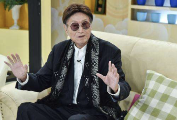

# 第二章 死亡

> **哲学中的死亡**
>
> 死亡哲学是哲学的一个分支学科。
> 世界上所有的宗教都是利用人们对死亡的恐惧心理而得到广泛传播的。三大宗教基督教、佛教、伊斯兰教，有地狱、炼狱、因果报应等说法，这是典型的通过「死」来控制「生」，无论信教与否，人们多多少少都受此限制。
> 但希腊哲学家伊壁鸠鲁则根本不承认死亡，他说：「最可怕的恶是死，但死却与我们毫无关系，因为我们活着的时候，死亡还不存在；当死亡来到的时候，我们又已经不存在了。」

## 第一节 概述

**定义**：「死亡」是指 **生命** 消失；即个体生命功能的永久丧失。

> 生命的本质是机体内 **同化、异化** 过程这一对矛盾的不断运动；而死亡则是这一对矛盾的终止。

**死亡在医学领域的意义**

- **临床医学**：判定死亡后才可放弃抢救、治疗。
- **法医学**：涉及民事、刑事等诸多法律问题。死亡诊断或死亡证明必须得到法律的认可；确定死亡原因、性质、方式以及死亡事件推断等。

### （一）心脏性死亡（cardiac death）

指因心脏疾病或损伤导致心脏功能严重障碍或衰竭所引起的心脏停搏早于呼吸停止的个体死亡。
心跳停止先于呼吸停止
较多见于心脏、循环系统疾病或引起心脏功能严重障碍的损伤
较为符合人们的传统观点

### （二）呼吸性死亡（respiratory death）

指因呼吸系统尤其是肺的疾病或损伤导致其功能严重障碍或衰竭所引起的呼吸停止先于心脏停搏。
呼吸停止先于心跳停止
较多见于呼吸系统疾病或引起呼吸功能严重障碍的损伤以及一些阻碍呼吸功能的毒物中毒（CO、氰化物等）

### （三）脑死亡（brain death）

#### 1. 脑死亡的定义

指大脑、小脑和脑干等全脑功能不可逆转的永久性丧失。

可分为原发性、继发性。

> 脑死亡是包括脑干在内的全脑功能不可逆转的丧失，即死亡。
> ——2009 卫生部脑死亡判定技术规范

**脑死亡的发展**

- 有史以来、长期把呼吸、心跳的停止作为判断死亡的标准；
- 1951 年美国的布莱克法律辞典：「血液循环的完全停止，呼吸、脉搏的停止」；
- 医学技术的发展：体外循坏、呼吸机；
- 1959 年法国学者首次提出脑死亡概念；
- 1968 年哈佛大学医学院提出「不可逆转的昏迷或脑死亡」；
- 1971 年芬兰立法；
- 1981 年美国立法；
- 1986 年我国草拟诊断标准（南京版）；
- 1999 年武汉草案；
- 2009 卫生部修订稿《脑死亡判定技术规范》；
- 2018 年 9 月底，同意脑死亡立法，可能不再单独立法，而是拟采用在现行法律中增加脑死亡和心死亡的「二元死亡」标准（即脑死亡和心脏死亡标准并存的法律认定方式），给死者家属一定选择权；
- 2020 年 8 月 3 日，世界脑死亡项目（The World Brain Death Project）在美国医学会杂志（JAMA）正式发表国际脑死亡国际共识。

> **国际脑死亡国际共识**
>
> **定义**：脑功能完全、不可逆丧失，即昏迷无应答，失去意识，脑干反射消失，不能自主呼吸。
>
> **诊断**
>
> 1. 没有证据表明对最大的外部刺激能唤醒患者或让其恢复意识，包括有害的视觉、听觉、触觉刺激；
> 2. 瞳孔固定在中等大小或扩散的状态，对光线无反应；
> 3. 角膜反射、头眼反射和眼前庭反射消失；
> 4. 伤害性刺激下没有面部运动；
> 5. 双边咽喉壁刺激下无呕吐反射；
> 6. 气管深部吸痰刺激下无咳嗽反射；
> 7. 在有害刺激下，四肢未出现受大脑控制的运动反应；
> 8. 当呼吸暂停试验的目标 pH 值 < 7.30，且 $PaCO_2$（二氧化碳分压）>= 60 毫米汞柱时，仍然没有自主呼吸；
>
> 当上述临床检查无法完成时，可考虑进行辅助检查，例如同时进行血流检查或电生理检查
>
> **争议**：脑死亡到底是代表整个大脑还是仅代表脑干的死亡，现有临床实践中仍缺乏共识。

> **脑死亡的诊断标准（国内目前）**
>
> **一、先决条件**
>
> 1. 明确的昏迷原因
> 2. 排除各种原因的可逆性昏迷
>
> **二、临床判定**
>
> 1. 深昏迷
> 2. 脑干反射全部消失
> 3. 无自主呼吸（靠呼吸机维持，自主呼吸激发试验证实无自主呼吸）
>
> 以上三项必须全部具备。
>
> **三、确认实验**
>
> 1. 脑电图呈电静息
> 2. 经颅多普勒超声无脑血流灌注现象
> 3. 正中神经短潜伏期体感诱发电位（SLSEP）N9 和 N13 存在，P14、N18 和 N20 消失。
>
> 以上三项中至少两项阳性即可。
>
> **四、判定时间**
>
> 临床判定和确认实验结果均符合脑死亡判定标准者可首次判定为脑死亡。首次判定 12 h（**24 h**）后再次复查，结果仍符合脑死亡判定标准者，方可最终确认为脑死亡。

#### 5. 脑死亡与持续性植物状态（植物人）

由于神经中枢的高级部位（大脑皮质）功能丧失，病人成意识障碍或昏迷状态；皮质下中枢部位（皮质下核、脑干）功能仍然存在。
表现为呼吸、循环、体温调节、消化吸收、分泌排泄、新陈代谢等仍存在或部分存在。

> 对于植物人放弃治疗、抢救为非法。（安乐死？）
> ——不同于脑死亡

### 二、死亡的过程与假死

#### （一）死亡过程

##### 1. 濒死期（agonal stage）/临终期（terminal stage）

临床死亡前主要生命器官功能极度衰弱，逐渐趋向停止。

- **表现**：意识障碍（丧失）各种反射减弱（迟钝）
- **时间长短不同**：死因（慢性疾病、急性死亡）
- 可短暂甚至阙如

##### 2. 临床死亡期（clinical death)

临床死亡是临床上判断死亡的标准，是指人的躯体或个体死亡（somatic death）。传统的死亡概念是指脑功能丧失，呼吸、心跳停止。

> 器官移植？

##### 3. 生物学死亡期（biological death）/细胞性死亡（cellular death）

- 器官功能永久性消失
- 超生反应（supravital reaction）消失

#### （二）假死（apparent death）

**定义**：指人的循环、呼吸和脑的功能活动高度抑制，生命活动极其微弱，用一般临床检查方法查不出生命体征，外表看来好像人已经死亡，而实际仍然存活的一种状态。

**意义**：可能复苏（**有些国家规定死亡后 48 小时方可解剖**）。法医要求尽早进行尸体解剖。

##### 1. 假死的原因

一般为脑缺血、缺氧造成生命功能高度抑制。常见有机械性窒息、安眠镇静类药物中毒、电击、低温、强烈精神刺激以及部分疾病（尿毒症、糖尿病昏迷、严重营养不良）等。

##### 2. 假死的检查方法

心电图、脑电图等。

**日常生活中的排除**

- 微弱呼吸的检查；
- 微弱血流的检查等。

### 三、法医学死亡分类

#### （一）自然死亡（natural death）/非暴力死亡（non-violent death）

符合生命和疾病自然发展的规律，没有暴力因素干预时发生的死亡。

##### 1. 生理性死亡（physiological death）

衰老死（无疾而终）

##### 2. 病理性死亡（pathological death）

#### （二）非自然死亡（unnatural death）/暴力性死亡（violent death）

非正常死亡，由一种或几种外来的作用因素导致到死亡。

##### 分类

- 自杀、他杀、意外
- 物理性、化学性、生物性

#### （三）新概念

##### 1. 安乐死

- 无痛苦致死术；
- 尊重生命权利；
- 有尊严的死亡。

**发展过程**

- 1976 年东京召开国际安乐死讨论会；
- 美国率先通过《自然死法》，承认死亡的权利；
- 2002 年荷兰成为第一个安乐死合法的国家（比利时、卢森堡、瑞士、美国部分州）。

##### 2. 尊严死

> **「被动」安乐死？**
>
> **台湾地区**：2005 年《安宁缓和医疗条例》，允许患者在疾病终末期拒绝心肺复苏术。《病人自主权利法》于近年通过，并预定于 2019 年 1 月 6 日实施。病人可以自己决定如何死亡。该法规定，发生永久植物人、极重度失智等五种状况的患者，经医疗评估确认病情无法恢复，医师可依病人预立意愿，终止、撤除、不进行维持生命的治疗或灌食。
>
> **大陆地区**：2013 年 6 月北京生前预嘱推广协会成立。理念：按照本人意愿，以尽量自然和有尊严的方式离世，是对生命的珍视和热爱。

**五个愿望**

- 我要或不要什么医疗服务；
- 我希望使用或不使用生命支持治疗；
- 我希望别人怎么对待我；
- 我想让我的家人和朋友知道什么；
- 我希望谁帮助我。

奥地利、丹麦、法国、德国、匈牙利、挪威、斯洛伐克、西班牙、瑞典等国，允许「被动」安乐死。

**尊严死并非安乐死**

「安乐死」是通过注射药物等措施帮助患者安详地结束生命，是积极的、主动的，带有协从性质的「助死」，目的是为了结束进入临终状态患者的痛苦。而「尊严死」并不提前结束自然人的生命，而是在尊重个人意愿的前提下，不人为延长自然人的生命。

> **BBC纪录片：选择死亡（Choosing to Die）（特里·普拉切特）**
>
> 
>
> 英国著名奇幻小说作家 Terry Pratchett 患上了阿兹海默症，时而清醒时而迷糊，逐渐丧失写作能力，他开始思考自愿选择结束生命的可能性，于是他和他的助手走访了几位曾经和正在选择安乐死的对象（家庭），于 2011 年拍下了这部纪录片。

> **中国首例安乐死**
>
> 
>
> 执行医生：蒲连升
> 事件回顾：
> - 1986 年患者夏 ×，癌症患者；
> - 1986 年 9 月 20 日医生被逮捕；
> - 5 年后，被宣判无罪；
> - 次年，再审宣判无罪。
>
> 后续：夏 × 的儿子王 × 身患癌症，向医疗机构提出要求进行安乐死，但遭到拒绝。

> **台湾主持人傅达仁**
>
> 
>
> 2018 年 6 月安乐死（瑞士）

### 四、死亡原因与死亡机制

#### （一）死亡原因（cause of death)  

直接或间接促进死亡的损伤或疾病，包括导致死亡发生的暴力、疾病、衰老等因素。

##### 1. 根本死因（primary cause of death）

引起死亡的初始原因，引起死亡的原发性自然性疾病或暴力。

##### 2. 直接死因（immediate cause of death）

直接引起死亡的原因，根本死因的致命性并发症；中毒、感染、出血、全身衰竭、栓塞等。

##### 3. 辅助死因（contributory cause of death）

根本死因之外的自然性疾病或损伤，本身不会致命，但起辅助作用。

##### 4. 死亡诱因（inducing cause of death）

诱发身体原有潜在疾病而引起死亡；情绪波动、气候变化等。

##### 5. 联合死因（combined cause of death）

合并死因，两种或以上难以区分主次的死因，共同引起死亡；疾病/疾病、疾病/暴力、暴力/暴力。

#### （二）死亡机制

> **多因素作用死亡原因分析**
>
> 某男，45 岁，体型肥胖，患有精神分裂症及呼吸暂停综合征。
> 某日上午，该男子精神分裂症急性发作，家属口服给药氯丙嗪 6 片（正常剂量 2 片），并使用布条将其约束于躺椅（半卧位），后家人嫌其吵闹，随手将一件冲锋衣搭在该男子头面部。
> 后于该日下午发现该男子窒息死亡。
> 解剖发现该男子心脏肥大、冠状动脉三度狭窄。
>
> 死因？

### 五、死亡方式

- 制定案件侦查方向（刑/非刑）
- 司法审判定罪
- 民事调解、灾害赔偿

#### 1. 自杀死（suicidal death)

#### 2. 他杀死（homicidal death)

- 非法他杀死（death from murder）
  - 故意杀人
- 合法他杀死（death from justifiable decision）
- 过失伤害死（manslaughter）

#### 3. 意外死（accidental death）
