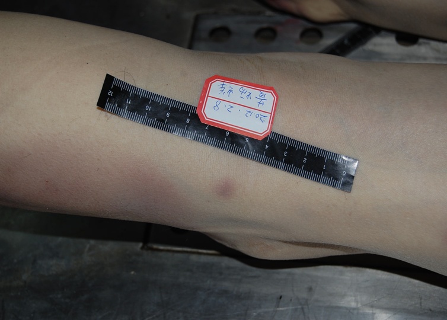
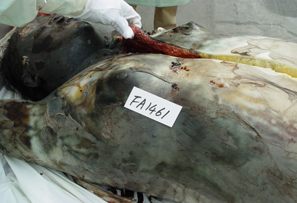

# 第二章 死亡与死后变化

> **哲学中的死亡**
>
> 死亡哲学是哲学的一个分支学科。
> 世界上所有的宗教都是利用人们对死亡的恐惧心理而得到广泛传播的。三大宗教基督教、佛教、伊斯兰教，有地狱、炼狱、因果报应等说法，这是典型的通过「死」来控制「生」，无论信教与否，人们多多少少都受此限制。
> 但希腊哲学家伊壁鸠鲁则根本不承认死亡，他说：「最可怕的恶是死，但死却与我们毫无关系，因为我们活着的时候，死亡还不存在；当死亡来到的时候，我们又已经不存在了。」

## 第一节 死亡

**定义**：「死亡」是指 **生命** 消失；即个体生命功能的永久丧失。

> 生命的本质是机体内 **同化、异化** 过程这一对矛盾的不断运动；而死亡则是这一对矛盾的终止。

**死亡在医学领域的意义**

- **临床医学**：判定死亡后才可放弃抢救、治疗。
- **法医学**：涉及民事、刑事等诸多法律问题。死亡诊断或死亡证明必须得到法律的认可；确定死亡原因、性质、方式以及死亡事件推断等。

### （一）心脏性死亡（cardiac death）

指因心脏疾病或损伤导致心脏功能严重障碍或衰竭所引起的心脏停搏早于呼吸停止的个体死亡。
心跳停止先于呼吸停止
较多见于心脏、循环系统疾病或引起心脏功能严重障碍的损伤
较为符合人们的传统观点

### （二）呼吸性死亡（respiratory death）

指因呼吸系统尤其是肺的疾病或损伤导致其功能严重障碍或衰竭所引起的呼吸停止先于心脏停搏。
呼吸停止先于心跳停止
较多见于呼吸系统疾病或引起呼吸功能严重障碍的损伤以及一些阻碍呼吸功能的毒物中毒（CO、氰化物等）

### （三）脑死亡（brain death）

#### 1. 脑死亡的定义

指大脑、小脑和脑干等全脑功能不可逆转的永久性丧失。

可分为原发性、继发性。

> 脑死亡是包括脑干在内的全脑功能不可逆转的丧失，即死亡。
> ——2009 卫生部脑死亡判定技术规范

**脑死亡的发展**

- 有史以来、长期把呼吸、心跳的停止作为判断死亡的标准；
- 1951 年美国的布莱克法律辞典：「血液循环的完全停止，呼吸、脉搏的停止」；
- 医学技术的发展：体外循坏、呼吸机；
- 1959 年法国学者首次提出脑死亡概念；
- 1968 年哈佛大学医学院提出「不可逆转的昏迷或脑死亡」；
- 1971 年芬兰立法；
- 1981 年美国立法；
- 1986 年我国草拟诊断标准（南京版）；
- 1999 年武汉草案；
- 2009 卫生部修订稿《脑死亡判定技术规范》；
- 2018 年 9 月底，同意脑死亡立法，可能不再单独立法，而是拟采用在现行法律中增加脑死亡和心死亡的「二元死亡」标准（即脑死亡和心脏死亡标准并存的法律认定方式），给死者家属一定选择权；
- 2020 年 8 月 3 日，世界脑死亡项目（The World Brain Death Project）在美国医学会杂志（JAMA）正式发表国际脑死亡国际共识。

> **国际脑死亡国际共识**
>
> **定义**：脑功能完全、不可逆丧失，即昏迷无应答，失去意识，脑干反射消失，不能自主呼吸。
>
> **诊断**
>
> 1. 没有证据表明对最大的外部刺激能唤醒患者或让其恢复意识，包括有害的视觉、听觉、触觉刺激；
> 2. 瞳孔固定在中等大小或扩散的状态，对光线无反应；
> 3. 角膜反射、头眼反射和眼前庭反射消失；
> 4. 伤害性刺激下没有面部运动；
> 5. 双边咽喉壁刺激下无呕吐反射；
> 6. 气管深部吸痰刺激下无咳嗽反射；
> 7. 在有害刺激下，四肢未出现受大脑控制的运动反应；
> 8. 当呼吸暂停试验的目标 pH 值 < 7.30，且 $PaCO_2$（二氧化碳分压）>= 60 毫米汞柱时，仍然没有自主呼吸；
>
> 当上述临床检查无法完成时，可考虑进行辅助检查，例如同时进行血流检查或电生理检查
>
> **争议**：脑死亡到底是代表整个大脑还是仅代表脑干的死亡，现有临床实践中仍缺乏共识。

> **脑死亡的诊断标准（国内目前）**
>
> **一、先决条件**
>
> 1. 明确的昏迷原因
> 2. 排除各种原因的可逆性昏迷
>
> **二、临床判定**
>
> 1. 深昏迷
> 2. 脑干反射全部消失
> 3. 无自主呼吸（靠呼吸机维持，自主呼吸激发试验证实无自主呼吸）
>
> 以上三项必须全部具备。
>
> **三、确认实验**
>
> 1. 脑电图呈电静息
> 2. 经颅多普勒超声无脑血流灌注现象
> 3. 正中神经短潜伏期体感诱发电位（SLSEP）N9 和 N13 存在，P14、N18 和 N20 消失。
>
> 以上三项中至少两项阳性即可。
>
> **四、判定时间**
>
> 临床判定和确认实验结果均符合脑死亡判定标准者可首次判定为脑死亡。首次判定 12 h（**24 h**）后再次复查，结果仍符合脑死亡判定标准者，方可最终确认为脑死亡。

#### 5. 脑死亡与持续性植物状态（植物人）

由于神经中枢的高级部位（大脑皮质）功能丧失，病人成意识障碍或昏迷状态；皮质下中枢部位（皮质下核、脑干）功能仍然存在。
表现为呼吸、循环、体温调节、消化吸收、分泌排泄、新陈代谢等仍存在或部分存在。

> 对于植物人放弃治疗、抢救为非法。（安乐死？）
> ——不同于脑死亡

### 二、死亡的过程与假死

#### （一）死亡过程

##### 1. 濒死期（agonal stage）/临终期（terminal stage）

临床死亡前主要生命器官功能极度衰弱，逐渐趋向停止。

- **表现**：意识障碍（丧失）各种反射减弱（迟钝）
- **时间长短不同**：死因（慢性疾病、急性死亡）
- 可短暂甚至阙如

##### 2. 临床死亡期（clinical death)

临床死亡是临床上判断死亡的标准，是指人的躯体或个体死亡（somatic death）。传统的死亡概念是指脑功能丧失，呼吸、心跳停止。

> 器官移植？

##### 3. 生物学死亡期（biological death）/细胞性死亡（cellular death）

- 器官功能永久性消失
- 超生反应（supravital reaction）消失

#### （二）假死（apparent death）

**定义**：指人的循环、呼吸和脑的功能活动高度抑制，生命活动极其微弱，用一般临床检查方法查不出生命体征，外表看来好像人已经死亡，而实际仍然存活的一种状态。

**意义**：可能复苏（**有些国家规定死亡后 48 小时方可解剖**）。法医要求尽早进行尸体解剖。

##### 1. 假死的原因

一般为脑缺血、缺氧造成生命功能高度抑制。常见有机械性窒息、安眠镇静类药物中毒、电击、低温、强烈精神刺激以及部分疾病（尿毒症、糖尿病昏迷、严重营养不良）等。

##### 2. 假死的检查方法

心电图、脑电图等。

**日常生活中的排除**

- 微弱呼吸的检查；
- 微弱血流的检查等。

### 三、法医学死亡分类

#### （一）自然死亡（natural death）/非暴力死亡（non-violent death）

符合生命和疾病自然发展的规律，没有暴力因素干预时发生的死亡。

##### 1. 生理性死亡（physiological death）

衰老死（无疾而终）

##### 2. 病理性死亡（pathological death）

#### （二）非自然死亡（unnatural death）/暴力性死亡（violent death）

非正常死亡，由一种或几种外来的作用因素导致到死亡。

##### 分类

- 自杀、他杀、意外
- 物理性、化学性、生物性

#### （三）新概念

##### 1. 安乐死

- 无痛苦致死术；
- 尊重生命权利；
- 有尊严的死亡。

**发展过程**

- 1976 年东京召开国际安乐死讨论会；
- 美国率先通过《自然死法》，承认死亡的权利；
- 2002 年荷兰成为第一个安乐死合法的国家（比利时、卢森堡、瑞士、美国部分州）。

##### 2. 尊严死

> **「被动」安乐死？**
>
> **台湾地区**：2005 年《安宁缓和医疗条例》，允许患者在疾病终末期拒绝心肺复苏术。《病人自主权利法》于近年通过，并预定于 2019 年 1 月 6 日实施。病人可以自己决定如何死亡。该法规定，发生永久植物人、极重度失智等五种状况的患者，经医疗评估确认病情无法恢复，医师可依病人预立意愿，终止、撤除、不进行维持生命的治疗或灌食。
>
> **大陆地区**：2013 年 6 月北京生前预嘱推广协会成立。理念：按照本人意愿，以尽量自然和有尊严的方式离世，是对生命的珍视和热爱。

**五个愿望**

- 我要或不要什么医疗服务；
- 我希望使用或不使用生命支持治疗；
- 我希望别人怎么对待我；
- 我想让我的家人和朋友知道什么；
- 我希望谁帮助我。

奥地利、丹麦、法国、德国、匈牙利、挪威、斯洛伐克、西班牙、瑞典等国，允许「被动」安乐死。

**尊严死并非安乐死**

「安乐死」是通过注射药物等措施帮助患者安详地结束生命，是积极的、主动的，带有协从性质的「助死」，目的是为了结束进入临终状态患者的痛苦。而「尊严死」并不提前结束自然人的生命，而是在尊重个人意愿的前提下，不人为延长自然人的生命。

> **BBC纪录片：选择死亡（Choosing to Die）（特里·普拉切特）**
>
> 
>
> 英国著名奇幻小说作家 Terry Pratchett 患上了阿兹海默症，时而清醒时而迷糊，逐渐丧失写作能力，他开始思考自愿选择结束生命的可能性，于是他和他的助手走访了几位曾经和正在选择安乐死的对象（家庭），于 2011 年拍下了这部纪录片。

> **中国首例安乐死**
>
> 
>
> 执行医生：蒲连升
> 事件回顾：
> - 1986 年患者夏 ×，癌症患者；
> - 1986 年 9 月 20 日医生被逮捕；
> - 5 年后，被宣判无罪；
> - 次年，再审宣判无罪。
>
> 后续：夏 × 的儿子王 × 身患癌症，向医疗机构提出要求进行安乐死，但遭到拒绝。

> **台湾主持人傅达仁**
>
> 
>
> 2018 年 6 月安乐死（瑞士）

### 四、死亡原因与死亡机制

#### （一）死亡原因（cause of death)  

直接或间接促进死亡的损伤或疾病，包括导致死亡发生的暴力、疾病、衰老等因素。

##### 1. 根本死因（primary cause of death）

引起死亡的初始原因，引起死亡的原发性自然性疾病或暴力。

##### 2. 直接死因（immediate cause of death）

直接引起死亡的原因，根本死因的致命性并发症；中毒、感染、出血、全身衰竭、栓塞等。

##### 3. 辅助死因（contributory cause of death）

根本死因之外的自然性疾病或损伤，本身不会致命，但起辅助作用。

##### 4. 死亡诱因（inducing cause of death）

诱发身体原有潜在疾病而引起死亡；情绪波动、气候变化等。

##### 5. 联合死因（combined cause of death）

合并死因，两种或以上难以区分主次的死因，共同引起死亡；疾病/疾病、疾病/暴力、暴力/暴力。

#### （二）死亡机制

> **多因素作用死亡原因分析**
>
> 某男，45 岁，体型肥胖，患有精神分裂症及呼吸暂停综合征。
> 某日上午，该男子精神分裂症急性发作，家属口服给药氯丙嗪 6 片（正常剂量 2 片），并使用布条将其约束于躺椅（半卧位），后家人嫌其吵闹，随手将一件冲锋衣搭在该男子头面部。
> 后于该日下午发现该男子窒息死亡。
> 解剖发现该男子心脏肥大、冠状动脉三度狭窄。
>
> 死因？

### 五、死亡方式

- 制定案件侦查方向（刑/非刑）
- 司法审判定罪
- 民事调解、灾害赔偿

#### 1. 自杀死（suicidal death)

#### 2. 他杀死（homicidal death)

- 非法他杀死（death from murder）
  - 故意杀人
- 合法他杀死（death from justifiable decision）
- 过失伤害死（manslaughter）

#### 3. 意外死（accidental death）

## 第二节 死后变化（postmortem changes）

### 一、死后变化的概念

人个体死亡后受体内外物理、化学以及生物学因素的作用，在尸体上发生各种变化，称为死后变化，亦称尸体现象（postmortem phenomena）。

- 死后化学变化
- 尸体毁坏
- 死后人为现象

**分类**

- 按尸体是否完整分为：
  - 毁坏型死后变化
  - 保存型死后变化
- 根据死后经过时间分为：
  - 早期死后变化
  - 晚期死后变化

**尸体现象的法医学意义**

- 确定死亡
- 推测死亡时间
- 提示死亡原因
- 有助于推测案情（尸体痉挛的死前特定姿势）
  - 提示尸体是否被移动（尸斑出现部位、尸僵与死后体位变化的关系）
- 鉴别生前与死后的变化：自溶与坏死，尸斑与皮下出血

### 二、早期死后变化（early postmortem changes）

人死亡后24小时内所发生的尸体变化。

#### （一）超生反应（supravital reaction）

生物个体死亡后，其器官、组织和细胞在短时间内仍保持某些活动功能，对刺激仍保持发生一定反应的能力，该现象称为超生反应。

##### 1. 常见的超生反应

瞳孔反应、骨骼肌超生反应等。

##### 2. 法医学意义

- 认识人死后发生的超生反应，注意与人活着时的正常反应相鉴别。
- 各器官组织的超生反应持续的时间有一定的差异性，据此可推测死亡时间。

#### （二）肌肉松弛（muscullar flaccidity）

躯体死亡后，肌张力消失，肌肉变软，称为肌肉松弛（muscular flaccidity）。

##### 1. 肌肉松弛的表现

尸体呈迟缓状态（瞳孔散大、眼微睁，面部松弛，各肢体关节易屈曲，括约肌的松弛可导致大小便、精液外溢）。

##### 2. 法医学意义

肌肉松弛是直接导致皮肤接触压痕的原因，有助于推断案情。

#### （三）皮革样化（parchment-like transformation）/局部干燥（local desiccation）

死后水分从皮肤较薄部位迅速蒸发，局部干燥变硬，呈黄褐色或深褐色，称为皮革样化。

##### 1. 常见部位

- 口唇、会阴部等皮肤较薄、皱褶较多的部位
- 表皮剥脱、烫伤面、索沟等损伤处

##### 2. 法医学意义：

- 皮革样化可使损伤更加明显；
- 应区别自然状况以及损伤：口唇、会阴部位。

#### （四）角膜混浊（postmortem turbidity of cornea）

人体死亡后，角膜透明度逐渐减低，混浊，呈灰白色，最后完全不能透视瞳孔，称为角膜混浊（postmortem turbidity of cornea）。

##### 1. 法医学意义：推测死亡时间

**时间规律**

死后 5～6 小时 | 6～12 小时 | 15～24 小时 | 48 小时
:---: | :---: | :---: | :---:
角膜出现白色小点 | 斑点扩大 | 混浊加重、半透明 | 不能透视瞳孔
--- | 轻度混浊 | 中度混浊 | 高度混浊

**早期轻度角膜混浊**

**角膜中度混浊**

#### （五）尸冷（algor mortis, cooling of the body）

人体死亡后，新陈代谢停止，热量不再产生而体表散热不断进行，使尸体温度降到环境温度，称为尸冷（cooling of the body, algor mortis）。

##### 1. 影响因素

- 内因（脂肪厚度、体表面积、死前产热）
  - 肥胖程度
  - 年龄、性别
  - 身体状态
  - 死因
- 外因（热交换条件）
  - 环境温度、空气湿度、通风情况
  - 接触介质：水、土、空气
  - 接受能量（辐射）
  - 身体附着物

**测量部位**：直肠或肝表面

体格一般的成人尸体（体重65～70公斤）：

- 春秋季节，15～20 ℃ ，死后前 10 小时每小时下降1 ℃ ，10 小时后每小时下降0.5 ℃；
- 环境温度低（2～9 ℃ ）死后每小时平均下降1 ℃；
- 环境温度高（20 ℃ 以上，夏季）死后每小时平均下降0.5 ℃；
- 环境温度高于 40 ℃，则尸冷不发生；
- 严寒、通风条件良好，则尸冷迅速。

应用中要结合实际情况，进行校对。

##### 2. 法医学意义

推断死亡时间：一般作为死后 18 小时内较为可靠的证据。有一定的局限性，需客观完善考虑外界因素。

#### （六）尸斑（livor mortis）

尸体血管内血液因循环停止，在自身重力作用下，下沉到 **尸体低下部位**，坠积在 **未受压部位** 血管中，透过皮肤显示出 **边缘不清的有色斑痕**，称为尸斑。

##### 1. 尸斑的发展

分期 | 死后时间 （h） | 外观表现 | 病理表现 | 按压改变 | 改变体位
--- | --- | --- | --- | --- | ---
沉降期 | 6～12 | 从小块或条纹，到融合成片，颜色加深，边界不清。承重处苍白色，未受压处为尸斑颜色 | 毛细血管、小静充满坠积的红细胞 | 按压可褪色 | 原尸斑部分或完全消失，重新在低下未受压部位形成新的尸斑
扩散期 | 12～24 | 颜色加深 | 红细胞溶解，血红蛋白进入血管壁以及周围组织 | 按压稍褪色 | 新的低下未受压部位形成新尸斑，原尸斑不能完全消退
浸润期 | > 24 | 颜色固定 | 血红蛋白以及分解产物完全进入组织间隙 | 按压不褪色 | 原尸斑不消失，新的尸斑不能产生

**尸斑（腰背部）**

**指压褪色**

##### 2. 尸斑的分布

尸斑处于低下未受压处。

- **仰卧位**：尸斑处于枕、项、背、腰、臀、四肢背侧，以及身体的侧面（两腋侧）；
- **俯卧位**：尸斑处于颜面、胸腹、四肢的腹侧面，以及身体的侧面（两腋侧）；
- **悬垂位**：尸斑见于下肢、两手及前臂，以及绳索腰带等束压物的上方；
- **水中尸体**：因水流翻动，尸斑不易固定，且因血液被稀释，尸斑不明显。

**注意**：如尸斑位置与尸体体位明显不符，应注意是否死后移尸。

**仰卧位尸斑的情况（着衣）**

**背后尸斑的情况**

##### 3. 尸斑的颜色

尸斑颜色是血红蛋白与肤色的综合颜色。

- **暗紫红色（血红蛋白）**：还原血红蛋白；
- **鲜红色（氧合血红蛋白）**：冻死尸体；氰化物中毒；
- **樱红色（碳氧血红蛋白）**：一氧化碳中毒；
- **灰褐色（正铁血红蛋白）**：氯酸钾、亚硝酸钠、铅中毒；
- **蓝绿色**：硝基苯中毒。

**尸斑的颜色**

##### 4. 影响因素

- 死亡原因
  - 猝死和窒息的尸体，尸斑出现快而浓，有时形成散在的皮下出血点。
  - 大失血、恶病质、衰竭死亡者，尸斑出现慢而微弱。
- 外界因素
  - 受压迫部位尸斑难以形成

##### 5. 法医学意义

- 尸斑是最早出现的死亡指征之一；
- 尸斑的分布可以推测死亡时的尸体位置和以后尸体位置有无变动；
- 根据尸斑的发展可以大致推测死亡时间；
- 尸斑颜色可以提示某些中毒以及某些死因。

**尸斑与皮下出血的鉴别**

--- | 尸斑 | 皮下出血（挫伤）
:---: | --- | ---
形成 | 死后血液坠积而成 | 生前外伤所致
发生部位 | 尸体低下未受压部位 | 身体的任何部位
范围 | 广泛，境界不清 | 局限，境界清楚
表面情况 | 一般无损伤，呈大片状分布；未受压处不出现尸斑 | 局部肿胀，常伴表皮剥脱；多为片状
加压试验 | 在死后 12 小时内，加压后颜色减退，压力移去后，颜色复现 | 加压后颜色不消退
体位改变 | 早期可消失、并出现新尸斑，晚期无变化 | 翻动尸体后无变化
切开检验 | 晚期尸体现象出现以前经水冲洗和用纱布擦拭后可消失 | 组织间有血液或小凝血块，用水冲洗和纱布擦拭皆不消失
镜下观察 | 无生活反应 | 可见出血和生活反应

#### （七）尸僵（rigor mortis, cadaveric rigidity）

个体死亡后，各肌群发生僵硬并将关节固定的现象称为尸僵（rigor mortis, cadaveric rigidity）。

##### 1. 尸僵发生和缓解的时间

死后 1～3 小时开始出现，12～15 小时达高峰。

**再僵直（restiffeness）**：在死后 4～6 小时内，人为地将已形成的尸僵破坏，不久可重新形成尸僵，这种现象称为再僵直。

**尸僵存在时间**：夏季 36～48 小时，冬季 72 小时或更久，之后开始缓解，完全缓解则在死后 3～7 天。

##### 2. 尸僵形成的机制

三磷酸腺苷耗竭（残存的 ATP 决定尸僵的形成早晚，而肌动蛋白、肌球蛋白的量则决定尸僵的强度）。

**尸僵**

**未着衣上面观**

##### 3. 影响因素

- 体内 ATP 的储量；
- 体内肌动蛋白肌球蛋白的量；
- 死前的状态。

注意区分烧死者的僵直、冰冻尸体的僵硬。

$$
影响因素\begin{cases}个体因素\begin{cases}肌肉情况\\死亡原因\end{cases}\\环境温度\end{cases}
$$

**其他肌肉的僵硬**

- 心肌
- 平滑肌
  - 立毛肌；
  - 瞳孔括约肌等。

##### 4. 法医学意义

- 尸僵是死亡的确证；
- 根据尸僵的出现顺序、发生和发展、持续时间的长短和强度，可作为推测死亡原因和死亡时间的参考；
- 推测案情（尸体位置和姿势固定），以及尸体是否被移动过。

#### （八）尸体痉挛（cadaveric spasm, instantaneous rigor）

是一种特殊的尸僵现象。死亡的瞬间，肌肉未经松弛阶段直接进入僵硬状态，保持着死亡时刻的姿势和动作，称为尸体痉挛（cadaveric spasm, instantaneous rigor）。

##### 1. 形成机制和表现

与在高度神经兴奋状态下死亡有关。

##### 2. 法医学意义

可以固定死者临死时的动作、体位和姿势，因此对判断或推测自杀或他杀，有时极有价值。

#### （九）内脏器官血液坠积（visceral hypostasis）

人死后，内部器官的血液因自身重力而坠积于这些器官的低下部位的血管内，称为内部器官血液坠积。在血管内红细胞沉积的同时，发生小血管的被动扩张。

##### 1. 法医学意义

注意与生前病变相鉴别

#### （十）自溶（autolysis）和自家消化（autodigestion）

人死亡后，组织细胞因受细胞内固有的各种酶的作用而发生细胞结构的破坏，因而各器官软化甚至液化，称为自溶（autolysis）。

##### 1. 自溶的机制

主要是人体死亡后，人体自稳的结构不能保持，作为防御自身酶的膜系统破坏，系统内的各种酶被释放出来，使得机体发生结构的破坏。

细菌的存在加速自溶。

##### 2. 自家消化

人死后，胃肠道因受消化液的作用而溶解者称为自家消化（autodigestion）。

##### 3. 影响自溶和自家消化的因素

- 温度
- 死亡过程
- 器官组织的差异
- 人为因素

 | 
--- | ---
 | 

##### 4. 法医学意义
- 鉴别生前坏死病变与死后自溶
  - 急性坏死出血性胰腺炎
  - 急性肾小管坏死
  - 肝细胞水样变性、肝细胞坏死
  - 肺炎、肺水肿
- 不同器官组织自溶的发展情况有助于推测死后经过时间。

### 三、晚期死后变化（late postmortem phenomenon）

个体死亡 24 小时后在尸体上表现出的死后变化（late postmortem phenomenon) 。

包括两类：

- 毁坏型死后变化；
- 保存型死后变化。

基本上在死后第一昼夜末或 2～3 昼夜表现出来，但充分达到白骨化则需要更长的时间。

$$
晚期死后变化\begin{cases}毁坏型晚期死后变化\begin{cases}尸体腐败\\霉尸\\白骨化\end{cases}\\保存型晚期死后变化\begin{cases}尸蜡\\木乃伊\\泥炭鞣尸\end{cases}\end{cases}
$$

**一般过程**：环境温度为常温

$$
死亡\xrightarrow{3～6 h}尸臭\xrightarrow{24～48 h}\begin{cases}尸绿\\腐败静脉网\\腐败水气泡\end{cases}\xrightarrow{5～7 d}腐败巨人观
$$

**腐败发展概图**

$$
腐败细菌大量繁殖\xrightarrow{分解蛋白质、脂肪和碳水化合物}腐败气体\to\begin{cases}尸臭\\尸绿\\腐败水气泡\\腐败静脉网\\泡沫器官\\腐败巨人观\end{cases}
$$

#### （一）毁坏型晚期死后变化

##### 1. 尸体腐败（putrefaction）

人死后腐败细菌在尸体内大量生长繁殖，使蛋白质、脂肪和糖类分解为简单的有机物、无机物和腐败气体，使尸体软组织逐渐分解和消失的过程。

###### （1）腐败的发展和形态变化

**尸臭（odor of putrefaction）**：个体死亡后 3～6 小时，肠道内的腐败菌繁殖生长，产生并释放出腐败气体，发出腐败臭味，称为尸臭。

- **腐败气体的成分**：含氧氮氢的小分子气体，二氧化碳，还有含氨、硫化氢、甲烷等具有强烈臭味的成分。

**尸绿（greenish discoloration on cadaver）**：腐败气体中的硫化氢与血红蛋白生成硫化血红蛋白，透过皮肤呈绿色，称为尸绿。尸绿通常在死后 24 小时开始出现，最初多见于右下腹部，经 3～5 日，尸绿可以遍布全腹及更广泛的部位。

- **形成机制**：腐败气体的硫化氢与溶血产物血红蛋白及其衍生物结合生成硫化血红蛋白或硫化变性血红蛋白，或与血液中的游离铁结合成为硫化铁，使皮肤呈污绿色。

**死后循环（cadaveric circulation）**：尸体血管内产生的腐败气体，压迫血液使之流动，称为死后循环。

**腐败静脉网（putrefactive networks）**：尸体内部器官及血管中的血液受腐败气体的压迫，流向体表，使皮下静脉扩张，充满腐败血液，在体表呈现暗红色或污绿色树枝状血管网，称为腐败静脉网。

**腐败巨人观（bloated cadaver）**：尸体腐败扩展到全身时，尸体软组织内充满腐败气体使整个尸体膨胀，体积变大，面目全非，称为巨人观。表现为颜面膨大，眼球突出，口唇外翻，舌尖突出于口外，颈部变粗，胸、腹部显著膨胀隆起，阴茎、阴囊高度肿胀，皮肤呈污绿色、腐败静脉网多见，皮下组织和肌肉呈气肿状，四肢增粗，有的手和足的皮肤可呈手套和袜状脱落，容貌难以辨认。

**泡沫脏器（foaming organ）**：因腐败气体使尸体器官形成大小不等的海绵样空泡，称为泡沫器官。

**死后呕吐（postmortem vomiting）**：死后胃内容物因受腐败气体的压迫，从食管经口鼻腔排出，称死后呕吐。同样，也可压迫积聚在气管和支气管中的腐败血性液体自口鼻腔排出。

**死后分娩（postmortem delivery）**：高度腐败的尸体，腐败气体可以将子宫内的胎儿挤出子宫，称为死后分娩，或棺内分娩。

###### （2）影响腐败的因素

- 温度
- 湿度
- 空气流通
- 尸体本身因素：个体差异、死亡原因

###### （3）法医学意义

- 推断死亡时间；
- 区别腐败征象与生前的疾病和损伤；
- 争取及早进行尸解，采取措施防止腐败；
- 注意有意义的证据的提取
  - 如：骨折的保存，骨髓的硅藻检验，颈动脉的内膜裂伤，动脉粥样硬化，器官组织的异物存留及某些毒物中毒等。

##### 2. 霉尸（molded cadaver）

尸体处于适宜真菌生长的环境条件下，在裸露的局部或全身表面出现一层白色或灰绿霉斑，称为霉尸。

###### （1）形态表现

霉斑开始多见于颜面部的眼、鼻、口唇及周围，颈部和腹股沟等处。

###### （2）法医学意义  
- 推测尸体所处的环境条件，有利于分析案情。
- 注意与某些损伤和疾病相鉴别。

##### 3. 白骨化（skeletonized remains）

尸体的软组织经腐败逐渐软化、液化，直至完全溶解消失，指甲毛发脱落，仅残余骨骼，称为白骨化。

###### （1）法医学意义
- 尸骨可以长久保存损伤痕迹；
- 重金属毒物可以在骨质中进行检测；
- 骨髓可用于硅藻检查；
- 个人识别（法医人类学）。

#### （二）保存型尸体变化

尸体受某些内外因素的影响，使腐败过程中断，软组织免于崩解液化，并将尸体全部或部分保存下来，称为保存型尸体。

##### 1. 干尸

尸体处在干热或通风条件良好的环境中，因水分迅速蒸发而不发生腐败，以干枯状态保存下来，称为木乃伊（mummy），或称为干尸。

###### （1）形成的条件：

- **外因**：干燥、通风、较高的环境温度或周围有强吸水的物质（大量木炭、灯芯、多层棉质吸水的衣物、香灰等）；
- **内因**：尸体条件（死前有严重脱水的死因－砷中毒致腹泻；死前体质消瘦或脱水）

###### （2）法医学意义：

- 可保留生前某些损伤形态；
- 可保留某些个人特征
- 可保留生前某些病变

##### 2. 尸蜡（adipocere）

埋于湿土或浸于水中的尸体，皮下脂肪组织因皂化或氢化作用，形成灰白色或黄白色蜡样物质而被保存，称为尸蜡。多为局部性，罕见全身性尸蜡。

###### （1）尸蜡征象

一般呈白色、灰白色、黄色坚实的蜡样物，有油腻感，可以压陷，但脆而易碎。

###### （2）法医学意义

可以保存生前的伤痕，如颈部的索沟、扼痕等；个人识别。

##### 3. 泥炭鞣尸（cadaver tanned in peat bog）

处于酸性土壤或泥炭沼泽中的尸体，因鞣酸和多种腐植酸等酸性物质的作用，腐败停止发展，皮肤鞣化，骨骼脱钙，变成体积小、重量轻、易弯曲的软尸，称为泥炭鞣尸。又称「软尸」。

###### （1）法医学意义

可以保留某些生前的损伤痕迹。

##### 4. 浸软（maceration）

妊娠 8 周以上的死胎，滞留于宫内不能完全被溶解吸收，而浸泡于无菌的羊水中，发生死后改变，称为浸软，或称浸软儿。

###### （1）浸软程度

根据浸软的部位和范围分为三度。

- **一度浸软**：表皮层内；
- **二度浸软**：真皮层；
- **三度浸软**：深部组织及内部器官。

###### （2）法医学意义

- 浸软胎儿是死胎，死后已在宫内一段时间，在此期间母体受伤不是引起胎儿死亡的原因。
- 浸软胎儿一旦暴露于空气中极易发生腐败，故应尽早进行法医学检验。

### 三、其他死后变化

#### （一）死后化学变化（postmortem chemical changes）

人死后，尸体各种组织、细胞和体液因持续分解而发生的一些化学和生物化学变化，称为死后化学变化。

**研究对象**：血液、脑脊液、玻璃体液

##### 1. 影响因素

- 死亡时间
- 取材部位和方法
- 检测技术和方法

##### 2. 法医学意义

- 有助于推测死后经过时间。
- 有助于分析死亡原因。如血糖、IgE；
- 有助于判断生前所患疾病或损伤。

#### （二）昆虫、动物对尸体的毁坏

动物对尸体的毁坏与死后变化无内在联系，但是可以造成典型的损坏表现，需与生前损伤加以区分。

##### 1. 昆虫

法庭昆虫学（forensic entomology）

- 蝇（fly）、蛆
- 蚂蚁（ant）
- 甲虫（beetles）

##### 2. 动物

- 鼠类
- 狼、犬类
- 鸟类
- 水族动物

#### （三）其它自然环境因素对尸体的毁坏

- 江河湖泊水中尸体
- 铁路、公路道上的尸体  
- 建筑物、厂房等处的尸体  
- 山坡上的尸体  
- 雷雨天的尸体
- 火灾中的尸体

### 四、死后人为现象

- 抢救时胸外按摩导致肋骨、胸骨骨折；
- 搬运尸体过程中造成的损伤；胃内容物的返流；
- 尸体解剖操作不当导致的骨折等现象；

## 第三节 死亡时间推断

### 一、死亡时间的概念

死亡时间（time of death）在法医学上实际是指死后经历时间（the time since death, TSD）, 或称死后间隔时间（postmortem interval，PMI），即从发现、检查尸体时到死亡发生时的时间间隔。

### 二、推断死亡时间的法医学意义

死亡时间推断在许多案例是法医需要解决的首要问题。死亡时间在多数情况下标志着案件发生的时间，并与有关的人和事密切相关，推断死亡时间对确定作案时间，认定和排除嫌疑人有无作案时间，划定侦查范围乃至案件的最终侦破均具有重要作用。

- 死后早期死亡时间推断
- 晚期（腐败）尸体死亡时间推断
- 白骨化尸体死亡时间推断

### 三、推断死亡时间的办法

#### （一）根据早期尸体变化推断死亡时间

##### 1. 根据尸温推断死亡时间

###### （1）尸体温度的测量

检测脑室、肝及直肠温度。

**直肠温度测量方法**：将温度计插入尸体肛门 15 cm，插入时温度计应尽量远离骨盆后壁，以避免骨盆壁温度较低而造成误差。

**肝脏温度的测量方法**：从尸体右肋下缘切一小口，插入温度计达肝表面。现多采用电子测温仪。

###### （2）死亡时的尸体温度

直肠温度可波动在 34.2～37.6 ℃之间，平均 36.9 ℃。

$$
T_b = 0.67 T_r + 0.33 T_s
$$

###### （3）尸体冷却规律

尸体散热过程整个过程呈反「S」形曲线。

可用二次幂 S 形曲线公式表示。

$$
Q = \frac{T_r - T_a}{T_o - T_a} = A\exp\{Bt\} + (1 - A)\exp\{\frac{AB}{A - 1}t\};
$$  $$
\footnotesize
Q = 标准温度; T_r = 所有时间测得的直肠温度; T_a = 环境温度; T_o = 临终直肠温度; A \in \mathbb{C}; B \in \mathbb{C}; t = 死亡时间; \exp 代表指数（exponent）.
$$

公式里的第二个指数（以常数 $A$ 表示）代表起始部的平台，第一个指数（以常数 $B$ 表示）代表平台以后的曲线。常数 $B$ 依赖于体重。

###### （4）根据尸冷推断死亡时间的公式及方法

- Moritz 公式（1954）

$$
\begin{aligned}
TSD &= (37 - T_r) \times 3 / 2.5 \\
TSD &= (37 - T_r) + 3
\end{aligned}
$$

- De Saram 公式（1955）

$$
\frac{TSD}{t_2 - t_1} = \frac{\log_θ0 - log_θ1}{log_θ1- log_θ2}\quad(所有温度 θ 均以华氏表示)
$$  $$
\footnotesize
θ_0 = 死亡时直肠温度; θ_1 = 死后 t_1 时刻直肠温度; θ_2 = 死后 t_2 时刻直肠温度; t_2 - t_1 = 两次测量直肠温度的差, 一般间隔 1 小时.
$$

- 中国刑事警察学院编著的《法医学》（1983）

  > 以春秋时节为准，夏季尸体温度下降率较春秋时节慢 1.4 倍，冬季快 0.7 倍；在死后最初 10 小时，尸温每小时下降平均 1 ℃；10 小时后，平均每小时下降 0.5 ℃；肥胖尸体在死亡后最初 10 小时，尸温每小时下降 0.75 ℃，消瘦尸体每小时下降 1 ℃。

- 其他公式
