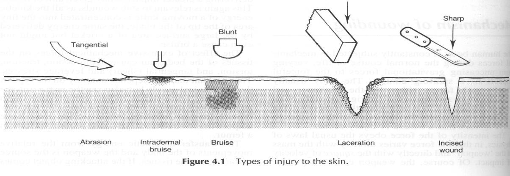
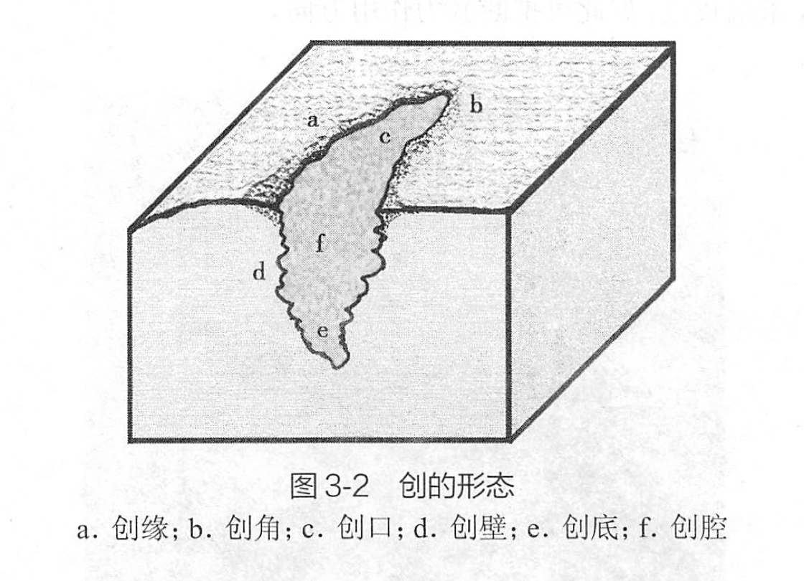

# 第三章 机械性损伤（Mechanical Injury）

## 第一节 概述

### 一、机械性损伤的概念及分类

**致伤物（force instrument）** 作用于人体引起组织器官结构、功能或代谢的异常称为 **损伤（injury）**。由机械性暴力造成的机体损伤称为 **机械性损伤（mechanical injury）**。

按致伤物的性状分类 force instrument | 按损伤时间分类 time | 按损伤性质分类 manner of injury
:---: | :---: | :---:
钝器伤（blunt） 锐器伤（sharp） 火器伤（firearm） | 生前伤（ante-mortem） 濒死伤（peri-mortem） 死后伤（post-mortem）| 自杀伤（suicide） 他杀伤（homicide） 意外或灾害伤（accident） **造作伤（artificial）**

### 二、机械性损伤的形成机制

机械性损伤形成机制可应用 **物理学** 和 **生物学** 的有关知识来解释。

#### （一）影响机械力作用的物理学因素

- 致伤物的质量（$m$）
- 运动的速度（$v$）
- 作用时间（$\Delta t$）
- 作用面积（$S$）

#### （二）人体组织器官的结构特性和反应性

生物力学研究证实，人体各种组织具有不同的抗压力、抗拉力、抗冲撞力和抗剪应力。人体组织均具有反应性、弹性和收缩性，这些是活体组织所共有的特性。

## 第二节 机械性损伤的基本形态

### 一、以形态、结构改变为主的损伤

#### （一）擦伤（abrasion）

擦伤是指 **表面粗糙的致伤物** 与体表 **摩擦** 致表皮层或表皮层与部分真皮层剥脱和缺损，又称表皮剥脱。

##### 1. 特征

- Most superficial injury
- No vessels damaged

##### 2. 分类

根据致伤物运动方向及其作用机制的不同，可将擦伤分为以下四种类型：

- **抓痕（scratch，finger nail abrasion）**
- **擦痕（grazes，brush abrasion）**
- **撞痕（impact，crushing abrasion）**：交通事故
- **压擦痕（friction，pressure abrasion）**：缢吊

##### 3. 意义

**临床**

- 最轻伤
- 常被忽略

**法医**

- 机械性暴力证据
- 机械性暴力方向
- 感染——生前伤
- 颜色变化——损伤时间
- 分布——嫌犯目的
- 形态——致伤物

#### （二）挫伤（contusion，bruise）

挫伤是指 **钝性致伤物** 作用于人体造成 **皮内或皮下血管破裂** 引起以皮内出血（intradermal hemorrhage）或皮下出血（subcutaneous hemorrhage）为主要改变的闭合性损伤。

##### 1. 特征

- 挫伤（bruise）
  - 皮下（intracutaneous）
  - 皮内（subcutaneous）
- 表皮剥脱（abrasion）
- 局部肿胀（swelling）
- 炎症反应（inflammation）

> **问**：如何鉴别挫伤（contusion）与尸斑（liver mortis）？

颜色变化 | 损伤时间推断
:---: | :---:
红 | 短期
蓝 | 1～4 天
绿 | 4～7 天
黄 | 7～10 天
正常 | 14～21 天

##### 2. 意义

**临床**

- 局限性挫伤——非致命伤
- 弥漫性挫伤——外伤性休克/急性肾衰竭
- 外伤轻，内伤重
- 严重内伤可能被忽视——危险

**法医**

- 机械性暴力证据
- **生前伤**
- 颜色变化——损伤时间
- 分布——嫌犯目的
- 形态——致伤物

#### （三）创（wound）

创是指由较大的暴力致 **皮肤全层和皮下组织如肌肉、血管、神经断裂或内脏器官被膜破裂** 等。

##### 1. 特征

- 创缘（edge）
- 创角（angle）
- 创口（slit）
- 创壁（wall）
- 创底（bottom）
- 创腔（cavity）
- **组织间桥（tissue bridge）**

##### 2. 分类

钝器伤 | 锐器伤 | 火器伤
:---: | :---: | :---:
撕裂创（tear） 挫裂创（laceration） 捅创（poking） | 切创（cut） 刺创（stab） 砍创（gash） 剪创（scissors）  | 枪创（GSW） 爆炸创（explosion）

**挫裂创与锐器创的鉴别**

--- | 挫裂创 | 锐器创
--- | --- | ---
**形状** | 不规则，常呈星芒状、波浪状 | 常呈线状、纺锤状，与皮纹有关
**创缘** | 锯齿状，常伴擦伤、挫伤，出血较少 | 光滑、不一定伴有擦伤、 挫伤
**创壁** | 凹凸不平 | 平滑
**创角** | 多圆钝，常有撕裂 | 多尖锐
**创腔** | 较浅，有组织间桥 | 较深，无组织间桥

##### 3. 意义

**临床**

- 易感染（及时处理）
- 注意异物残留

**法医**

- 推断机械性暴力致伤物种类
- 伤口异物残留——确认机械性暴力致伤物种类
- **特殊场所——案件性质**
- 致命伤

#### （四）骨折（fracture）与脱位（dislocation）

机械性暴力作用下，造成骨组织解剖结构的完整性和连续性的破坏称骨折。

##### 1. 特征

- 局部肿胀
- 形态异常
- 运动异常
- 骨擦音
- 并发脱位

##### 2. 意义

**临床**

- 诊断
- 治疗
  - 复位
  - 手术

**法医**

- 机械性暴力证据（直接/间接）
- 推断机械性暴力致伤物种类
- 机械性暴力机制

#### （五）内脏破裂（rupture of viscera）

**外界暴力** 致人体内脏器官解剖学结构完整性的破坏称内脏破裂。内脏破裂是 **机械性损伤的常见死因之一**。

##### 1. 特征

- 巨大暴力
- 致命伤

##### 2. 意义

**临床**

- 致命伤
- 紧急事件
- 易忽视（钝器伤、刺创）

**法医**

- 致命伤——尸体
- 功能障碍——幸存者

#### （六）肢体断离（amputation）

巨大暴力作用使人体躯干、四肢遭受到严重的破坏和离断称肢体断离。肢体断离多见于 **交通事故、爆炸、建筑物倒塌、高坠（如飞机失事）等** 所致的多发伤、复合伤，多为撕裂伤、挫裂伤和骨折等多种损伤的组合。肢体断离也可见于死后 **碎尸**、水中尸体螺旋桨损伤等。

- 碎尸（shattered cadaver）
- 他杀（homicide or artificial）
- 意外（accident case）：交通事故、爆炸等

### 二、以功能改变为主的损伤

#### （一）神经源性休克（neurogenic shock）

神经源性休克是指机体某些部位的神经末梢对机械性暴力的作用非常敏感，受到打击时可引起严重的反射性自主神经功能紊乱，出现休克并可迅速死亡。人体的太阳神经丛喉返神经分布区、颈动脉窦区、外阴部和肛门直肠部等属此类敏感区，也称 **触发区（trigger regions）**。

#### （二）震荡伤（concussive injury）

## 第三节 机械性损伤的类型

### 一、钝器伤（blunt instrument injury）

- 多种损伤并存
- 表里不一

#### （一）徒手伤

#### （二）咬伤

#### （三）棍棒伤（stick injury，rod-like weapon injury）

**竹打中空**：铁轨样挫伤（train-line/railway-line bruise）

#### （四）砖石伤

#### （五）挤压伤（crush injury）

挤压综合征（crush syndrome）

#### （六）坠落伤（injury due to fall from height）

- 外轻内重
- 多种损伤并存，广泛而严重
- 远离着地部位损伤可更严重
- 多发骨折力的方向一致
- 一次性暴力作用可以解释所有损伤
