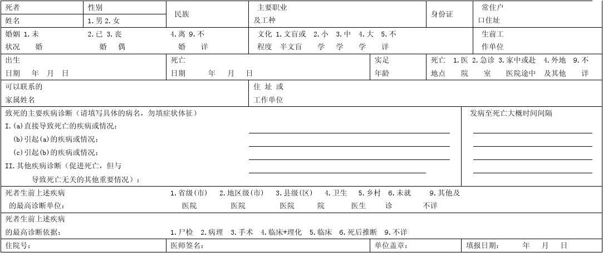

# 第一章 绪论

> **关于教材**：《法医学（第二版）》

## 案例

- 沈某，男，1930 年 11 月出生。2010 年 10 月 30 日沈某骑电动三轮车发生交通事故受伤。
- 医院诊断：股骨颈骨折。
- 处理：11 月 3 日上午行股骨颈骨折人工髋关节置换术。
- 当日下午死亡。
  - 交通事故损伤死亡？
  - 判罪量刑？死者家属经济赔偿？
- 《刑事法》第 233 条：「**过失** 致人死亡的，处三年～七年有期徒刑；情节较轻的，处三年以下有期徒刑。」

> 心肌散在瘢痕，心肌肥大  
> 肾小球萎缩，炎症细胞浸润，小动脉管壁增厚

- 心：重 430克。左心室肥厚，心肌切面灰白色瘢痕；左 CA 主干及左前降支 IV 级狭窄，右 CA 主干 IV 级狭窄、严重钙化
- 肺：两肺切面淤血，右肺胸膜增厚，两肺上叶肺气肿  
- 肝、脾、胰、胃（-）  
- 左右肾表面高低不平，呈细颗粒状
- 脑：硬脑膜、蛛网膜下腔（-）；脑底血管硬化；大脑、小脑及脑干切面（-）

* **分析说明**：沈某系老年男性，生前患有严重的冠心病，2010 年 10 月 30 日因道路交通事故所致股骨骨折等损伤，为非致命伤；但该损伤及伤后手术创伤，对其原有心脏疾病的发展、恶化有促进作用。因此，沈某主要死因为冠心病，道路交通事故损伤（股骨骨折等）为辅助死因。
* **鉴定意见**：沈某 **主要死因** 为冠心病，道路交通事故损伤为 **辅助死因**。

### 补充说明

- 本案例中，沈某系老年男性，生前患有严重冠心病；此次因交通事故所致损伤虽然为非致命伤；但该损伤及临床手术治疗的创伤，对其健康状况造成较大的影响，致使其原有疾病急速恶化，并最终导致死亡。
- 因此，我们认为，沈某交通事故损伤在其死亡原因的参与度约为 40%。

---

## 法医学（forensic medicine，legal medicine）

法医学是研究人体死亡、损伤及个人识别等相关问题，并为司法实践提供科学证据的医学科学。

### 法医学研究的对象及内容
- 尸体的鉴定（死亡原因、方式、时间；致伤物推断、损伤时间推断等）
- 活体的鉴定（损伤程度鉴定——判罪量刑；伤残等级评定——民事赔偿；精神状态等）
- 人体生物源性物证的鉴定（血痕、精斑、骨骼、毛发等）——个人识别、亲子鉴定
- 毒（药）物鉴定等

## 法医学分支学科

### 法医病理学（forensic pathology）

研究与法律有关的人身伤亡发生发展规律的法医学分支学科。

1. 死亡的发生发展过程、表现及影响因素；
2. 死亡的机制；
3. 不同原因死亡尸体的病例组织学变化特征、各种生物学活性物质表达特点；
4. 死后尸体物理性与化学性变化的规律及其法医学意义；
5. 死亡于损伤、中毒和疾病的关系等。

### 法医临床学（clinical forensic medicine）

是应用临床医学和法医学理论和技术，研究并解决与法律有关的人体伤、残及其他生理病理状态等问题的法医学分支学科。

- 损伤程度
- 伤残等级、劳动能力、生理功能
- 损伤时间、损伤方式、致伤物

### 法医物证学（science of medicological physical evidence）
对涉及法律问题的生物性检材进行检验，解决个人识别（personal identification）和亲权鉴定（identification in disputed paternity）问题的法医学分支学科。

### 法医毒理学（forensic toxicology）

是研究与法律有关的由毒物所致机体生理、病理损害过程的法医学分支学科。

- 毒物如何进入人体？如何代谢？
- 毒物对人体的作用？表现？
- 体内的毒物与死亡的关系？

### 法医毒物分析（forensic toxicological analysis）

研究与法律有关的毒物的分离提取定性、定量的法医学分支学科。

- 生物学检材是否有毒？
- 何种毒？
- 含量？

### 法医精神病学（forensic psychiatry）

研究与法律有关的人类精神疾病和精神状态的法医学分支学科。

- 被鉴定人是否有精神疾病？事件发生时精神状态？有无责任能力？在押人员有无精神异常？是否符合刑罚减免或保外就医？
- 被害人/证人有无精神异常？证词的法律效力？
- 公民精神状态？行为能力如何？

## 法医学的工作任务

- 为刑事案件的侦査、审理提供医学证据
- 为群体性事件的处理提供医学依据
- 通过科学研究促进医学发展
- 为医药卫生实践与立法提供科学依据

##　医学生学习法医学的意义
- 医学证据的保全（病史记录及物证）
- 死亡的确认
- **诈病（伤）simulation 与造作病（伤）artificial injury 的识别**
- 医疗纠纷的预防及处置
- 参与鉴定

## 法医学与医学及其他学科的关系

- 验伤单、病史资料（门急诊病史、出院小结、手术记录等）
- 物证/检材（体内取出的异物、呕吐物、血样、尿液等）的提取与收集
- 居民死亡证明书

# 法医学鉴定

法医学鉴定是指法医应用法医学理论与技术，以人体及来源于 **人体的生物学检材** 等为鉴定对象，解决与法律有关的人身伤亡、生理或病理状态及其他专门性问题并做出判断性意见的科学活动。

## 法鉴定人的条件

- 具有专业知识和技能
- 自然人（对鉴定意见负责）
- 与案件没有利害关系（中立）

### 我国现行的法医鉴定人

- **司法机关内设置的从事法医学鉴定的人员（公、检、法）。**
- 在司法行政管理部门注册，取得了执业资格和鉴定资格，在司法鉴定机构从业的人员。

## 司法鉴定的基本原则

### 鉴定原则

- 依法鉴定
- 客观鉴定
- 独立鉴定
- 保密原则

### 鉴定程序

- 鉴定委托、受理；
- 了解案情；
- 检查（现场勘查——必要时）；
- 制作鉴定文书。

## 鉴定文书

- 司法鉴定意见书
- 补充鉴定
- 重新鉴定

# 法医学简史

## 国内发展情况

- 张举烧猪（三国吴末公元 253 ~ 280）
- 宋慈（宋 1186 ~ 1249）《洗冤集录》公元 1247
- 「事莫大于任命，罪莫大于死刑，杀人者抵法故无恕，施刑失当心则难安，故成指定狱全凭死伤检验。倘检验不真，死者之冤未雪，生者之冤又成，因一命而杀两命数命，仇报相循惨何底止。」
- 1913 年颁布《解剖规则》
- Established in China in the 1930s, pioneered by Professor Lin Ji (1897 ~ 1951)
- 1950 年卫生部颁布《解剖尸体暂行规则》
- 1950 年南京中央大学「法医学师资班」
- 1979 年部分院校开设法医学专业
- 1984 年招收法医学本科生

## 国外发展情况

- 公元前 44 年，罗马医生 Antistius 检查了凯撒尸体，发现 23 处刺创
- 认为：第一、二肋间的刺创是致命伤

### Italy

- 1249 年外科医生 Hugo de Luca 向 Bologna 法院出具一份医学证明书
- 1302 年 Bartolomeo de Varignana 应 Bologna 法院要求对一例疑为中毒死亡的尸体进行解剖
- 1394 年在 Pavia 法庭尸体检验制度建立
- Galen 1500 A.D. described difference between lung tissue before & after birth
- 1561 A.D. - Sonnenkalb in Saxony introduced hydrostatic test for live birth

### Germany

- 1532 年 Emperor Charles 5th 颁布「Constitutio Criminalis Carolina」
- Injury to the person, infanticide, suicide, procured abortion, concealed & pretended pregnancy, medical malpractice, simulated diseases
- Allowed opening of bodies for investigation
- 1782 A.D. - 1st medicolegal journal "Magazine fur die Gerichtliche Arzeneikundeund Medicinische Polizei"
- 1985 - Alec Jeffery, Leicester University - DNA fingerprinting
- After 2000 - Virtopsy project of the Institutes of Forensic Medicine, Diagnostic Radiology & Neuroradiology at the University of Bern, Switzerland

## 法医学发展及展望

- 法医分子病理学（组学、分子生物学等）
- 法医毒物学（毒理 + 毒化 + 病理）

交叉学科广泛应用，疾病诊断技术、遗传物质提取检测及化学物质分析技术使法医学得到迅猛发展，尤其在个人识别、毒药物检测方面的应用，现在的关键是 **快速检测、提高效率**

---

# 小结

- 法医学及其主要分支学科的概念和研究对象、内容
- 临床医学生学习法医学的意义
