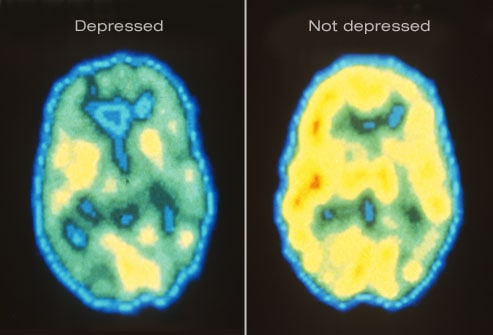

# 抑郁症

> 「日出而作，日落而息」，人们起居、工作、饮食、睡眠，每日循环往复，这看起来再平常不过的事。而对于我国超过 9500 万抑郁症患者而言，睡眠并非如此简单。他们可能无法轻松应对日常生活，面对罪责感和无望感，享受与朋友在一起的闲暇时光，作出简单的决定，沉浸于个人爱好，上班工作……
>
> 抑郁症是中国首要的心境障碍之一。如果不治疗，其症状及严重程度将随着时间逐渐加重。
>
> 但是，抑郁症并非绝望无光。重型抑郁发作是可被治愈的疾病。如今，抑郁症有许多治疗手段，而其治愈的关键在于早发现、早诊断、早治疗，并且选择合适病情的治疗手段。
>
> 社会为抑郁症患者提供了各项免费的健康教育、信息资源、社会支持。
>
> ——「你并非一个人，我们都可以帮助你。」 

## 什么是抑郁症？

**抑郁症**是一种以抑郁心境和兴趣丧失或缺乏愉快体验为主要特征的 **心境及情感障碍**。

大部分人都曾有悲伤或抑郁的情绪，它们是对于应对生活中失落感和挫败感的普通反应。但是持续发生的严重的悲伤情绪——包括无助感、绝望感、无价值感和过度的罪恶感等，并且影响到了您的社会功能，那可能就不仅仅是悲伤情绪这么简单了。你可能正在经历抑郁发作，一种可治疗的临床疾病。

> 上图为大脑 PET 扫描图像，左图为抑郁发作患者的大脑活跃水平，由于为无抑郁症人群的大脑活跃水平。

## 抑郁症症状

根据《精神疾病诊断与统计手册（第五版）》（Diagnostic and Statistical Manual of Mental Disorders，DSM-5）重型抑郁发作的诊断标准，在连续的 2 周内存在下述症状中的 5 项（或 5 项以上），并且较以前的功能有所变化；其中至少 1 项症状是抑郁心境或丧失兴趣或愉快感。

1. 几乎每天大部分时间都心境抑郁，这可来自病人的主观述说（如感到悲伤或空虚）或他人的观察（如流泪）。
2. 几乎每天大部分时间对所有或几乎所有活动兴趣或愉快感明显降低（来自主观描述或他人的观察）。
3. 没有节食而体重却明显下降，或者体重增加（如一个月内体重变化超过 5%），或者几乎每天都有食欲减退或增加。
4. 几乎每天都有失眠或睡眠过多。
5. 几乎每天都有精神运动性激越或迟滞（他人可观察到，不仅仅是病人主观感到坐卧不安或迟缓）。
6. 几乎每天都感到疲乏或精力缺乏。
7. 几乎每天都有无用感，或过度或不合理的内疚感（这可能是妄想，不仅仅是由于生病而自责或内疚）。
8. 几乎每天都感到思维能力或集中注意的能力降低，或者犹豫不决（来自主观感受或他人的观察）。
9. 反复想到死亡（不仅仅是恐惧死亡），反复出现自杀观念但无具体的计划，或有自杀的企图，或有自杀的具体计划。

这些症状十分普遍，并非所有抑郁症患者都有同样的症状。症状的严重程度、发生频率和持续时间都可能不同。

上述症状也可能规律性发生。例如，抑郁发作可能表现出季节性特点（曾称为 **季节性心境障碍**）。

由于与抑郁相关的大脑神经递质，尤其是血清素和去甲肾上腺素，都在不仅在情绪控制上起作用，也在疼痛相关机制中发挥作用。所以，抑郁症患者的躯体表现并不少见，其中包括关节痛、背痛、消化不良、睡眠障碍和食欲改变等，同时可能有活动和反应的缓慢和迟滞等。

## 儿童与抑郁症

儿童抑郁症与一般抑郁心境或一般日常情感不同。如果您的孩子感到悲伤，不等同于他患有抑郁症。仅当悲伤情绪持续不缓解时考虑抑郁症。影响日常社会生活、兴趣爱好、学校课业或家庭生活的干扰性行为可能是抑郁症的信号之一。

## 青少年与抑郁症

许多青少年会感到悲伤或情绪化。当悲伤情绪持续 2 周以上或伴有其他抑郁症症状时，应当考虑抑郁症。朋友和家人关系疏远、学习成绩的突然下降及酒精或药物滥用都可能是抑郁症的信号。此时应当寻求医生的帮助。通过治疗，可以帮助青少年在成长过程中免受抑郁症的侵扰。

## 抑郁症病因

抑郁症的病因尚未明确。目前认为，抑郁症是多种因素共同作用的结果，包括：

- **大脑结构**：抑郁症患者的大脑结构可能较一般人不同。
- **神经递质**：脑内的称为神经递质的化学物质能够起到调节情绪的重要作用。抑郁发作时，可能存在神经递质功能异常。
- **激素**：妊娠、产后、甲状腺疾病、绝经期或其他原因都可能导致激素水平的变化。其可能为抑郁症状的诱因。
- **基因**：研究者尚未确定抑郁症责任基因，但亲属患抑郁症的人群患抑郁症的几率高于一般人群。

## 抑郁症伴发症

抑郁症患者常伴发其他躯体或心理疾病，例如焦虑障碍、惊恐障碍、恐惧症、物质滥用及进食障碍等。如果您或您身边的人具有抑郁症或其他精神疾病的症状，请寻求医生的帮助。

## 抑郁症和自杀

应当重视任何存在自我伤害倾向者。请不要犹豫求助在地的自杀求助热线，拨打 <a href="tel:021-12320-5">021-12320-5</a> （上海 24 小时免费心理危机咨询热线）。或者立即求助精神科医生。如果您存在自杀倾向或者打算自杀，请立刻去精神科就医。

- 自杀的信号包括：
- 想法或言语中包含死亡或自杀
- 想法或言语中包含自我伤害或伤害他人的意图
- 易激惹或冲动

如果您身边的人正在服用抗抑郁药物，请关注以上信号。一般地，小于 25 岁初次服用抗抑郁药物或更换抗抑郁药物剂量及种类的患者可能在第 1 周表现出自杀倾向。

## 抑郁症诊断

为明确抑郁症诊断，医生可能进行如下检查：

- **体格检查**：医生将进行一般健康检查以排除其他疾病。
- **实验室检查**：例如抽血进行相关激素水平检查。
- **心理测量**：医生将关心患者的心理健康状况并询问相关情感、感受或行为习惯等。同时可能进行量表评估。
- **根据《精神疾病诊断与统计手册（第五版）》（Diagnostic and Statistical Manual of Mental Disorders，DSM-5）诊断**：手册列举了抑郁症的诊断标准。医生将根据患者实际状况依照 DSM-5 标准进行诊断。

## 抑郁症治疗

如果您或您身边的人符合抑郁症症状，请寻求精神科医生的帮助。他们可以对情况作出评估并给予相应的治疗。

医生会根据症状及其严重程度给予相应的治疗，可能包含下述中的一项或多项治疗手段：

- **药物治疗**：抗抑郁药物治疗（作为综合治疗的一部分）对大部分抑郁症患者有效。抗抑郁药物种类繁多，在明确最适药物前可能需要尝试多种药物，且可能考虑两种抗抑郁药联合使用。医生可能根据具体情况给予相关辅助药物，包括情绪稳定剂、抗精神病药物、抗焦虑药物或神经兴奋剂。
- **心理治疗**：对于抑郁症及其他心理问题有规律地寻求心理治疗师的帮助，包括认知行为治疗（cognitive behavioural therapy，CBT）和谈话治疗等。
- **住院治疗**：如果认为抑郁症已经使生活无法自理，或可能存在伤害自己或他人的倾向，患者可能需要住院治疗。
- **电休克治疗（Electroconvulsive therapy，ECT）**：通过电流刺激大脑使神经递质功能恢复正常。一般地，电休克治疗并非首选治疗手段，仅在抗抑郁药物无效或因其他原因无法服用抗抑郁药物时考虑。
- **经颅磁刺激（Transcranial magnetic stimulation，TMS）**：一般地，尽在抗抑郁药物治疗无效时考虑。通过线圈向大脑发出磁脉冲，刺激神经细胞调节情绪。