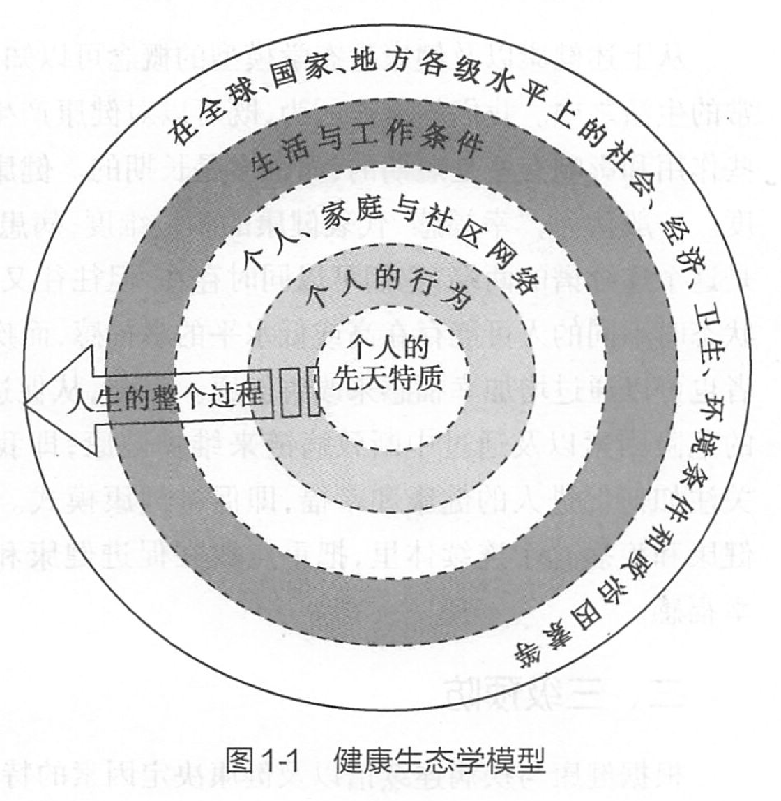
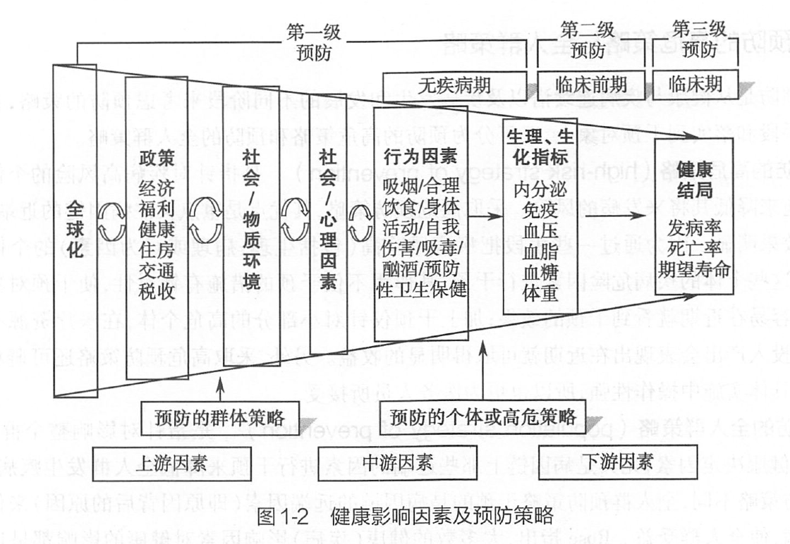
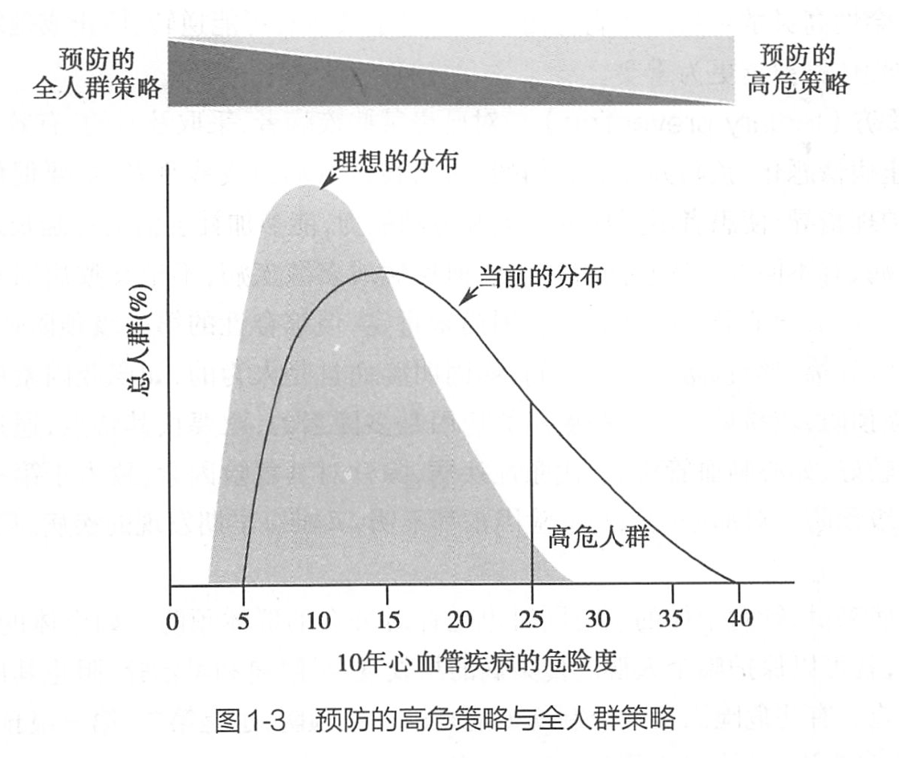
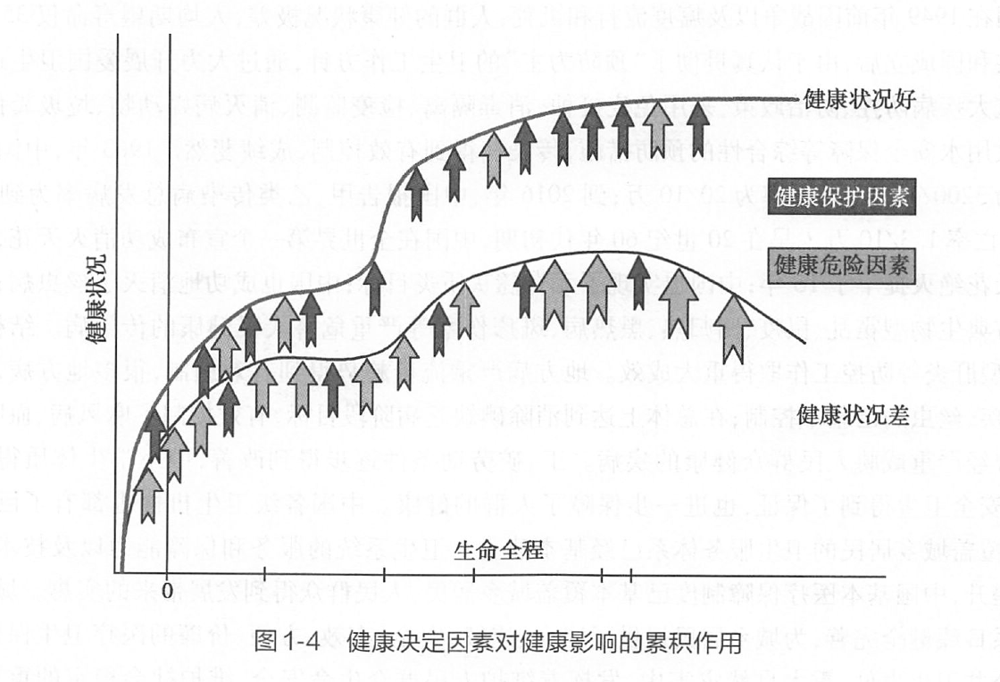

# 第一章 绪论

## 第〇节 学习预防医学的意义

### 案例1

- 李某：男，49 岁，公司经理。在一次商务会议上，突然手捂胸部跌倒在地，45 分钟后被送进了急诊室。心电图显示前导联 ST 段压低 3 毫米，随即进行溶栓治疗，但病情发展为室颤，抢救无效而死亡。
- 家人和单位员工无比悲痛，社会各界也无比惋惜
- 尸检发现：这位病人的血胆固醇高达 356 mg/dL，心脏的左总和前降支有大块血栓。
- 据家人介绍：该病人近几年体重持续增加，吸烟量也越来越多，但其它方面看起来倒挺健康。他的父亲和叔叔均早死于无预兆的心脏病。该病人成年后只看过三次医生，主要是为了治疗因间断性的慢跑所致的关节扭伤，在医生的记录中只注明了关节扭伤，但未提及病人的吸烟史、家族史、饮食习惯及体力活动较少等问题，病史中无有关病人血胆固醇水平的纪录。

#### 上述案例的特点
- 即病人所经历的疾病或死亡都是在生命的早期可以进行有效预防的。在发生疾病（如冠心病）的几个月、几年或几十年以前就可发现有一定的危险因素或亚临床疾病状态，但都没有得到很好地检查和干预治疗。

### 儿科医师刘晓琳与大头娃

- 儿科主任医师刘晓琳，值班时发现一个现象，前来看病的患儿中有许多头比较大，化验结果显示：他们都有明显的低蛋白血症。
- 逐例询问后，刘晓琳发现这些孩子都是留守儿童，由爷爷奶奶人工喂养奶粉，所用奶粉价格都只有正常奶粉价的一半。但孩子每月吃的奶粉量是足够的。
- 鉴定结果让刘晓琳大吃一惊：蛋白质含量仅 2%，只有国家规定的 1/8，还不如米粉的营养价值!
- 最后经国务院联合调查组公布的结果是阜阳市 2003 年 5 月以后出生、以奶粉喂养为主的婴儿共有 189 例有营养不良，其中 12 例「大头娃娃」死亡。
  - 典型病例：2003 年 8 月 7 日某女婴（出生 130 天）送进阜阳医院，入院时严重的营养匮乏，肝肾功能中毒衰竭，伴发肠炎性皮炎，局部溃烂。2003 年 8 月 13 日女婴死去。
- 原因是：不法分子用淀粉、蔗糖替代奶粉，再加奶香精进行调香，制作成劣质奶粉所致。

### 2008 年手足口病首报者

- 2008 年 3 月 28 日，阜阳市人民医院儿科主任刘晓林在连续发现患儿死亡事件。两个患儿接踵死亡，病情进展迅速，只来得及给其中一个孩子拍了胸片。胸片和血象检查都像「肺炎」，可进展这么快的肺炎还是第一次见到。
- 两个孩子两肺满布湿音，口吐粉红色泡沫痰，是典型的肺水肿、左心衰表现。
- 肺炎应该引发右心衰，为什么孩子却死于左心衰?刘医生 意识到这不是普通肺炎，她迅速向 CDC 汇报，引起了阜阳市及安徽省卫生部门高度重视。经过国家和省市专家的连续奋战，4 月 23 日正式明确了病因是肠道病毒 71 型感染引起的手足口病。
- 全国各地相继开始报告病例。许多原先被误诊的孩子，又从死神手中抢了回来。

### 临床医生在保护人群健康的作用

- 作为公共卫生突发事件的第一报告人、疾病监测的前哨、以及日常各种个体化预防服务和疾病管理服务的提供者，在保障公众健康中起到非常重要的作用（vital role）。

### 「张爸」火了，搞科普需要硬核大白话

---

> **教学目的**

> 通过对非预防医学专业预防医学的学习，培养学生牢固树立预防医学的观念，掌握预防医学的基本知识和技能，使其成为既能诊治病人，又能开展个体化的临床预防服务和群体的社区预防服务，同时又具备一定医学科研能力，和全心全意为社区居民健康服务的医学毕业生，从而满足我国 21 世纪卫生事业发展和实现「人人享有卫生保健」的人才要求。

> **基本要求**

> - 全面理解预防医学的定义、基本观念及特点；
> - 掌握环境、行为方式与健康的关系和健康生态学模型，以及三级预防的策略；
> - 在实际工作中开展临床预防服务的基本技能；
> - 社区环境有关常见疾病防制的基本理论和方法；
> - 了解卫生系统的功能以及保障提供安全有效卫生服务的要素。

> **《预防医学》（第七版）课程设置**

> - 人群健康研究方法
> - 临床预防服务
> - 社区预防服务
> - 卫生服务体系与卫生管理

---

## 第一节 预防医学概念与健康生态学模型

> **本讲：目的要求**
> - 掌握预防医学和 **健康的基本概念**、健康的决定因素及 **健康生态学模型**、以及三级预防策略;
> - 以「环境-人群-健康」这一「生态健康模式」为主线，理解健康观，健康影响因素与健康的关系，生命全程健康观、预防策略的实施原则。

### *一、预防医学的定义、特点和内容

预防医学（preventive medicine）是医学的一门应用学科，它以个体和确定的群体为对象，目的是保护、促进和维护健康，预防疾病、失能和夭折。

#### （一）预防医学的特点

##### 1. 思维的整体性

强调应用系统论的思维方式，把人的健康及其决定因素作为一个整体来认识，提供以人为本的一体化服务。

##### 2. 服务的针对性
针对个体和特定的群体开展预防工作。

- 个体：既包括来看病的病人，也包括一般的健康个体。
- 特定群体：可以是地理区域来界定的群体，某一健康问题如慢性病病人的群体，某一生物学特征如儿童、妇女、老年人等群体，某一经济状况如贫困群体等。

##### 3. 措施的主动性

主动防患于未然。

- 增权（empowerment）：能掌控自身健康的主动权。

#### （二）预防医学的内容

- 流行病学
- 医学统计学
- 临床预防医学（个体服务）
- 社区卫生与环境医学
- 卫生管理

### *二、健康的概念

- WHO：
  - 「健康的身体、心理和社会幸福的完好状态，而不仅是没有疾病和虚弱。」（1948 年）
  - 「健康是日常生活的资源，而不是生活的目标。健康是一个积极概念，它不仅是个人身体素质的体现，也是社会和个人的资源。」（1986 年）
- **健康是适应和自我管理的能力。**

#### （一）健康的组成

健康是适应和自我管理的能力。

##### 1. 躯体

帮助我们完成一系列的生理功能去处理每天的事情。

##### 2. 心理

- **智力**：接受和处理信息的能力
- **情绪**：看待现实社会、处理压力、并能灵活和妥协地处理冲突的能力
- **精神**：对整个宇宙的认识、人类行为的本性，还有你服务他人的愿望

##### 3. 社会

人们发挥其潜力和承担义务的能力，即使患有一些疾病也能以某种程度的独立性来管理自己生活的能力，以及参与包括工作在内各种社会活动的能力。

- **独立**：与一个相对不成熟的个体相比，一个社会成熟的个体应具有更大的独立性和自主性。
- **人际关系**：一个社会健康个人的特点应该是具有与人建立联系并与他们合作的能力。
- **责任**：一个社会成熟的人应该敢于承担义务和责任。

#### （二）健康的作用

健康的组成是从健康的 3 个维度获取资源，并把它应用到每天的日常生活中，即健康的作用。

健康能否发挥作用，取决于：

- **个人的内在潜能**
  - **基因**
  - **健康特征**
    - 年龄相关的趋势
    - 健康相关行为、特点和技能
    - 生理学改变和危险因素
    - 疾病与损伤
    - 体内稳态的变化
    - 其他老年性疾病的症状
  - **个体特征**
    - 性别
    - 种族
    - 文化程度
    - 职业
- **功能发挥能力**
  - **环境**
    - 家和社区（人际关系）
    - 周围的人造环境和社会环境
    - 民间团体和政府（政策与服务）

健康是一种追求和实现愿望、满足需求和改变或处理环境的能力，从而成为追求幸福的资源。  

健康是一个人使用与健康的各个维度联系的 **内在潜能和外在资源**，从而充分地参与到对生命过程有益活动的能力反映，最终目标是当人们评价自己一生过程的时候觉得幸福。

**健康不仅是医学问题，更是一个社会问题。**  

**健康**

- 是人类的一项基本需求和权利，也是社会进步的重要标志和潜在动力。
- 是「人类生存和发展的基本要素」
- 是促进人的全面发展的必然要求，是经济社会发展的基础条件。实现国民健康长寿，是国家富强、民族振兴的重要标志，也是全国各族人民的共同愿望。

### *三、健康决定因素及健康生态学模型

#### （一）健康决定因素

健康决定因素（determinants of health）是指决定个体、群体乃至全人群健康状态的因素。

##### 1. 社会经济环境（social and economic environment）

- **个人收入和社会地位**
- **文化背景和社会支持网络**
- **教育**
- **就业和工作条件**

##### 2. 物质环境（physical environment）

包括在生活和职业环境中的物理、化学以及建成环境。

- **物理化学和生物因素**
  - 按来源分类：自然、工业、农业
  - 按载体分类：空气、水、土壤、食物
  - 按环境分类：家庭、学校、工作场所、其他生活场所
  - 按传播途径分类：人呼吸道吸入、消化道消化吸收、皮肤渗入、咬伤
- **建成环境（built environment）**：是指为人类活动而提供的人工建造环境，如房屋和街道等建筑物，公园及其他绿化空间等。居民居住小区的建成环境成为了人们每天生活、工作和娱乐的人造空间，对促进居民养成健康的生活方式，促进身体活动和心理健康有着重要的影响。

##### 3. 个人因素（personal factors）
- **健康的婴幼儿发育状态**
- **个人的卫生习惯**
- **个人的能力和技能**
- **人类生物学特征和遗传因素**

##### 4. 卫生服务（health services）

卫生服务尤其是指维持和促进健康、预防疾病和损伤、健全的卫生机构，完备和质量保证的服务网络，一定的经济投入，公平合理的卫生资源配置，以及保证服务的可及性，对每一个人乃至整个人群健康有着重要的促进作用。

#### （二）健康生态学模型（health ecological model）

强调个体和群体健康是个体因素、卫生服务以及物质和社会环境因素相互依赖和相互作用的结果，且这些因素间也相互依赖和相互制约，以多层面上交互作用来影响着个体和群体的健康。

促进健康需要多部门互相协作、社会行动和政策支持。

特点：

1. **多重性（multiple impacts）**
2. **交互性（interaction）**
3. **多维性（multiple dimensions）**

## *第二节 预防的策略

### 一、三级预防

#### 1. 第一级预防（primary prevention）

> 指针对病因所采取的预防措施

在第一级预防中，如果在健康的有害因素还没有进入环境之前就采取预防性措施，则称为根本性预防（primordial prevention）。

- **保障全人群健康的社会和环境措施**
  - 全球性预防战略
  - 健康共治：健康融入到所有的政策
  - 环境卫生：大气、水和土壤
  - 职业卫生
  - 食品卫生
  - 市政建设与小区环境
  - 社会环境：健康的公共政策
- 针对健康个体的措施
  - 增进健康，提高抗病能力；开展健康教育，注意合理营养和体格锻炼，培养良好的行为和方式；
  - 有组织地进行预防接种，提高人群的免疫水平;
  - 预防遗传性疾病，做好婚前教育和禁止近亲结婚;
  - 做好妊娠和儿童期的卫生保健工作。

#### 2. 第二级预防（secondary prevention）

在疾病的临床前期通过采取早期发现、早期诊断、早期治疗的「三早」预防措施，以控制疾病的发展和恶化，防止疾病的复发或转化为慢性。

#### 3. 第三级预防（tertiary prevention）

- 对已患某些疾病者，采取及时的、有效的治疗措施，终止疾病的发展、防止病情恶化、预防并发症和伤残；
- 对已丧失劳动力或残废者,主要促使功能恢复、心理康复，进行家庭护理指导，使患者尽量恢复生活和劳动能力，能参加社会活动并延长寿命。

### 三、预防的高危策略与全人群策略

对不同类型的疾病，有不同的三级预防策略。

#### 1. 预防的高危策略（high-risk strategy of prevention）

- 是指针对疾病高风险的个体采取预防干预措施来降低其将来发病的风险。
- 采取高危预防策略，其优点是重点关注病因链的近端，干预针对性强和效果明显。

#### 2. 预防的全人群策略（population strategy of prevention）

- 是指针对影响整个群体的健康危险因素，尤其是病因链上那些远端的因素进行干预来降低全人群发生疾病的风险。
- 全人群预防策略干预的是病因链的远端因素（即原因背后的原因）来促进健康和预防疾病，使全人群受益。

### 四、健康的生命全程路径（life course approach to health）与以人为本的一体化服务模式（people-centered integrated care，PCIC）

#### （一）健康的生命全程路径

是一种从保证健康的生命起始，并根据整个人生各关键时期（如孕期、婴幼儿期、青少年期、成年期以及老年期）的需求，采取有针对性措施来提高健康干预有效性的策略。

它不仅是在时间上关注一个人的一生和下一代，还从生态学的视角关注群体健康的多重原因，从而通过及时的健康投资让个人和整个社会获得健康和经济的高回报。

#### （二）以人为本的一体化服务模式

是一种据居民及其家庭的健康需求来组织提供服务的模式。

- 以人为本的卫生服务（people-centered care）：让患者、家属和所在社区作为卫生服务的受益人和参与者共同参与到卫生服务决策和实施过程中，从而使他们对卫生服务体系充满信任，而同时卫生服务体系也能够以人性化和一体化的方式，根据他们的需求和偏好提供服务。
- 一体化卫生服务（integrated care，也称整合式卫生服务）：指根据健康需求，通过协调卫生系统内部各级各类卫生医疗机构，将包括健康促进、疾病预防、治疗、疾病管理康复和临终关怀等在内的各种医疗卫生服务整合在一起，为服务对象提供终生连续性的服务。

#### （三）慢性病自我管理和相互帮助模式

慢性病自我管理健康教育项目是建立共同参与型医患关系的桥梁。

## 第三节 预防医学的成就及其学习的意义

### （一）中国卫生工作面临的挑战

**「共建共享、全民健康」——健康中国建设**

- **卫生与健康工作方针**
  - 以人民健康为中心，坚持以基层为重点，以改革创新为动力，预防为主，中西医并重，把健康融入所有政策，人民
共建共享。
- **创新医疗卫生服务供给模式**
  - 建立专业公共卫生机构、综合和专科医院、基层医疗卫生机构「三位一体」的重大疾病防控机制。
  - 建立信息共享、互联互通机制，推进慢性病防、治、管整体融合发展，实现医防结合。
