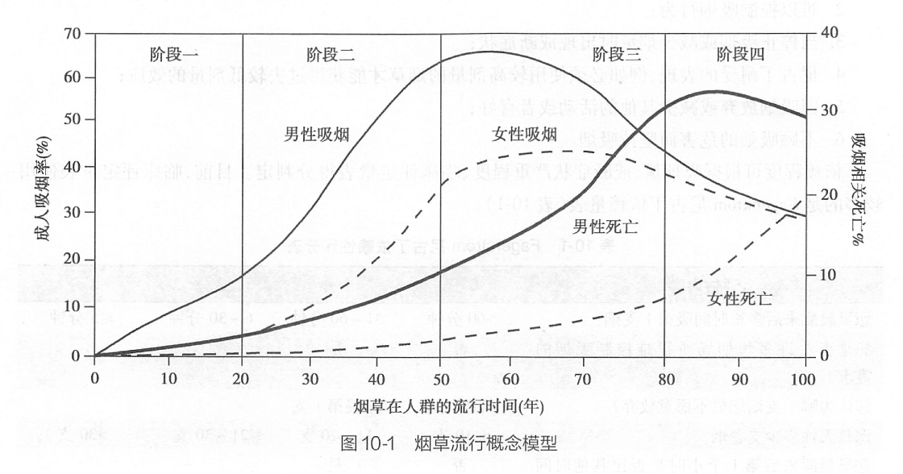

# 第十章 烟草的控制

## 第一节 吸烟的危害

### 一、烟草的类型及主要的有害成分

> **背景**
>
>「医生吸烟就像活的烟草广告，其产生的负面作用比任何一
个烟草广告更为危险。」
>
> 美国相关医学协会要求其会员成为「无烟会员」，医院只有成为「无烟医院」才能获得营业执照。
>
> 「如果能把中国 190 万临床医生都调动起来，每人每年帮助 10 个病人戒烟，哪怕有一个能戒烟成功，将使近 100 万人今后免于死于吸烟相关疾病。哪一项临床手段，公共卫生措施能取得如此的效果！」 ——心血管专家，胡大一

> **思考**
>
> 医务人员在控烟中有哪些责任？
> 如何实施这些职责？

> 「烟草是唯一一种危害所有使用者并可造成一半使用者死亡的合法消费品。」——《牛津医学手册》，1994 年；世界卫生组织，《全球烟草流行报告》，2008年

#### 吸烟的流行病学

目前全世界每天有 13 000 多人死于烟草。  
按照该速度计算，从 2000 年到 2030 年吸烟者将从 12 亿上升到 16 亿，每年死于烟草的人数将从 490 万上升到 1 000 万；  
烟草使青少年期开始吸烟的吸烟者中半数死亡，而这些死亡者中的半数在中年丧生。

#### 烟草的两大类型

> 不存在无害的烟草制品，所有形式的烟草制品都会危害健康。

##### 有烟烟草
包括自卷烟、机器制造的卷烟、雪茄烟、比迪烟、丁香烟等。其中，机制卷烟是在全球烟草制品中占据最大份额。

- **卷烟**：内含烟丝，或经过加工并混入数百种化学物的烟草。通常附上过滤嘴。世界上96%的制造烟草产品为卷烟。
- **比地草烟**：在印度广泛流行，在烟草市场中号称自然的烟草。有一系列香味能够掩盖原有的味道。没有过滤嘴，导致焦油和尼古丁的较高含量。
- **丁香烟**：产于印度尼西亚，在市场上被称为年轻人潮流和奢侈的象征。含有多种丁香酚和香料，具有麻醉力，可以深深吸进肺部。
- **雪茄**：用烟叶卷起风干发酵的烟草制成，与一般的卷烟相比放出更多的 CO。从上个世纪九十年代开始，雪茄开始风靡全球。

##### 无烟烟草

包括鼻烟和咀嚼烟草。

- **咀嚼烟草**：烟叶中添加了甜味剂和调味剂。包括口嚼烟，散烟叶和烟卷。或称槟榔烟，是将烟草和槟榔和卷在槟榔叶中。嚼烟在印度和东南亚国家最为流行。
- **鼻烟**：分为干烟和湿烟。用口吸食或者用鼻吸入。

#### 烟草烟雾的主要成分

烟草烟雾含有 7000 余种化学成分，其中已发现数百种成分对人体有害，已明确至少有 69 种化学物是致癌物。

##### 烟草的成瘾性来源——尼古丁

美国医生协会的报告指出：

- 烟草以及其他所有形式的烟草具有成瘾性；
- 尼古丁是导致成瘾性的主要来源；
- 吸烟成瘾的药理学和其行为特点与海洛因和可卡因类似。尼古丁已被公认为是强烈的成瘾性物质。

###### 尼古丁戒断症状

- 渴望
- 易怒
- 挫败感或者愤怒
- 焦虑
- 难以集中精力
- 心律减慢
- 睡眠紊乱
- 食欲增加或者体重增大

##### 一氧化碳

血液中一氧化碳浓度升高，影响输氧功能及心血管系统，促进胆固醇储量增多，加速动脉粥样硬化。

与尼古丁协同作用，升高血压，增加心率增加了冠心病和脑卒中发生机率

##### 焦油

焦油中的致癌物
- 苯并(a)芘
- 甲醛
- 砷
- N-亚硝基降烟碱
- 氯乙烯
- 铍
- 4-(N-亚硝基甲氨基)-1-(3-吡啶基)-1-丁酮
- 环氧乙烷
- 镍
- 六价铬化合物
- 2-萘胺
- 镉
- 4-氨基联苯
- 钋-210
- 苯

#### 主流烟雾和侧流烟雾

- 主流烟雾是指当吸烟者吸卷烟时从卷烟嘴端或者烟蒂端吸出的烟雾，最终仍有部分由吸烟者呼出。
- 侧流烟雾是指从卷烟的燃烧端在两次抽吸之间阴燃时产生的烟雾，也包括从包装烟草烟纸扩散出来的烟雾。
- 吸烟者呼出的主流烟雾和侧流烟雾，与周围的空气混合，形成我们通常所说的环境烟草烟雾（environmental tobacco smoke，ETS）。

### 烟草使用对健康的影响

> 2004 年摘自《美国卫生总署报告》 的主要结论
> - 吸烟几乎伤害全身的每一个组织
> - 戒烟既有即时的也有长期的益处，降低患病风险，改善健康状态。
> - 吸焦油和尼古丁低的烟草对健康也没有任何明显的益处
> - 与吸烟有关疾病的新发现：
>   主动脉瘤，白血病，白内障，子宫颈癌，胰腺癌，肾癌，胃癌，牙周炎

#### 吸烟与肿瘤

已经有充分的证据表明，吸烟可以导致肺癌、口腔癌、鼻咽部恶性肿瘤、喉癌、食管癌、胃癌、肝癌、胰腺癌、肾癌、膀胱癌和宫颈癌。还有证据提示吸烟可以导致结肠直肠癌、乳腺癌和急性白血病。

#### 吸烟与呼吸系统疾病

吸烟对于呼吸道免疫功能、肺功能均会产生不良影响，引起多种呼吸系统疾病。有充分证据证明吸烟可以导致慢性阻塞性肺病和青少年哮喘，增加肺结核和其他呼吸道感染的发病风险。而戒烟后可以明显降低上述疾病的风险，并改善预后。

#### 吸烟与心脑血管疾病

有充分的证据说明吸烟可以导致冠心病、脑卒中和外周动脉疾病，戒烟可以显出降低这些疾病的发病和死亡风险。

#### 吸烟对于生殖系统危害

有充分的证据说明女性吸烟可以降低受孕机率，导致前置胎盘、胎盘早剥、胎儿生长受限、新生儿低出生体重以及婴儿猝死综合征。此外，有证据提示吸烟还可以导致异位妊娠和自然流产。吸烟还可以导致男性勃起功能障碍。

#### 吸烟的其它危害

吸烟可以导致髋部骨折、牙周炎、白内障、手术伤口愈合不良以及手术后呼吸系统并发症，皮肤老化。

幽门螺旋杆菌感染者可以导致消化道溃疡。

有充分证据说明吸烟可以导致牙周炎和核性白内障。

吸烟可以导致 2 型糖尿病，并且可以增加糖尿病患者发生大血管和微血管并发症的风险，影响疾病预后。

#### 二手烟的危害

「二手烟」（secondhand smoke）又称「被动吸烟」和「环境烟草烟雾暴露」，是指不吸烟者吸入吸烟者呼出的烟雾及卷烟燃烧产生的烟雾。

二手烟暴露能使非吸烟者的冠心病风险增加 25～30%，肺癌风险提高 20～30%。

即使短暂的暴露，也会导致上呼吸道损伤，激发哮喘频繁发作，增加血液粘稠度，伤害血管内膜，引起冠状动脉供血不足，增加心脏病发作的危险等。

二手烟可以导致新生儿猝死综合征，中耳炎，低出生体重等。
