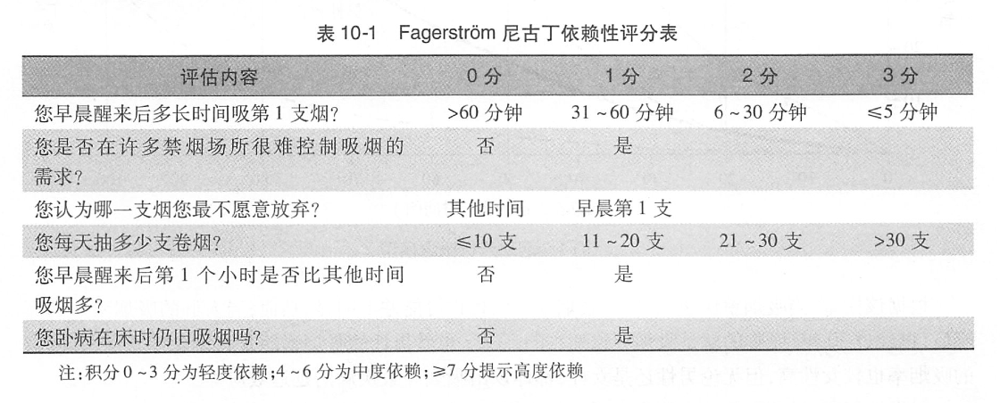
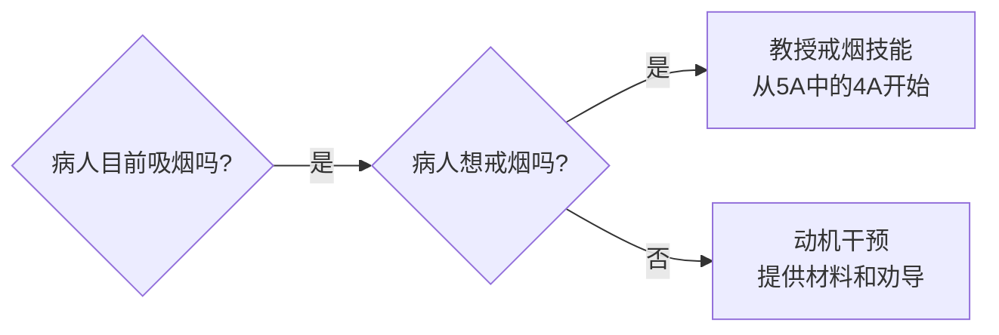
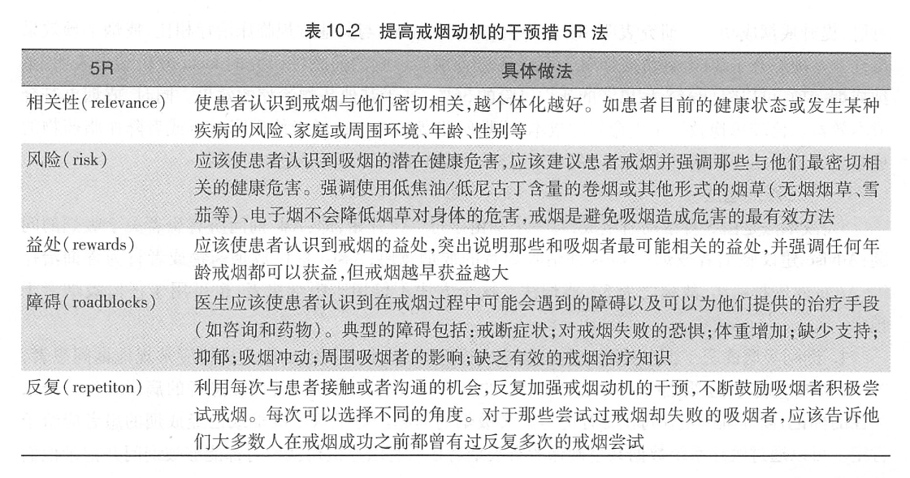
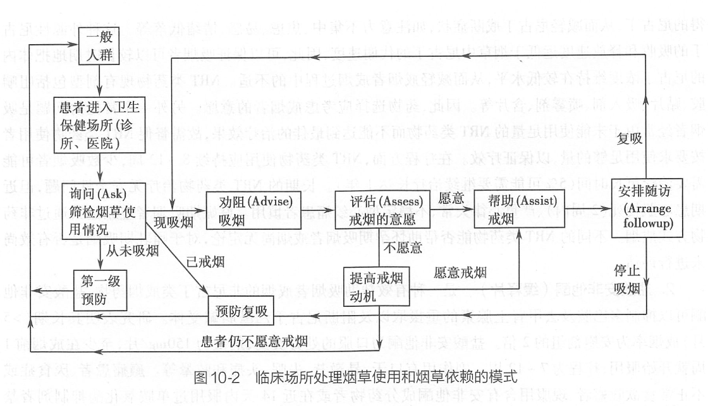
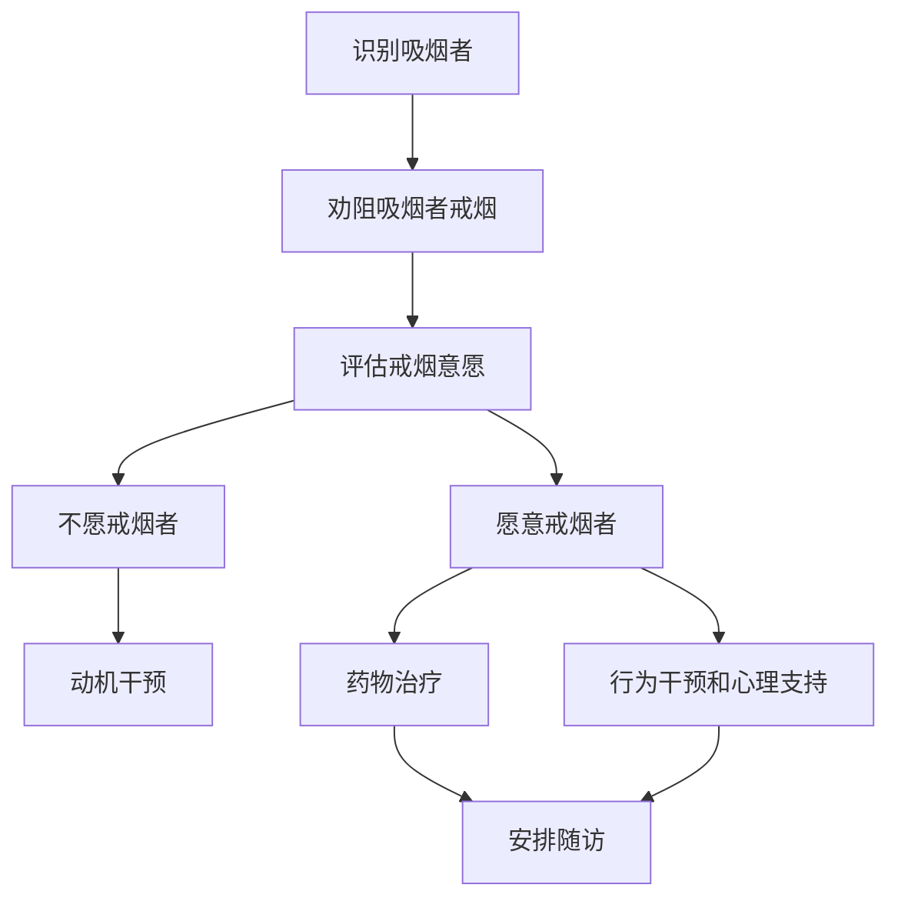
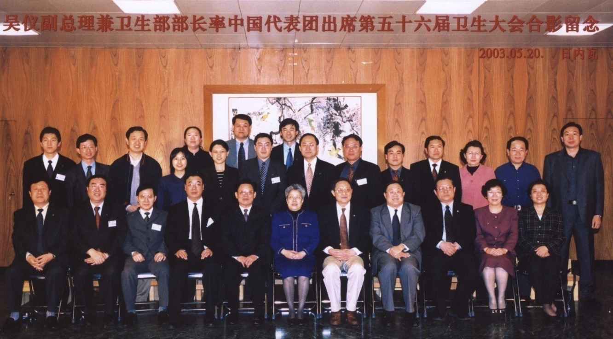
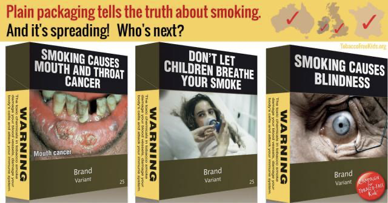

# 第十章 烟草的控制

## 第一节 吸烟的危害

### 一、烟草的类型及主要的有害成分

> **背景**
>
>「医生吸烟就像活的烟草广告，其产生的负面作用比任何一
个烟草广告更为危险。」
>
> 美国相关医学协会要求其会员成为「无烟会员」，医院只有成为「无烟医院」才能获得营业执照。
>
> 「如果能把中国 190 万临床医生都调动起来，每人每年帮助 10 个病人戒烟，哪怕有一个能戒烟成功，将使近 100 万人今后免于死于吸烟相关疾病。哪一项临床手段，公共卫生措施能取得如此的效果！」 ——心血管专家，胡大一

> **思考**
>
> 医务人员在控烟中有哪些责任？
> 如何实施这些职责？

> 「烟草是唯一一种危害所有使用者并可造成一半使用者死亡的合法消费品。」——《牛津医学手册》，1994 年；世界卫生组织，《全球烟草流行报告》，2008年

#### 吸烟的流行病学

目前全世界每天有 13 000 多人死于烟草。  
按照该速度计算，从 2000 年到 2030 年吸烟者将从 12 亿上升到 16 亿，每年死于烟草的人数将从 490 万上升到 1 000 万；  
烟草使青少年期开始吸烟的吸烟者中半数死亡，而这些死亡者中的半数在中年丧生。

#### 烟草的两大类型

> 不存在无害的烟草制品，所有形式的烟草制品都会危害健康。

##### 有烟烟草
包括自卷烟、机器制造的卷烟、雪茄烟、比迪烟、丁香烟等。其中，机制卷烟是在全球烟草制品中占据最大份额。

- **卷烟**：内含烟丝，或经过加工并混入数百种化学物的烟草。通常附上过滤嘴。世界上96%的制造烟草产品为卷烟。
- **比地草烟**：在印度广泛流行，在烟草市场中号称自然的烟草。有一系列香味能够掩盖原有的味道。没有过滤嘴，导致焦油和尼古丁的较高含量。
- **丁香烟**：产于印度尼西亚，在市场上被称为年轻人潮流和奢侈的象征。含有多种丁香酚和香料，具有麻醉力，可以深深吸进肺部。
- **雪茄**：用烟叶卷起风干发酵的烟草制成，与一般的卷烟相比放出更多的 CO。从上个世纪九十年代开始，雪茄开始风靡全球。

##### 无烟烟草

包括鼻烟和咀嚼烟草。

- **咀嚼烟草**：烟叶中添加了甜味剂和调味剂。包括口嚼烟，散烟叶和烟卷。或称槟榔烟，是将烟草和槟榔和卷在槟榔叶中。嚼烟在印度和东南亚国家最为流行。
- **鼻烟**：分为干烟和湿烟。用口吸食或者用鼻吸入。

#### 烟草烟雾的主要成分

烟草烟雾含有 7000 余种化学成分，其中已发现数百种成分对人体有害，已明确至少有 69 种化学物是致癌物。

##### 烟草的成瘾性来源——尼古丁

美国医生协会的报告指出：

- 烟草以及其他所有形式的烟草具有成瘾性；
- 尼古丁是导致成瘾性的主要来源；
- 吸烟成瘾的药理学和其行为特点与海洛因和可卡因类似。尼古丁已被公认为是强烈的成瘾性物质。

###### 尼古丁戒断症状

- 渴望
- 易怒
- 挫败感或者愤怒
- 焦虑
- 难以集中精力
- 心律减慢
- 睡眠紊乱
- 食欲增加或者体重增大

##### 一氧化碳

血液中一氧化碳浓度升高，影响输氧功能及心血管系统，促进胆固醇储量增多，加速动脉粥样硬化。

与尼古丁协同作用，升高血压，增加心率增加了冠心病和脑卒中发生机率

##### 焦油

焦油中的致癌物
- 苯并(a)芘
- 甲醛
- 砷
- N-亚硝基降烟碱
- 氯乙烯
- 铍
- 4-(N-亚硝基甲氨基)-1-(3-吡啶基)-1-丁酮
- 环氧乙烷
- 镍
- 六价铬化合物
- 2-萘胺
- 镉
- 4-氨基联苯
- 钋-210
- 苯

#### 主流烟雾和侧流烟雾

- 主流烟雾是指当吸烟者吸卷烟时从卷烟嘴端或者烟蒂端吸出的烟雾，最终仍有部分由吸烟者呼出。
- 侧流烟雾是指从卷烟的燃烧端在两次抽吸之间阴燃时产生的烟雾，也包括从包装烟草烟纸扩散出来的烟雾。
- 吸烟者呼出的主流烟雾和侧流烟雾，与周围的空气混合，形成我们通常所说的环境烟草烟雾（environmental tobacco smoke，ETS）。

### 二、烟草使用对健康的影响

> 2004 年摘自《美国卫生总署报告》 的主要结论
> - 吸烟几乎伤害全身的每一个组织
> - 戒烟既有即时的也有长期的益处，降低患病风险，改善健康状态。
> - 吸焦油和尼古丁低的烟草对健康也没有任何明显的益处
> - 与吸烟有关疾病的新发现：
>   主动脉瘤，白血病，白内障，子宫颈癌，胰腺癌，肾癌，胃癌，牙周炎

#### 吸烟与肿瘤

已经有充分的证据表明，吸烟可以导致肺癌、口腔癌、鼻咽部恶性肿瘤、喉癌、食管癌、胃癌、肝癌、胰腺癌、肾癌、膀胱癌和宫颈癌。还有证据提示吸烟可以导致结肠直肠癌、乳腺癌和急性白血病。

#### 吸烟与呼吸系统疾病

吸烟对于呼吸道免疫功能、肺功能均会产生不良影响，引起多种呼吸系统疾病。有充分证据证明吸烟可以导致慢性阻塞性肺病和青少年哮喘，增加肺结核和其他呼吸道感染的发病风险。而戒烟后可以明显降低上述疾病的风险，并改善预后。

#### 吸烟与心脑血管疾病

有充分的证据说明吸烟可以导致冠心病、脑卒中和外周动脉疾病，戒烟可以显出降低这些疾病的发病和死亡风险。

#### 吸烟对于生殖系统危害

有充分的证据说明女性吸烟可以降低受孕机率，导致前置胎盘、胎盘早剥、胎儿生长受限、新生儿低出生体重以及婴儿猝死综合征。此外，有证据提示吸烟还可以导致异位妊娠和自然流产。吸烟还可以导致男性勃起功能障碍。

#### 吸烟的其它危害

吸烟可以导致髋部骨折、牙周炎、白内障、手术伤口愈合不良以及手术后呼吸系统并发症，皮肤老化。

幽门螺旋杆菌感染者可以导致消化道溃疡。

有充分证据说明吸烟可以导致牙周炎和核性白内障。

吸烟可以导致 2 型糖尿病，并且可以增加糖尿病患者发生大血管和微血管并发症的风险，影响疾病预后。

#### 二手烟的危害

「二手烟」（secondhand smoke）又称「被动吸烟」和「环境烟草烟雾暴露」，是指不吸烟者吸入吸烟者呼出的烟雾及卷烟燃烧产生的烟雾。

二手烟暴露能使非吸烟者的冠心病风险增加 25～30%，肺癌风险提高 20～30%。

即使短暂的暴露，也会导致上呼吸道损伤，激发哮喘频繁发作，增加血液粘稠度，伤害血管内膜，引起冠状动脉供血不足，增加心脏病发作的危险等。

二手烟可以导致新生儿猝死综合征，中耳炎，低出生体重等。

### 三、烟草使用的现状及其对健康影响的特点


#### 中国的烟草使用情况

我国烟草流行水平居高不下，吸烟人群依然超过3亿。

- 男性吸烟率一直处于高平台期；女性吸烟率仍处于相对较低的水平，但是年轻女性的吸烟率有所上升。
- 2010 年总吸烟人数为 3.56 亿，较 2002 年调查结果有所上升。按照上述模型，再过 20 年，我国将进入吸烟归因死亡的高峰期。

## 第二节 吸烟的个体干预策略

### 一、烟草依赖疾病的概念

烟草依赖疾病是一种慢性高复发性疾病，其本质是尼古丁依赖。烟草依赖特点为无法克制的尼古丁觅求冲动，以及强迫性地、连续地使用尼古丁，以体验其带来的欣快感和愉悦感，并避免可能产生的戒断症状。

WHO 已将烟草依赖作为一种疾病列入国际疾病分类（ICD-10) 。

> **烟草依赖综合症**
> 1. 对吸烟的强烈渴望或冲动感；
> 2. 对吸烟行为的开始、结束及剂量难以控制；
> 3. 当停止吸烟或减少烟量时出现生理戒断状态；
> 4. 尼古丁耐受的依据，例如必须使用较高剂量的烟草才能获得过去较低剂量的效应；
> 5. 因吸烟逐渐忽视其它的快乐或兴趣，在获取、使用烟草或从其作用中恢复过来所花费的时间逐渐增加；
> 6. 固执地吸烟而不顾其明显的危害性后果，如过度吸烟引起相关疾病后仍然继续吸烟。
>
> 诊断为烟草依赖综合征需要在过去一年内体验过或表现出六条中的至少三条

> **判定尼古丁依赖的Fagerström量表**
>
> 

### 二、临床日常诊疗中的戒烟指导

**戒烟的意义**

- 戒烟才是降低吸烟对健康危害的唯一方法。戒烟可显著降低吸烟者的死亡风险。
- 戒烟可以降低肺癌、冠心病、慢性阻塞性肺病等多种疾病的患病风险。
- 戒烟可以延缓肺癌、冠心病、慢性阻塞性肺病等多种疾病的进展，改善预后。
- 吸烟的女性在怀孕前或怀孕早期戒烟，可以降低多种妊娠风险。
- 任何年龄戒烟均可获益。早戒比晚戒好，戒比不戒好。
- 戒烟时间越长，健康获益越大。

> **WHO有关戒烟的建议**
>
> - 吸烟是世界上最大的，可预防的，引起疾病和死亡的因素。
> - 戒烟15年后，肺癌死亡率降至接近不吸烟水平。
> - 最好在35岁之前戒烟。

**医生的责任**

控制烟草是医生的义不容辞的责任。

作为医生：

- 首先不吸烟
- 不能单纯治疗吸烟导致的疾病：
- 帮助患者戒烟

烟草控制是医生职业责任中无法回避的部分。

**临床干预流程**



**阶段变化理论在控烟中的应用**

$$
\begin{cases}
无打算期 \to 不愿改变现有不良行为 \to 5R动机干预\\
\left.\begin{aligned}
打算期\\
准备期
\end{aligned}\right\} \to 愿意改变不良行为 \to 提供帮助\\
\left.\begin{aligned}
行动期\\
维持期\\
终止期\end{aligned}\right\} \to 已经开始改变不良行为 \to 提供支持，解决问题
\end{cases}
$$

**医生的潜力**
- 10 万医生都采取有效的干预措施，每年可挽回 300 万新吸烟者。
- 医生对吸烟病人的干预将产生一个巨大的潜在的对公众健康的影响

#### （一）5A戒烟法

- **Ask**：询问所有患者关于吸烟的问题
- **Advise**：建议吸烟者戒烟
- **Assess**：评估吸烟者的戒烟意愿
- **Assist**：提供戒烟药物或者行为咨询治疗
- **Arrange**：安排随访

##### 1. Ask：询问吸烟情况

- 询问病人现在是否吸烟
- 询问吸烟者是否想戒烟
- 尼古丁成瘾性量表
- 每一次就诊时，常规地询问病人：「你吸烟吗？」或「你还吸烟吗？」对于吸烟的病人（或以前曾吸烟）就应在病人的病历上作一个永久性的标记。

##### 2. Advise：建议所有的吸烟者戒烟

- 告诉吸烟者「毫不犹豫地」戒烟！
- 强调戒烟的重要性
- 告知吸烟者为什么应该戒烟

**劝告的要点**

- 明确的——「戒烟对你来说是很重要的，我会帮助你。」「如果等生病才戒烟就来不及了。」
- 强烈的——「戒烟是你现在和将来维护健康所能做的最有意义
的事情。 我和其他医务人员将帮助你。」
- 个性化的——对病人进行戒烟劝告时，考虑病人的健康情况、社会和经济费用、戒烟意愿、对家庭中其他成员的影响等。

**抓住可教育的时间**
- 发生与吸烟有关的疾病；
- 肺功能检查；
- 出现高血压；
- 亲友患有和吸烟有关的严重疾病。

##### 3. Assess：评估吸烟者的戒烟意愿

- 询问每一位吸烟者在这段时间（比如在以后的 30 天内）是否愿意戒烟。
- 评价病人的戒烟意愿：如果病人在这段时间准备戒烟，则和他们达成戒烟共识，制定戒烟计划。

> **问题**：如何结合健康信念模式，强化吸烟者的戒烟意愿？
>
> **HBM中的基本概念**
>
> - 威胁
>   - 自觉疾病的易感性（如可能患癌症）
>   - 自觉疾病的严重性（ 如死亡）
> - 结果的预期
>   - 自觉特定行为的益处
>   - 自觉执行行为的可能障碍
> 自我效能



#### 4. Assist：帮助患者戒烟

##### 帮助病人制定戒烟计划

- 确定一个戒烟日——理想的是将戒烟日确定在两个星期内。
- 告诉家人、朋友和同事自己准备戒烟，并请求他们的理解和支持。
- 思考戒烟可能面临的挑战（ 特别是最初的几个星期内）。
- 去除环境中的烟草。在戒烟之前，避免在久留地方（如工作场所、家里、汽车里）吸烟。

##### 提供咨询（解决问题）

- 提供治疗内的社会支持
- 帮助病人获得治疗外的社会支持
- 推荐药物治疗
- 提供戒烟指南和其它戒烟资料

#### 5. Arrange：安排随访

当病人知道要检查他们戒烟的进展时，其戒烟成功的机会将会提高。

- 在戒烟的最初两周内加强同病人的联系。随访包括对病人戒烟进展的评价，对问题的讨论等。
- 继第一次的访问后医生或工作人员在 1～2 月内需进行第二次随访。对于谢绝随访的病人，通过电话或信件的联系。

##### 工作程序的调整

- 发现所有吸烟的病人：当病人被确定为吸烟者时，在吸烟病人的病历卡上应用明显的方式作出记号；
- 在病历卡上贴上一张戒烟流程卡，这样可以让整个团队方便地了解病人目前吸烟的状况，以及当病人每次就诊时， 医务人员都能按常规简要地给予戒烟忠告。

戒烟的随访可由一名医务人员安排。


### （二）对不同类型人群的戒烟干预指导



##### 劝导的流程和理论基础

- **流程**：5A  
理论基础：阶段变化理论
- **提升动机方法**：5R  
理论基础：健康信念模型

##### 简单的临床干预步骤



## 第三节 常用的戒烟药物及使用方法

### 1. 尼古丁替代疗法（nicotine replacement therapy，NRT）类药物

通过向人体提供外源性尼古丁以代替或部分代替从烟草中获得的尼古丁，从而减轻尼古丁戒断症状。这种外源性尼古丁的吸收和释放速度远低于烟草中尼古丁的代谢速度，因此，可以保证吸烟者可以较长时期地把体内的尼古丁浓度维持在较低水平。包括口香糖、贴片、吸入剂、喷雾剂等。

需按照尼古丁依赖程度来决定是否安排患者使用NRT类药物。

### 2. 盐酸安非他酮（缓释片）

盐酸安非他酮是一种具有多巴胺能和去甲肾上腺素能的抗抑郁剂，作用机制包括抑制多巴胺及去甲肾上腺素的重摄取以及阻断尼古丁乙酰胆碱受体。

盐酸安非他酮为口服的处方类药。

对于尼古丁严重依赖的吸烟者，联合应用 NRT 类药物可增加戒烟效果。

### 3. 伐尼克兰

伐尼克兰是一种新型非尼古丁类戒烟药物。伐尼克兰对神经元中 α4β2 尼古丁乙酰胆碱受体具有高度亲和力及选择性，是尼古丁乙酰胆碱受体的部分激动剂，同时具有激动及拮抗的双重调节作用。伐尼克兰与尼古丁乙酰胆碱受体结合发挥激动剂的作用，刺激释放多巴胺，有助于缓解戒烟后吸烟者对烟草的渴求和各种戒断症状；同时，它的拮抗特性可以阻止尼古丁与受体的结合，降低吸烟冲动，从而减少复吸的可能性。

### 4. 联合用药原则

有效的联合药物治疗包括：

- 长程尼古丁贴片（> 14 周）+ 其他 NRT 类药物（如咀嚼胶和鼻喷剂）；
- 尼古丁贴片 + 尼古丁吸入剂；
- 尼古丁贴片 + 盐酸安非他酮。

## 第四节 戒烟过程的常见问题及解决方法

### 一、影响戒烟医院的常见因素

> **吸烟与戒烟的常见误区**
>
> - 「我吸的是低焦油卷烟，是安全的。」
> - 「并不是每个吸烟的人都得肺癌，有些人不吸烟，照样得了肺癌。」
> - 「有的人一直吸烟没有什么问题，而一旦戒烟就大病一场。」
> - 「我已经这么大年纪了，戒烟没啥意义。」
>
> **讨论**：如何运用健康行为改变理论进行具体分析？

### 二、戒烟过程遇到的常见问题

#### 1. 戒断症状

#### 2. 增重

一般而言，戒烟后平均体重增加约 4.5 斤。

**对策**

- 首先是避免进食高热量饮食
- 建议戒烟者加强锻炼

#### 3. 多次复吸

复吸是戒烟的一个重要部分，帮助患者从过去的复发中吸取经验，而不是将其看作为戒烟失败或逃避未来戒烟的一个理由。当患者来看病时，医生可以帮助患者分析过去复发的情况，采用一些对策避免这些情况的出现或者用另一种方式对这种情况作出反应。

一般来说，在工作上或在家庭的紧张和压力、人际关系矛盾等常常是患者吸烟复发的原因。

#### 4. 缺少社会支持

社会因素常常是导致戒烟复发的一个原因。

鼓励所有的患者将自己的戒烟决定告诉家人、朋友及同事，以寻求他们的支持和鼓励。没有戒烟社会支持的患者，如果他们愿意的话，可以动员他们集体参加戒烟小组，以求助于咨询人员或其他卫生保健人员。

对于这些造成心理紧张的情况要预先制订有一个具体的计划。

## 第五节 人群的控烟策略

### 一、《烟草控制框架公约》及 MPOWER 战略

- 吸烟行为的出现植根于特定的文化、习俗和社会环境中。
- 提倡以社区、学校、工厂为载体
- 以全人群为干预对象
- 以改变政策、环境为主的综合策略开展控烟

> **吸烟人群的基本干预策略**
>
> ```mermaid
> graph LR
> subgraph 社区支持性环境
> A[青少年] -->|消除吸烟动因| B[开始吸烟]
> B --> C[烟草依赖]
> C -->|督促病帮助戒烟| 发病及死亡
> A -->|减少被动吸烟机会| D[被动吸烟]
> id1(学校控烟干预) -.-> A
> id2(吸烟者干预) -.-> C
> end
> ```

> **烟草控制框架公约**
>
> 《烟草控制框架公约》（Framework Convention on Tobacco Control，FCTC）是 WHO 首次制定的一份具国际法约束力的全球性公约，是针对烟草的第一个世界范围的多边协议。其宗旨是遏制烟草在全世界的蔓延，尤其是在发展中国家的蔓延。

> 
> 5 月 21 日，WHO《烟草控制框架公约》 在第 56 届世界卫生大会上正式通过。我国于 2003 年 11 月 10 日在纽约签署公约，为第 77 个签约国。

烟草控制的主要措施

减少烟草供应 | 降低烟草需求
--- | ---
作物替代和多种经营；<br/>减少对烟草生产的价格支持和补贴；<br/>对国际贸易的限制；<br/>限制年轻人接触烟草； | 提高烟草税；<br/>健康教育：向公众发布烟草危害信息；健康警语；青少年控烟<br/>禁止制烟草广告和促销；<br/>公共场所禁烟；<br/>戒烟干预措施，等。

> **17条关键的控烟措施**
>
> 1. 减少烟草需求的价格和税收措施（第6条）
> 2. 减少烟草需求的非价格措施（第7条）
> 3. 防止接触烟草烟雾（第8条）
> 4. 烟草制品成分管制（第9条）
> 5. 烟草制品披露的规定（第10条）
> 6. *烟草制品的包装和标签（第11条）
> 7. 教育、交流、培训和公众意识（第12条）
> 8. *烟草广告、促销和赞助（第13条）
> 9. 与烟草依赖和戒烟有关的降低烟草需求的措施（第14条）
> 10. *烟草制品非法贸易（第15条）
> 11. 向未成年人销售和由未成年人销售（第16条）
> 12. 对经济上切实可行的替代活动提供支持（第17条）
> 13. 保护环境和人员健康（第18条）
> 14. 责任（第19条）
> 15. 研究、监测和信息交换（第20条）
> 16. 报告和信息交换（第21条）
> 17. 科学、技术和法律方面的合作及有关专业技术的提供（第22条）

> **世界卫生组织MPOWER系列政策**
>
> 控烟措施：限制烟草广告
> - 广告和促销影响着人们对烟草的需求，并且吸引更多的人开始吸烟。
> - 禁止广告和促销是有效的，但前提是禁止活动要广泛开展，覆盖所有的媒体和和所有在用的烟草名称和标记。
> - 世界卫生组织和世界银行都建议各国或地区禁止所有形式的烟草广告和促销。据估计，如果全球一致采取这项措施，全世界烟草制品的需求将减少约 7%。

#### （一）M：监测烟草使用

监测数据是 MPOWER 系列策略中各项干预措施取得成功的保证。

一个完整烟草监测系统需要包括：

- 烟草使用的流行率；
- 控烟政策干预的影响；
- 烟草业的营销、促销策略等。

#### （二）P：保护人们免遭烟草烟雾危害

由于二手烟的暴露没有安全水平，无论是吸烟室、吸烟区都无法完全阻止环境烟雾的扩散。完全禁止在公共场所、工作场所、交通工具内吸烟是保护不吸烟者免受环境烟雾暴露的重要措施。

无烟环境不会对于经济造成负面影响。

#### （三）O：提供戒烟帮助

医疗卫生系统在治疗烟草依赖问题上肩负着主要责任。

戒烟干预包括三大类：

- 融入初级卫生保健服务的戒烟咨询；
- 便捷且免费的戒烟热线；
- 提供低廉的药物治疗。

#### （四）W：警示烟草危害

烟草包装警语可以降低烟草业市场营销的效果，向吸烟者揭示烟草使用的风险和后果，有效说服吸烟者戒烟。为了达到效果，警示信息必须占据足够大的面积，且清晰易懂，既要包括图片也要包括文字。警示信息至少应占烟草包装主要展示区域面积的一半以上，包含有吸烟导致危害和具体疾病的描述内容。

> **澳大利亚统一平装烟包**
>
> 

#### （五）E：执行烟草广告、促销和赞助禁令

全面禁止所有烟草广告、促销和赞助，可以保护人们免受烟草企业营销手段的误导。

禁令要产生效果，就必须全面执行，同时要针对所有类型营销和促销活动。全面禁止包括禁止互联网和广告牌在内的所有渠道。

#### （六）R：提高烟税

价格和税收手段在世界各国的控烟政策中，已经被公认为最有效的单项控烟政策需求措施，尤其是针对青少年和低收入人群。经验数据表明，烟草价格每提升 10%，发达国家的烟草消费会下降 4%，在发展中国家，则会下降 8%。

## 第六节 医生在控烟中的职责

医生在烟草控制领域担负着重要使命。

- 首先，作为医务工作者，理应成为不吸烟的行为模范。
- 其次，医生要成为戒烟的引导者。
- 在社区和社会层面，医生应该成为无烟的倡导者和支持者。

---

> **小结**
>
> - 行为咨询方法
> - 临床场所的戒烟咨询
> - 戒烟药物
> - 人群的控烟策略（FCTC）
> - 体力活动与静坐生活方式
> - 体力活动促进策略

> **复习思考题**
>
> 结合健康生态学模型，考虑如何从不同层次实施控烟？

> **推荐网站**
>
> 1. 中国控烟协会：http://www.catcprc.org.cn
> 2. 控烟之声：http://www.tcalliance.org.cn/home/index.php
> 3. 新领导俱乐部、医生和卫生保健工作者的控烟联盟：http://www.leadershipclub.cn/index.php?lang=cn
