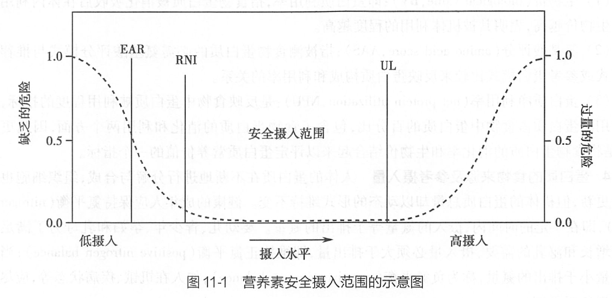

## 第一节 合理营养

> **目的要求**
>
> - 掌握营养素的生理功能、缺乏症状、膳食参考摄入量和主要食物来源。
> - 熟悉人群营养状况评价的知识。
> - 了解特殊人群营养指导，临床营养。

### 一、营养素参考摄入量概念

#### （一）营养与营养素

**营养（nutrition）**：指人体摄入、消化、吸收和利用食物中有效成分，维持生长发育、组织更新和良好健康状态的动态过程

**营养素（nutrient）**：指食物中含有的，能维持生命，促进机体生长发育和健康的化学物质。

$$
\begin{array}{llll}
  宏量营养素
  \begin{cases}
    蛋白质（包括 9 种必需氨基酸）\\
    脂类（包括 2 种必需脂肪酸）\\
    碳水化合物
  \end{cases} \\
  微量营养素
  \begin{cases}
    维生素\\
    矿物质
    \end{cases}
\end{array}
$$

#### （二）膳食营养素参考摄入量

##### 3. 适宜摄入量（adequate intake，AI）

AI 是通过观察或实验获得的健康人群

##### 4. 可耐受最高摄入量（tolerable upper lever intake，UL）

UL是平均每日摄入营养素的最高限量。UL 并不是一个建议的摄入水平。

「可耐受」是指这一剂量在生物学上大体是可以耐受的。

### 二、人体必须的营养素及能量

#### （一）蛋白质（protein）

##### 1. 生理功能

- 机体及机体 **一切细胞** 的基本构成物质，**生长发育**、**伤口愈合**。

##### 2. 氨基酸分类
- **必需氨基酸**：

蛋白质的互补作用：通过摄入混合食物中各种蛋白质所需的必需氨基酸种类和数量

##### 3. 食物蛋白营养价值评价

食物中蛋白质的营养价值决定于以下三个因素：

- 食物中蛋白质的含量
- 食物中蛋白质的消化率
- 食物中蛋白质的利用率

##### 4. 蛋白质的食物来源及参考摄入量

成年男子蛋白质 RNMI 为 65 g/d，成年女子为 55 g/d。

- **动物性蛋白质**，如肉、鱼、禽、蛋、奶及其制品，一半蛋白质含量较高，质量较好。

#### （二）之类

$$
脂类
\begin{cases}
  \\
\end{cases}
$$

调查方法 | 定义 | 优点 | 缺点
:---: | --- | --- | ---
**称重法** | 对膳食单位所消耗的 **食物全部称重**，计算每人每餐的摄取食物数量。 | 准确可靠 | 工作量大
**记账法** | 对于集体食堂查阅一定时期内的 **食品消费总量**，粗略计算每人每日的食品摄入量。 | 简单省力 | 准确性差
**回顾法** | 通过询问有调查单位 **回顾** 对象提供每天的 **膳食组成** 情况。适于个人或家庭。 | 简便易行 | 准确性差
**化学分析法** | 将调查对象一日的熟食收集齐全，在实验室中进行 **化学分析、测定营养素含量和能量**。 | 精确 | 费时
**食物频率法** | 估计被调查者在指定的一段时期内吃某些食物的频率的一种方法。 
