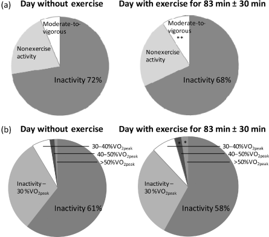
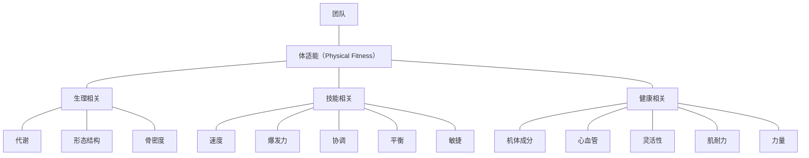
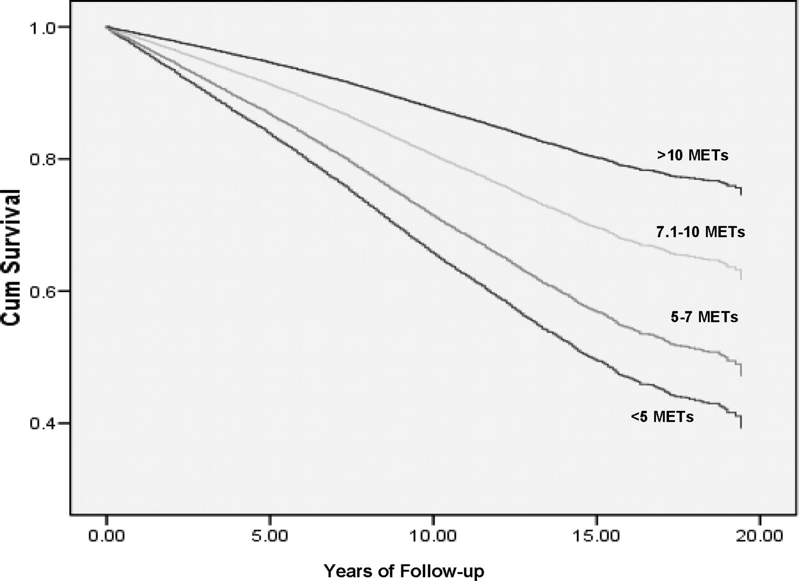
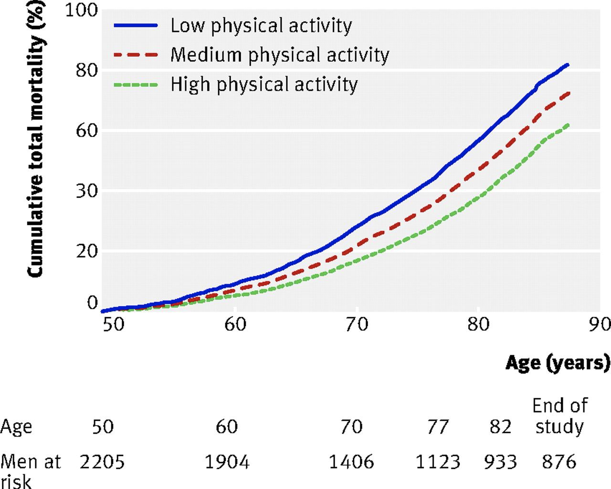

# 第十二章 身体活动促进

> The measure of life is its excellence, not its length in years.
>
> ——**Plutarch, Consolatio ad Apollonium**



## 第一节 身体活动概述

### 一、身体活动的类型

#### （一）按能量代谢分类

- **身体活动（physical activity）**：骨骼肌收缩 → 机体能量消耗 **明显** 增加。
  - **锻炼（exercise）**：保持/提高 体适能 一/多 个构建的有 计划/层次/重复 的身体活动。
    - **有氧运动**：大肌群/长时/节律/恒定
    - **无氧运动**：肌肉强力收缩

> **体适能（fitness）**：the degree of adaption of an organism to its environment, determined by its genetic constitution.
>
> ——***Collins English Dictionary***



#### （二）按生理功能分类

- 有氧
- 抗阻力
- 关节柔韧
- 身体平衡

### 二、身体活动总量

#### （一）身体活动的强度及其衡量

##### 1. 最大心率百分比

###### 心率

- 靶心率（THR）
- 客观方便

##### 2. 自我感知运动强度（ratings of perceived exertion，RPE）

- 用力 / 疲劳
- 动作困难 / 呼吸 / 大腿及全身

##### 3. 代谢当量（metabolic equivalent，MET）

- 与静息比值
- $1 \ MET = 3.5 \ mL \ O_2/kg \cdot min$

##### 4. 摄氧量

- 心肺耐力
- $VO_2max$

**身体活动强度分级**

运动强度 | 最大心率百分比（%） | 自我感知运动强度 （RPE） | 代谢当量（MET） | 最大耗氧量百分比（VO2max %）
:---: | :---: | :---: | :---: | :---:
低强度 | 40～60 | 较轻 | ＜ 3 | ＜ 40
中强度 | 60～70 | 稍累 | 3～6 | 40～60
高强度 | 71～85 | 累 | 6～10 | 60～75
极高强度 | ＞ 85 | 很累 | 10～11 | > 75

#### （二）身体活动总量

$强度 \times 频度 \times 时间 = 活动总量$

## 第二节 身体活动与健康

> "τίς εὐδαίμων, "ὁ τὸ μὲν σῶμα ὑγιής, τὴν δὲ ψυχὴν εὔπορος, τὴν δὲ φύσιν εὐπαίδευτος."
>
> ——**Thales of Miletus, 624 ~ 546 B.C.**

> "Mens sana in corpore sano"

> ——**Decimus Iunius Iuvenalis, 1 ~ 2 A.D.**

> 「欲劳于形，百病不能成。」
>
> ——**孙思邈， 581-682**

> “...L'homme est né pour l'action, comme le feu tend en haut et la pierre en bas. N'être point occupé et n'exister pas est la même chose pour l'homme.”
>
> ——**Voltaire, 1694-1778**

全死因 | 心肺 | 代谢 | 能量平衡 | 骨骼肌肉 | 功能性 | 肿瘤 | 心理 | 青少年
:---: | :---: | :---: | :---: | :---: | :---: | :---: | :---: | :---:
↓ 30% | CVD/CHD/中风<br />↓ 20～35% | II 型 DB / MS<br />↓ 30～40% | 3% 体重变化<br />5% 必须与膳食联合 | ↓ 36～68% 髋关节骨折<br />↓ 22～83% OA 发生<br />OA 疼痛缓解/功能/残疾：小～中幅<br />肌肉量和力量 | 中年/老年：↓ 30% 中度以上功能/角色限制<br />老年：↓ 30% 跌倒 | ↓ 30% 大肠癌<br />↓ 20% 乳腺癌 | 抑郁/心理苦恼/老年痴呆<br />↓ 20～30% | 心肺/肌力<br />身体成分<br />心血管/代谢<br />骨骼





> **哥本哈根城市 HEART 项目**
>
> ```mermaid
> graph LR
> A1["大人群<br />>17k"] --> B["慢跑<br />1-2.5 hrs/2-3 ses<br />中等 vs. 无慢跑习惯"]
> A2["长时间<br />10-35 yrs"] --> B
> B --> C["6.2 yrs 男<br />5.6 yrs 女"]
> C --> D1[身体活动减少]
> C --> D2[姿势不良]
> C --> D3[相对能量过剩]
> D1 --> E["心血管疾病<br />死亡率男性增加 30%，女性则加倍<br />累积性创伤<br />深静脉血管栓塞<br/ >抑郁<br />糖尿病<br />结肠癌<br />肥胖<br />骨质疏松<br />脂代谢疾病<br />肾结石<br />焦虑<br />……"]
> D2 --> E
> D3 --> E
> ```
