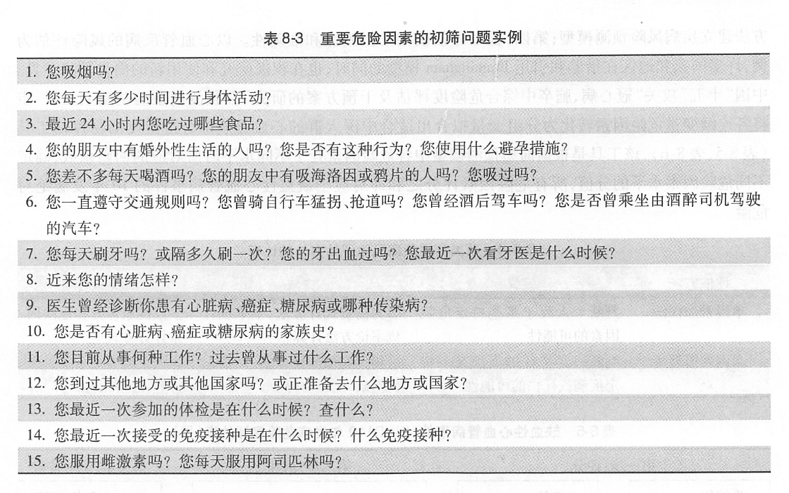

# 第八章 临床预防服务概论

### 案例 1

62 岁的张先生在家里正与邻居们一起打牌。但突然倒在桌旁，出现神志不清，口角歪斜和昏迷。邻居们马上把他送往医院。  
医院检查，血压达 180/120 mm Hg。CT 诊断为高血压性脑出血。虽然经过抢救挽回了生命，仍然留下了一侧肢体的行动障碍。  
该病人患有慢性胃炎，曾在消化科看病。如果你是消化科医生，在你的日常诊疗中，除了对于胃病的治疗，你认为还应了解哪些情况？

### 案例 2

一名 52 岁的妇女到消化科就诊，主诉有进行性的左下腹痛， 伴随体重减轻和疲劳 3 个月，过去几天出现血性粪便。  
结肠镜活检发现乙状结肠梗阻性腺癌，当即进行了部分结肠切除术和结肠造口术。  
病史显示，当病人 24 岁时就曾被诊断患有明显的溃疡性结肠炎，但当时没有得到进一步的治疗。近十几年病人只看过妇产科医生，但从未有医生怀疑过她患溃疡性结肠炎，也没有人建议她进行定期结肠镜检查。

### 案例 3

一名 29 岁的演员在一次车祸后被送入急诊室。他因为驾车没有系安全带，在高速碰撞后被抛出车外 10 米，头部受到致命的损伤。经检验，这名演员的酒精浓度达到 0.24%。  
据过去一年的记录，他曾患有慢性胃炎，从高中起就有明确的饮酒史，经常驾车不系安全带。

#### 问题

##### 这些案例有什么共同点？

很多情况下， 病人所经历的疾病或死亡在生命的早期都可以有效预防。在发生疾病（如冠心病和肠癌）、外伤 (如车祸) 的几个月、几年或几十年以前就可发现有一很好的检查和干预治疗。

##### 给你什么启示？

- 如果在病人看似健康的时候就能检测和处理这些危险因素，就可以避免危险因素的长期作用而导致最终不得不进行创伤性治疗（如化疗、外科手术、透析等）及发展为慢性疾病（疼痛、瘫痪、精神疾病、致残、死亡等）。
- 事实表明可以通过相对简单的干预措施（改变不良的行为如吸烟、免疫接种、筛检早期疾病等）预防那些在人力、物力和财力上花费很大的疾病和早死。

作为医生，在处理目前病人疾病的同时，还应着眼于他/她将来的健康问题。

---

> **目的要求**
>
> - **掌握**：临床预防服务的定义、内涵及主要内容；健康管理的概念；健康维护计划的概念、内容
> - **熟悉**：临床预防服务的原则、临床预防服务各项内容的具体原则与方法；健康危险因素评价的概念、含义和实施方法、 临床场所如何收集危险因素
> - **实习**：健康危险因素评价软件

> **教学计划**
>
> 内容 | 方法 | 教具 | 时间
> --- | --- | --- | ---
> 临床预防服务、健康管理的概念 | 小讲课/案例讨论 | 投影/黑板 | 10’
> 临床预防服务的基本内容与方法 | 小讲课 | 投影 | 45’
> 临床预防服务的实施原则 | 提问/小讲课 | 投影 | 10’
> 健康危险因素评价 | 上课/实习 | 投影 | 10’
> 健康维护计划 | 上课/案例讨论 | 投影 |15’

> **内容**
>
> - 健康管理
> - 临床预防服务
> - 临床预防服务的内容及实施的原则
> - 临床预防服务的基本步骤和实施

---

## 第一节 临床预防服务基本概念

### 一、临床预防服务的概念

- **临床预防服务（clinical prevention services）** 是指医务人员在临床场所对「健康者」和无症状「患者」的健康危险因素进行评价，实施个性化的预防干预措施来预防疾病和促进健康。
- **健康管理** 是对服务对象的 **健康危险因素** 进行全面、系统和针对性地评估并对整个生命全程进行干预，减少健康危险因素的威胁、早期发现并及时治疗疾病、 **对所患的疾病进行有效地治疗和预防并发症的发生**， 从而经济有效地避免早亡和提高生活质量。

* 健康管理最先应用于保险行业，保险公司将客户依据健康状况进行分类，那些最有可能成为高血压、糖尿病等疾病的人群被分别交给不同专业的健康或疾病管理中心，由他们采用健康管理与评价等手段指导病人自我保健，并对其进行日常后续管理，以促进健康，降低医疗费用。
* 健康管理的宗旨是调动个体和群体及整个社会的积极性，有效地利用有限的资源达到最大的健康效果。

- **共同点**：以健康为中心，对危险因素进行各种危险因素进行评价、干预和控制，变被动治疗为主动干预
- **差别**：临床预防服务：临床与预防的结合，主要由临床医务人员实施
- **健康管理**：管理学和经济学的理念，涉及预防、保健、诊疗、康复等多个领域。可以有医务人员和健康管理师实施。

预防和治疗一体化的服务方式是最佳的医学服务模式，成为医学发展的趋势。

## 第二节 临床预防服务的规范

### 一、临床预防服务的内容

**临床预防服务的对象**：「无症状（asymptomatic）」和「健康（healthy）」并非指病人目前没有任何主诉，而是针对某些严重威胁生命的特定疾病而言目前没有相应的症状和体征。这要求医生在处理目前病人疾病的同时，着眼于他/她将来的健康问题。

**临床预防服务的内涵**：是在临床环境下第一级和第二级预防的结合。在具体的预防措施上，它强调纠正人们不良的生活习惯、推行临床与预防一体化的卫生服务。

#### 1. 健康咨询（health counseling）

> - 在健康咨询、筛检、免疫、化学预防和治疗性预防这些临床预防中，改变人的行为是预防疾病最有效的方式。
> - 临床医生所提供的询问、教育和纠正病人健康行为比体格检查更能帮助他们预防将来的疾病。
> - 换句话说，**对话比体格检查更重要**。

> **临床医生的习惯思维**：临床医生更钟情于疾病的筛检。他们常常认为提供预防服务应该是做结肠检查或胆固醇检测，而不是要问他们是否吸烟，他们吃什么，或他们是否锻炼。
>
> - 不重视健康教育的原因可能是没有时间、 没有经济效益以及看不出立竿见影的效果。
> - 临床医生习惯于处理当时当地的情况, 而不去考虑危险因素对将来健康的影响。

> **我们面对的事实**
>
> - 尽管常规体检能减少某些疾病的死亡率，但对多数疾病而言，不健康的行为是人们主要的死因。
> - 全世界每年死于各种原因的成年人有 3000 万，其
中 300 万死于吸烟。中国每年死于吸烟的人数已达到 100 万。

> * 通过健康教育培养健康的行为以及纠正不良的健康行为，与第一、 第二和第三级预防都有密切的关系。

> **预防高血压**
>
> - 第一级预防：教育病人不吸烟、 不酗酒、 避免吃过咸的食品、 适当运动、 保持理想体重、 劳逸结合等；
> - 第二级和第三级预防：教育病人 定期测量血压以早期发现血压问题、发现有高血压后及时看医生、治疗中遵从医嘱以及坚持非药物和药物治疗等。
> - 然而，对筛检来说，只有当疾病产生可测量的病理改变时，才能检出疾病。

通过收集求医者的健康危险因素，与求医者共同制定改变不良健康行为的 **计划**，**随访** 求医者执行计划的情况等一系列的有组织、 有计划的教育活动，促使他们自觉地采纳有益于健康的行为和生活方式， 消除或减轻影响健康的危险因素，预防疾病、促进健康、提高生活质量。

##### 建议开展的健康咨询内容

- 劝阻吸烟
- 倡导有规律的身体活动
- 增进健康饮食
- 保持正常体重
- 预防意外伤害和事故
- 预防人类免疫缺陷病毒

#### 2. 筛检（screening）

运用快速、简便的体格检查或实验室检查等手段，在健康人群中发现未被识别的病人或有健康缺陷的人。

#### 3. 免疫接种（immunization）

是指将抗原或抗体注入机体，使人体获得对某些疾病的特异性抵抗力，从而保护易感人群，预防传染病，甚至消灭某些疾病。

#### 4. 化学预防（chemoprophylaxis）

是指对无症状的人使用药物、营养素（包括矿物质）、生物制剂或其他天然物质作为第一级预防措施，提高人群抵抗疾病的能力以防止某些疾病。  
化学预防不仅是使用药物，还包括使用激素、维生素、无机盐、脂肪酸、氨基酸等营养素、生物制剂和天然动植物的提取物。  
化学预防是对健康人群和无症状患者进行病因预防，属第一级预防范畴。

##### 常用的化学预防方法
- 对育龄或怀孕的妇女和幼儿补充含铁物质来降低罹患缺铁性贫血的危险；
- 补充氟化物降低龋齿患病率（高氟地区不可）；
- 孕期妇女补充叶酸降低神经管缺陷婴儿出生的危险；
- 绝经后妇女使用雌激素预防骨质疏松和心脏病；
- 阿斯匹林预防心脏病、脑卒中，以及可能的肿瘤。

###### 阿斯匹林预防
阿司匹林抑制血小板形成动脉粥样斑块，降低缺血性中风和心肌梗塞。  
强烈推荐医生与冠心病危险性增高的病人讨论阿司匹林的化学预防。  
讨论中同时考虑收益与风险。

**适用对象**

- 40 岁以上男性
- 绝经期女性
- 不足上述年龄但有冠心病危险因素的人群：（高血压、吸烟、糖尿病、冠状动脉疾病早期发病的家族史）可使用低剂量阿司匹林。

**副作用**

- 胃肠道副作用——如腹痛、烧灼感、恶心、便秘等。严重者引起消化道出血。
- 血小板抑制为减少大剂量阿司匹林的副作用，采取低剂量疗法。
- 每天 75 mg 的剂量即可以达到预防效果。
- 血压如果没有控制，会减少使用阿司匹林的收益，并且增加出血危险。
- 与其他抗炎类药物连用增加出血危险。
- 高龄患者患中风的危险因增加，因此使用阿司匹林的收益也增加，但同时出血的危险也增大。

* 是否接受阿司匹林化学预防也应遵守参与和共同决策的原则。
* 应让病人明白如果他们是冠心病、血栓栓塞的高危人群，阿司匹林对健康的益处可能超过其导致出血的危险。
* 多吃偏碱性食物、多饮水、选用肠溶衣片剂 饭后服及加服西咪替丁等 H2 阻滞剂等能缓解阿司匹林引起的胃肠不适。

> **在 1000 名个体中使用阿斯匹林的收益与风险**
>
> 5 年内冠心病发病率 | 可以预防的冠心病事件 | 可能导致的出血性中风事件 | 可能导致的大的消化道出血事件
> :---: | :---: | :---: | :---:
> 1% | 1 ～ 4 | 0 ～ 2 | 2 ～ 4
> 3% | 4 ～ 12 | 0 ～ 2 | 2 ～ 4
> 5% | 6 ～ 20 | 0 ～ 2 | 2 ～ 4

###### 雌激素预防

用于绝经后妇女的骨质疏松的预防

**受益**：保存骨质、改善脂蛋白、降低心血管疾病的死亡率、减少绝经期后症状；

**危险**：阴道出血、子宫癌；

**禁忌症**：乳腺癌病史、怀孕者、子宫内膜癌、诊断不明的阴道出血史，活动性肝病、血管栓塞。

**可以在下列妇女中考虑**：发生骨质疏松的危险性逐渐增加，低矿物质骨症，身材细长，绝经期提前，无已知禁忌症（如诊断不明的阴道出血、活动性肝病、血管栓塞、肿瘤史）

常规使用为复合马雌激素 0.625 mg，连服 25 天，同时疗程的最后 12 天内服 5～10 mg 醋酸甲羟孕酮乙酸盐。

**副作用**：恶心、头痛、出血、体重增加、乳房触痛

###### 乳腺癌的化学预防

推荐医生同乳腺癌高风险而对副作用低风险的妇女讨论乳腺癌的化学预防，告知化学预防的好处与风险。  
不推荐在一般妇女中使用他莫西芬等进行第一级预防。

**乳腺癌的高风险人群**：年龄增大、一级家属有乳腺癌病史、乳腺切片检查中有不典型增生、初潮早、不育或晚育、使用雌激素

**对化学预防副作用低风险人群**

- 年轻
- 没有血栓病的易感体质：如中风、 肺栓塞、深静脉血栓
- 子宫切除

> 对于两种化学预防的药物：Tamoxifen/Raloxifene 有证据表明前者效果更优，并已经被美国 FDA 批准。

#### 5. 预防性治疗（preventive treatment）

指通过应用一些治疗的手段，预防某一疾病从一个阶段进展到更为严重阶段，或预防从某一较轻疾病发展为另一较为严重疾病的方法。

- 早期糖尿病的血糖控制（包括饮食和身体活动等行为的干预以及药物治疗）预防更为将来可能出现更为严重的并发症；
- 手术切除肠息肉，预防发展为大肠癌；
- ……

### 二、临床预防服务的循证

疾病的预防是重要的，但不是每一项预防措施对人群都是有益的。  
人群健康干预的策略必须以科学研究的循证为基础。

$$
总的疾病负担 = \begin{cases}
  未知 \to 有待研究部分\\
  \left.\begin{aligned}
    医疗作用 \\
    临床预防作用 \\
    人群预防作用
  \end{aligned}\right\} 已有科学证据证明可预防的部分 \{ 科学证据证明但还没有应用来预防的部分
\end{cases}
$$

### 三、临床预防服务的推荐

#### 有效临床预防服务的优先次序

服务 | 描述 | $CPB^2$ | $CE^3$ | 总和
:--- | :--- | :---: | :---: | :---:
阿司匹林化学预防 | 讨论每天服用阿司匹林（男 ≥ 40岁， 女 ≥ 50 岁，和其他心血管危险增高的人群）来预防心血管事件的利弊。 | 5 | 5 | 10
儿童计划免疫接种 | 儿童免疫接种：白喉，破伤风，百日咳，麻疹，腮腺炎，风疹，灭活脊髓灰质炎病毒，B型流感嗜血杆菌，乙型肝炎，水痘，肺炎球菌，流感。 | 5 | 5 | 10
询问烟草使用情况并对吸烟者进行简要的干预 | 询问成人烟草使用的情况；对发现的吸烟者提供简要的指导，并提供药物治疗。 | 5 | 5 | 10
结肠直肠癌筛检 | 常规使用粪便隐血试验（FOBT）、 乙状结肠镜或者结肠镜对 ≥ 50 岁的成人进行筛检。 | 4 | 4 | 8
高血压筛检 | 对所有成人常规测量血压；对高血压病人使用抗高血压药物治疗以预防心血管疾病的发生。 | 5 | 3 | 8
流感的免疫接种 | 对 ≥ 50 岁的成人每年进行流感的免疫接种。 | 4 | 4 | 8
肺炎球菌的免疫接种 | ≥ 65 岁的成人进行肺炎的免疫接种（一次注射）。 | 3 | 5 | 8
询问饮酒的情况并对酗酒者进行简要的指导 | 常规地对成人进行饮酒习惯的询问，以识别那些因饮酒而危险性增加的人，并在随访中提供简要的指导。 | 4 | 4 | 8
成人视力筛检 | 用 Snellen 视力表，常规地对 ≥ 65 岁成人的视力减退进行筛检。 | 3 | 5 | 8
宫颈癌筛检 | 用宫颈细胞学（巴氏涂片）方法，对性活跃且有性行为发生三年内或者年龄达21岁的妇女进行宫颈癌筛检。 | 4 | 3 | 7
血脂异常筛检 | 对 ≥ 35 岁的男性和 ≥ 45 岁的女性常规进行血胆固醇的检查，并对血脂异常者使用降脂药物进行治疗，以预防心血管疾病的发生。 | 5 | 2 | 7
乳腺癌筛检 | 单独使用乳房 X 线摄片或者与临床乳房检查联用，对 ≥ 50 岁的女性进行乳腺癌筛检；并与 40 到 49 岁之间的妇女商量筛检乳腺癌的事宜，以确定什么时候启动筛检。 | 4 | 2 | 6
衣原体筛检 | 从性活跃期开始到25岁的妇女进行常规原体筛检 | 2 | 4 | 6
补钙咨询（化学预防） | 为青少年和青年女性提供关于使用补钙来预防骨折的咨询 | 3 | 3 | 6
儿童视力筛检 | 对 < 5 岁儿童进行常规视力筛检，以辨别弱视、斜视以及视觉敏锐度缺陷 | 2 | 4 | 6
叶酸化学预防 | 为育龄妇女提供关于补充叶酸来预防出生缺陷的常规咨询 | 2 | 3 | 5
肥胖筛检 | 对成年病人的肥胖情况进行常规筛检，为肥胖病人提供关于至少 1 年与饮食、 运动或两者相结合的行为干预措施 | 3 | 2 | 5
抑郁症筛检 | 对成年人的抑郁症进行筛检，并确保在临床工作中能准确诊断、治疗和随访等系列措施的有效地开展 | 3 | 1 | 4
听力筛检 | 对 ≥ 65岁成年人进行听力损伤筛检， 并向专科转诊 | 2 | 2 | 4
预防伤害的咨询 | 评估 < 5 岁儿童的父母所采取的安全措施，提供儿童相关的安全座椅，窗/楼梯防护，水池栅栏，毒品控制，热水温度和自行车头盔等咨询 | 1 | 3 | 4
骨质疏松症筛检 | 常规对 ≥ 65岁成年女性，对危险度较大的 ≥ 60岁成年女性常规进行骨质疏松症筛检，并讨论不同治疗选择的益处和害处 | 2 | 2 | 4
高危险人群的血脂异常筛检 | 对 20～35 岁男性和 20～45 岁女性，如果伴有冠心病的其他危险因素，使用降脂药物来预防冠心病的发生，需进行血胆固醇的常规检查 | 1 | 1 | 2
糖尿病筛检 | 对高血脂或高血压的成人进行糖尿病筛检；并对糖尿病患者进行综合治疗，以达到控制血糖到标准值范围 | 1 | 1 | 2
饮食咨询 | 对患有冠心病或其他饮食相关慢性疾病的成年患者提供高强度的行为饮食咨询 | 1 | 1 | 2
破伤风-白喉增强 | 每隔 10 年对成人进行免疫 | 1 | 1 | 2

## 第三节 临床预防服务的实施

### 一、临床预防服务的实施原则

> 根据上面讲述的内容，你认为在实施临床预防服务中，应该注意些什么？

- 重视危险因素收集
- 医患双方共同决策
- 综合性连续性
- 以健康咨询为先导
- 合理选择健康筛检内容
- 生命全程理念

#### 生命全程保健方法（life course approach）

通过把人生划分为几个明确的阶段，针对这些不同年龄组的人群在不同的场所（家庭、社区、学校、工作场所）中实施卫生保健措施，从而保证人生的不同阶段既能有效地获得有针对性的卫生服务，也不造成不必要的重复或遗漏，达到促进人群健康既高效又节省的目的。

### 二、临床预防服务的实施基本步骤

#### （一）将康危险因素收集

##### 询问目的
确定哪些危险因素需要在应诊或者随访中进一步评价、干预。

> 除了诊治危重或极端痛苦的病人外，应该为病人提供咨询。
如何用简短的时间进行有效地询问？

- 在应诊时询问几个初筛问题
- 在体检或者其他预防性检查时系统询问
- 制定询问的计划，每次仅询问几个问题。
- 如果仅有询问一个问题的时间，则应该问：  
  > 对于成年人？  
  > 对于青少年？

##### 如何询问
询问的时间可以放在问诊过程中或者将要结束时。

> 如：让患者因感冒就诊。  
> 「好了，您由于着凉咳嗽、咽痛两天，等一下我
会进一步检查。现在我想询问一下您的一些生活
方式的问题。您吸烟吗？」

##### 如何开始

1. **婉转和舒适的转折**  ：「您的胆囊问题可以转到外科处理，可能需要手术治疗。我想治疗结果应该令您满意。有时候，我们过于注意某个疾病，而忽略了其他与健康有关的其他问题。现在，我想询问一下与您健康有关的其他问题。您同意吗？」  
2. **注意病人的情绪反应**：措辞、语调、非语言交流等。  
3. **识别并表示理解**  
4. **避免判断性语句**

##### 问什么

###### 吸烟

- 初筛：「您吸烟吗？」
- 后继：「您目前还吸烟么？」

###### 体力活动

- 「您每天有多少时间进行体力活动？」
- 家长：「您的孩子每天有多少时间进行体力活动？」

###### 日常饮食

- 「最近24小时内您吃过哪些食品？」
- 婴儿父母：「孩子是母乳还是人工喂养？」「多长时间喂养一次？」
- 年长儿父母：「您的孩子三餐和点心，吃些什么食品？」

###### 性生活

- 「您的朋友中有婚外性行为的人吗？」
- 「您是否有这种行为？」
- 「您采用什么样的避孕方式？」

###### 酒精及其他药物使用

- 「您每天喝酒吗？」
- 「您的朋友有吸毒的人吗？」
- 「您吸过吗？」

###### 意外伤害

- 「您一直遵守交通规则吗？」
- 「您曾经酒后驾车吗？」
- 「您是否经常闯红灯？」
- 对婴儿父母：「您的孩子是否曾因进食受噎？」「是否被棉被等物品捂住口鼻？」

###### 口腔卫生

- 「您每天刷几次牙？」
- 「您的牙龈出血吗？」
- 「最近一次看牙医是什么时候？」

###### 精神卫生和功能

- 「近来您的情绪如何？」
- 家长：「近来您的孩子在学什么？」
- 老年人：「您在生活自理、进餐和洗澡等方面有困难吗？」

###### 既往病史

- 「医生曾诊断您患有什么疾病吗？」

###### 家族史

- 「您是否有心脏病、肿瘤、糖尿病的家族史？」

###### 职业与环境危险因素

- 「您从事什么工作？」「在工作中是否接触化学物质、
噪声或其他有害物质？」
- 父母：「您住在哪里？」「靠近什么工厂或交通干线？」「家里饮用什么水？」

###### 旅游史

###### 筛检状况

- 询问是否接受与其年龄和特征相符合的筛检，如针对 50 岁以上的妇女：「您最近一次的乳房摄片在什么时候？」

###### 免疫状况
- 询问是否接受与其年龄和特征相符合的免疫接种
- 「您最近一次注射破伤风疫苗是什么时候？」
- 对于儿童和青少年，问父母或查阅医学记录

#### （二）健康危险度评估

- 健康危险度评估是研究致病危险因素和慢性病发病率及死亡率之间数量依存关系及其规律性的一种技术。
- 健康危险度评估，将生活方式等因素转化为可测量的指标，预测个体在未来一定时间发生疾病或死亡的危险，同时估计个体降低危险的潜在可能，并将信息反馈给个体。
- 健康危险度评估属于疾病的初始级预防，在疾病尚未出现时评估危险因素对疾病的影响，通过健康促进教育人们建立健康的生活方式。
- 健康危险度评估是一项积极的健康促进措施，也是预防慢性病的有效手段。

随着社区卫生服务和全科医学在我国迅速发展，全科医生在开展慢性病防治，需要危险度评估技术提高健康教育力度。

##### 评估的基础
- 表面健康、无任何病症的人群中可能处于有潜在病症的发展中，在将来有可能扩散并导致过早死亡；
- 导致这种风险的因素是可以被检查出来的。
- 有些风险因素是可以被消除或者控制的，从而防止或减轻病情的发展，防止或推迟患病或死亡。

#### （三）个体化健康维护计划（health maintenance schedule）

指在特定的时期内，依据求医者的年龄、性别及危险因素而计划进行的一系列干预措施。

##### 1. 个体化健康维护计划的制定原则

以问题为导向的记录方式

- **主观资料**：主诉、症状、疾病史、家族史、社会生活史等
- **客观资料**：体检、实验室检查结果、心理行为测量结果、
病人态度、行为
- **对健康问题的评价**：诊断、鉴别、预后以及对危险因素的评价
- **健康维护计划**：诊断、治疗、预防保健、健康指导

> **案例**
>
> 王先生，男，45 岁，离婚，律师。
>
> **主观资料**
>
> 过去 6 周，反复出现上腹部烧灼感，进食后加重。服抗酸药可以减轻。无恶心、呕吐、腹泻、便秘。  
类似情况以往也曾发生，但以2个月前离婚后更为加剧。  
近日睡眠不好，有时靠安眠药入睡。  
每日吸烟 20 支，每天饮咖啡 4～5 杯。
>
> 既往史：30 岁曾查出乙肝表面抗原阳性。
>
> 家族史：父亲 75 岁时死于大肠癌。
>
> **客观资料**
>
> 病人紧张焦虑。腹软，上腹部有轻压痛。无包块。大便隐血试验阳性。
>
> **对健康问题的评价**
>
> 主要健康问题：初步诊断为胃溃疡。
>
> 健康危险因素：
> - 吸烟、饮咖啡等刺激性饮料加重了胃溃疡症状；
> - 离婚作为大的生活事件，增加了胃溃疡等身心疾病的发作机会；
> - 有肠癌的家族史，隐血试验阳性，患者应予以注意。必要时进行结肠镜检查。
> - 肝功能也需定期复查。
>
> **健康维护计划**
>
> 1. 诊断计划  
>   - 胃镜检查
>   - 幽门螺旋杆菌试验
>   - 肝功能检查
> 2. 治疗计划  
>   - 抗酸治疗
>   - 心理咨询和疏导
> 3. 健康维护计划  
>   - 大便隐血试验
>   - 戒烟（5A）
>   - 停咖啡：少饮或不饮咖啡
>   - 健康教育：吸烟危害、心理疏导等健康教育
>   - 按照患者年龄，进行胆固醇、肿瘤、牙齿等检查。

###### 病人教育资料

健康是你的责任

你所能做的几项重要活动：

1. 不吸烟；
2. 平衡膳食，少吃盐和含饱和脂肪酸的食品；
3. 可适量饮酒，但禁止酒后驾车；
4. 有规律地锻炼身体；
5. 注意生活中的压力与紧张，减少不必要的压力。

通过医生指导在家中做好你的保健工作：

- 如果超重，那么现在是节食的最好时机；
- 有规律的检查颈部与腹股沟，发现新的肿块要及时（不超过一个月）报告你的医生。
  - 女性
    - 每月检查乳房肿块。
    - 绝经后观察阴道流血情况。
  - 男性：检查睾丸肿块。
