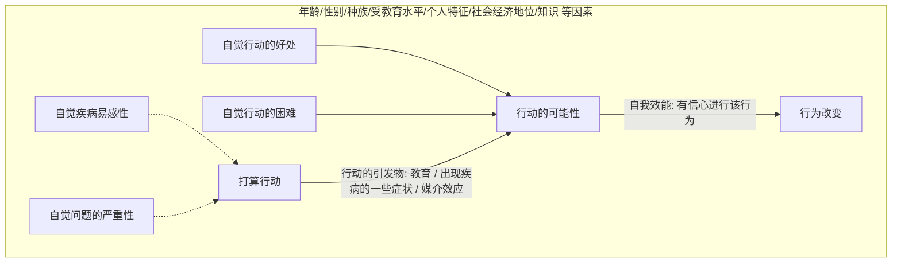
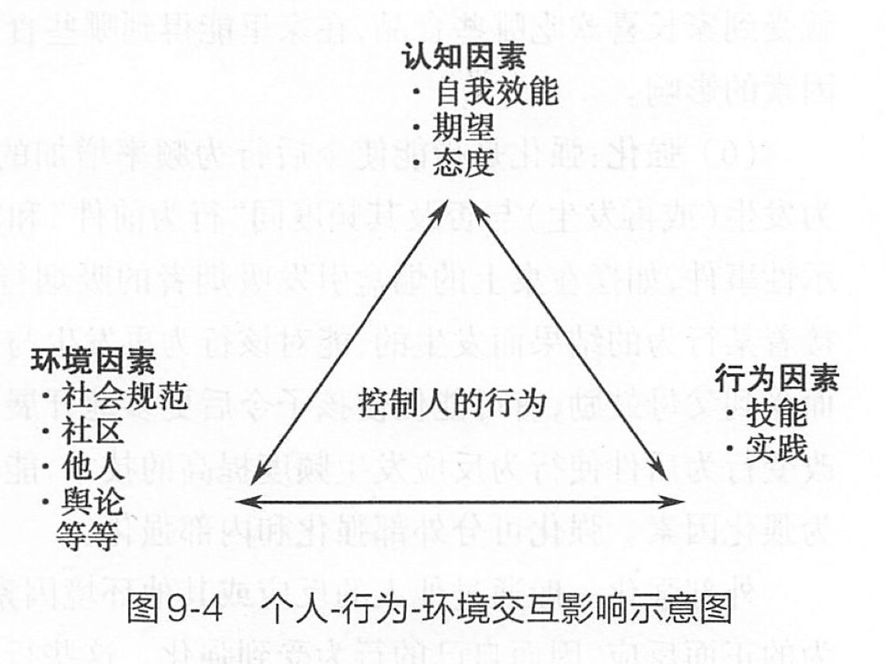

# 第九章 健康行为干预

## 第一节 健康行为及其影响因素

> **行为对健康的影响**
>
> 2011年9月，第66届联大预防和控制非传染性疾病问题高级别会议达成共识：人们的生活条件和生活方式影响其健康和生活质量是导致非传染性疾病发生率和流行率上升的因素。
> 世界卫生组织估计，全球三分之一以上的死亡可归因于烟草使用、酗酒、不健康饮食等十种行为危险因素。
> 事实已经证明，建立健康行为是降低慢性病风险的重要措施。美国历经30年，使心血管疾病的死亡率下降一半，该项成就的2/3归因于健康相关行为的改善，由此可见行为方式对于提升人群健康水平的重要性。
>
> **问题**
>
> 首先我们了解，什么是健康行为？我们身边的健康相关行为有哪些？

### 一、行为与健康行为的概念

#### 1. 健康行为（health behavior）

健康行为不仅包括个体或群体可观察到的、外显的行动，也包括人的思想活动和情感状态。  
David Gochmant 将健康行为定义为「与促进、维护或恢复健康相关的个体心理、情感状态和外显的行为模式」。

##### 健康行为定义

与促进、维护或恢复健康相关的个体心理、情感状态和外显的行为模式。

##### 常见健康行为分类

- 日常生活中有益于健康的基本行为；
- 预警行为，预防事故发生以及事故发生后的正确处置；
- 正确合理的利用卫生保健服务的行为；
- 避开环境危害等行为，以避免生活、工作的中的环境健康有害因素等，如在空气严重污染时减少外出活动等。

### 二、影响健康行为的因素

> 知识、信念、价值观
> 行为所必需的技术和资源
> 同伴、长辈
> 政策、法律
> ……

1. **倾向因素**：产生某种行为的动机或愿望，或者诱发产生行为的因素。包括知识、信念、态度、价值观、动机和行为意向。如吸烟危害的知识宣传。
2. **强化因素**：实施某行为后所得到的加强或减弱该行为的因素。如戒烟后的家人的支持。
3. **促成因素**：实施某行为必需的技术、资源或其他社会因素。如戒烟门诊、戒烟药物。

事实上，无论是倾向、促成抑或强化因素，都反映了人的行为受到多个层次上不同因素的影响。
例如，倾向因素往往和个体的认知、态度等有关，但也会受到家庭和社会环境的影响。强化可以来自自我激励，可以来自家庭或组织。
促成因素可能更多来自与社会资源。

在绪论中，我们谈到了健康生态学模型，即个人和人群的健康受到不同水平的因素的影响。同理，健康行为的生态学模型认为，健康行为的发生发展受到多个水平的因素影响：个体水平、家庭、朋友等人际水平；组织、群组水平；以及社区、社会水平。同时，在这些因素和水平间存在相互联系和相互作用。

为什么我们现在提倡综合干预？这是因为在多个水平干预贯穿环境的不同层次，可能取得最佳效果。

## 第二节 常用健康行为改变理论

> 江山易改，本性难移。其实当一种行为经过成百上千次的重复并固化为习惯的时候，改变也是需要策略的， 需要具体理论的指导。

健康生态学模型由于涉及到不同水平，需要多学科、多部门、多项目间的合作。 以控烟为例， 媒体传播烟草控制的信息，提高知识，强化无烟态度，针对的是倾向因素；家庭成员对于吸烟者戒烟的支持，属于人际水平，主要是是强化因素；社区医务人员提供的戒烟咨询和药物则是促成因素；而立法部门可以通过法律和政策等方式保护非吸烟者的权利，保证室内公共区域无烟作用于整个人群，保证无烟环境的实现，则主要是促成因素。

生态学模型是一个宏观模型，强调的是一种思维方式，是行为改变的基本框架，但在改变具体的健康相关行为时，还必须有一些理论的指导。

**行为改变的理论和模式**

- 按用途分
  - 解释行为的理论
  - 指导行为改变的理论
- 按作用对象来分
  - 个体水平的行为改变理论
    - 健康信念模式（health belief model，HBM）
    - 自我效能理论
    - 阶段变化理论（transtheoretical model and stage of change，TTM）
  - 人际水平的行为改变理论
    - 社会认知理论（social cognitive theory，SCT）
  - 群组水平的行为改变理论
    - 社区组织模型（community organization model）
    - 社区发展理论

### （一）健康信念模式（Health Belief Model，HBM）

> **你周围有这样的例子吗？**
>
> - 吸烟可能会致癌，但我没那么倒霉。
> - 体检是很重要，但最近太忙，这次不去了。
>
> **当然也有正面的例子：**
>
> 医生说吸烟会导致冠心病，我必须戒烟。
> 只要我想做，就一定能做到！

HBM 是由美国的 Hochbaum、Kegeles、Leventhal 和 Rosenstock 于 20 世纪 50 年代初提出来的。用于解释为什么人们不接受「疾病预防性筛检」（人们不愿意接受 X 线检查来筛检结核病）。
20 世纪 50 年代和 60 年代，美国卫生部门非常强调提高人们对新的医疗技术、服务和设备的使用

健康信念模式应用了心理学的概念来解释人们的健康有关行为。它认为 **健康信念** 是人们接受劝导、改变不良行为、采纳健康行为的关键。
HBM 认为，健康行为是由个体对疾病的自觉易感性、自觉疾病的严重程度、采取特定行为的自觉好处和可能障碍决定的。

#### 1. 健康信念模式的基本内容

- **感知到威胁（perceived threat）**
  - **自觉严重程度（perceived severity）**：人们对得了疾病的严重后果或得了病不治疗的严重后果的认识。如得了病是否会死亡、残废、剧烈疼痛？得了病之后自己的工作、家庭生活、社会关系是否会受到严重影响？
  - **自觉易感性（perceived susceptibility）**：指个人内心感觉到自己健康状况面临受到损害、面临某种疾病的威胁。如某人发现自己很有可能发生癌症、癌症复发。
- **行为评价（behavioral evaluation）**
  - **自觉益处（perceived benefits）**：人们对于采取某种行为以后，能够有效地消除健康损害、避免疾病发生和减轻损害后果的主观认识。如采取某行为之后，能否有效缓解病痛。只有人主观上感觉到了行为能够带来的益处，才能主动采取这种行为。
  - **自觉可能障碍（Perceived Barriers）**：人们对采取某种健康行为可能遇到的客观困难或自己心理上的障碍的主观认识。人们在考虑行为好处的同时，也在判断该行为风险（副作用）、不愉快（疼痛）、花费过多等。
- **自我效能（Self-efficacy）**：是人们对自己是否有能力执行某一特定行为的自信程度。自信心具有很重要的作用，特别是当人们感觉到采取某种行为会面临许多困难时，需要坚定克服困难的信心，才能最后建立起这种行为。自我效能（自信心）对于改变人们长期形成的生活习惯和饮食习惯，如吸烟、饮酒、缺乏锻炼等行为时尤为重要。
- **行动的引发物（cues to action）**：促使某种行为发生的「导火线」，如某一突发事件或因素。

> **HBM 中的基本概念小结**
>
> - 威胁
>   - 自觉疾病的易感性(如可 能患癌症)
>   - 自觉疾病的严重性（如死亡）
> - 结果的预期
>   - 自觉特定行为的益处
>   - 自觉执行行为的可能障碍
> - 效能预期：对自己有能力完成所推荐行为的自信程度（自我效能）
>
> 另外：社会人口学因素， 如教育、 年龄、性别等也以间接地影响行为的改变

### （二）行为改变的阶段变化理论（Stages of Change）

> **关注……**
>
> 同样是每天一包的吸烟者，甲根本不考虑戒烟，乙打算在3个月内戒烟，丙决定从明天起戒烟。
> 他们的情况相同吗？

**理论背景**：1982，Prochaska 和 Diclimente 在从事戒烟的相关研究中，以其他的理论构念（个人行为改变意愿、行为改变阶段）为基础提出来的。

**理论假设**：行为改变是一个过程而不是一个结果，每个人在行为改变的动机、准备方面，处于不同水平（有程度的差别）。

**基本理论概念**
- 人们一般要经历五个行为改变的阶段
- 人们经过各个阶段的速度不一
- 人们可能会在行为改变的各阶段之间来回变动

#### 1. 行为变化阶段

概念 | 简单定义 | 干预措施
:---: | --- | ---
无打算阶段 | 未意识到问题存在，未想到要改变行为 | 提高需要改变的意识；提供个体化的改变行为可得益处，不良行为后果的信息
打算阶段 | 想在最近（6 个月之内）进行行为改变 | 动员、鼓励病人制定特定的计划
准备阶段 | 制定一个月行动计划 | 帮助制定一个具体的行动计划 设定阶段性行为改变目标
行动阶段 | 实施特定的行为（保持 6 个月） | 协助信息反馈、解决问题、社会支持，强化
维持阶段 | 继续行为的改变 (6 个月以上，甚至终生) | 协助应对可能问题、设置提醒物、寻找替代品、避免反复

##### 无打算阶段

未考虑在接下来的 6 个月内改变自己的行为，或者是有意坚持不改变。

**特点**：不喜欢考虑或谈论有关这些高危行为的话题，甚至还有另外一套理论来抵制，他们也不打算参加健康促进项目。

##### 打算阶段

人们考虑在接下来的 6 个月内，对某些特定行为作出改变。他们已经意识到改变行为可能带来的益处，但是也十分清醒所要花费的代价，在效益和成本之间的权衡处于一种矛盾的心态。在此阶段停滞的时间可能不会很长，常常被称为慢性打算或行为拖延阶段。

**特点**：

- 知道行为的不良后果
- 不知如何开始行动
- 行为的代价 > 预期的好处
- 自信心不高

##### 准备阶段

人们严肃地承诺作出改变，并且开始有所行动，如打算加入健康教育培训班，向别人咨询，同医生交谈，购买辅导书等等

**特点**：

- 知道如何开始，却不知道如何维持行为的改变。需
要一个改变计划
- 预计的益处 = 所需花费的代价
- 有外在的动机
- 自信心一般
- 适当的准备是一个人能否进行自我改变的关键

##### 行动阶段

人们已经改变了自己的行为，但维持时间少于 6 个月；  
行动仅是 5（6）个阶段中的一个阶段，还不能看成行为的改变。行为改变是指要达到专业人员认可的能减少疾病风险的程度。

> 例如：在戒烟行为中，仅仅是减少吸烟量；或合理膳食行为中，仅仅是减少来源于脂肪的卡路里量，都只能看成是行动而并非行为的改变。

**特点**：

- 定期执行某行为，但时间 < 6 个月
- 存在较大的复发风险
- 行为成本 < 可能的益处
- 既有外在动机也有内在动机
- 自信心很高

##### 维持阶段

改变这种行为已经 6 个月以上，达到了预期的健康目标。在这个阶段应当预防反复，使人们对行为改变更有自信心。

**特点**：

- 无论发生什么都能继续执行该行为
- 自觉行为代价 < 自觉行为益处
- 内在动机强烈
- 自信心非常高

#### 2. 行为的阶段变化理论的基本原则

处于不同行为转变阶段的对象有不同的需要，应根据他们的特点和需要采取相应的措施。

#### 3. 阶段变化理论的局限性

- 仅为描述，非原因性解释
- 各阶段划分不够明确

### （三）社会认知理论（Social Cognitive Theory）

心理学家常常根据单项的原因解释人们的行为：行为或者被描述为受环境控制和塑造的，要么认为是受内部驱动力驱动的。

社会认知理论根据三方互动的原因解释心理现象。根据这一互动的因果模型，人的能动性是其内部因素（认知、情感等）、行为模式和环境营销三者彼此相互作用的结果。

双向箭头表示了两个因素之间的决定关系。
- **主体与行为的相互决定**
  - 个体的期待、信念、意向、情绪等主体因素影响或决定行为方式；
  - 行为的内部或外部反馈结果又部分决定他的思想信念和情感反应；
- **行为与环境的相互决定**
  - 环境是行为的对象，行为改变着环境；同时，行为也必须适应环境。
- **主体与环境的相互作用**
  - 虽然个体的人格特征、认知技能是环境作用的产物，但环境的存在及作用不是绝对的，而是潜在的，取决于主体的认知把握。

> The social cognitive theory explains how people acquire and maintain certain behavioral patterns, while also providing the basis for intervention strategies (Bandura, 1997).
>
> Evaluating behavioral change depends on the factors environment, people and behavior. SCT provides a framework for designing, implementing and evaluating programs.

#### 1. 社会认知理论的主要概念

概念 | 定义 | 应用
:---: | --- | ---
环境 environment | 客观存在的外部因素 | 提供机会和社会支持
情境 situaton | 个人对外部环境的理解 | 修正错误概念，促进健康规范
行为能力 behavioral capability | 执行特定行为的知识和技能 | 通过技能培训，促进主动学习
结果预期 outcome expectation | 预期的行为结果 | 模拟健康行为的有利结果
结果期望 outcome expectancies | 对特定的行为结果的价值的判断，把预期的行为结果量化 | 展示行为改变的有意义的结果
自我控制 self-control | 对针对目标的行为或行为实施的个人调节 | 提供目标设定、决策、问题解决、自我监督和自我奖励的机会
观察学习 observational learning | 通过观察其他人的行为和结果而形成自已行为的过程 | 提供目标行为的角色模式
强化 reinforcements | 对行为的应答，可进一步增强或减弱该行为发生的可能性 | 促使自我奖励和激励
自我效能 self-efficacy | 个人对实施某特定行为并克服困难的信心 | 通过能确保成功的小步骤来开始行为改变；寻找该种改变的特点
情感性应答反应 emotional coping responers | 个人处理感情刺激的策略和战术 | 提供处理紧张和解决问题的培训，包括实践针对因情景而产生的情绪的应对技能
交互决定论 reciprocal determinism | 在个人、行为和环境的动态交互影响中形成行为 | 考虑促使行为改变的多种因素,包括环境改变、技能和个人变化

##### 环境（environment）

个人身体之外的，能够影响个体行为的所有客观因素的总称。

- 物质环境包括房间的大小、室温、所需的资源及可及性等。社会环境包括家庭成员、朋友、同事、同学等。环境能在人们毫无知觉的情况下影响人们的行为。

##### 情境（situation）

客观环境在心理的反映，包括真实的、歪曲的或想象的因素。情境时个体对环境的主观感觉，如场所、时间、外形特征、参与者以及他在情境中的角色。

##### 行为能力（behavioral capability)

如果一个人要完成某一特征的行为，他必须知道要做什么以及如何做。  
自我效能是一个人对自己能力的感知，而行为能力则是一个人真正的能力。  
只提供知识是不够的，必须提供接近于真实的场景来提高人们的行为能力。  
提高行为能力的训练必须包括教授知识、提供练习的机会以及对实习的反馈。

##### 结果预期（outcome expectation）

> Outcome expectation is a judgment of the likely consequence that a certain behavior will produce.
> “When I do exercises, I will be
stronger.”

##### 结果期望（outcome expectancies）

> Outcome expectancies are the values that individuals place on a certain outcome.

期望值指个体对行为的某个特定结果所赋予的值。通常以连续的数值来表示期望值的大小。
个体的正性期望值可以作为个体行为改变的促进因素。

> 如果我参加锻炼，我的身体将发生变化……
> （-5 代表瘦弱，5 代表强壮）

##### 观察学习（observational learning）

观察学习是一个信息加工过程。将有关示范原型的行为结构和环境事件的信息作为符号表征，作为观察者以后表现这种行为的内部指导。

包括四个子过程：注意过程、保持过程、生成过程、动机过程。

- 注意过程：观察者将心理资源等贯注于示范事件的过程。决定了个体选择什么为观察对象，以及从观察对象中获得什么信息。
  - 决定因素：观察榜样的细致程度、外界刺激的影响、榜样本身的特征、榜样与自身的相似性。
- 保持过程：观察者将观察过程获得的有关的示范行为转化为语言或符号并存储于记忆之中以备用的过程。
  - 认知演练：将示范事件或行为在头脑中向放电影一样放一遍。
- 生成过程：观察者实现示范行为。  
在导致生成过程中，除了具备复制被观察事件的技能，动机也必不可少。如果没有学习被示范行为的动机，则注意和保持过程不会导致生成过程。

##### 自我效能（self-efficacy）

指的是个体对自己执行某一特定行为的能力大小的主观判断，即 **个体对自己执行某一特定行为并达到预期结果的能力的自信心**。

> **Self-efficacy** is a judgment of a person’s capability to accomplish a certain level of performance. I’m confident that I can do exercise everyday.

自我效能感是个人对自己是否具备某一行为水平的能力的
判断，而结果预期是对这种行为可能带来的结果的判断。

> **例如**：相信自己跳过 1 米的高度是一种效能判断，而预期到这一行为所带来的表彰、赞扬、自我满足构成了自我预期。
> > 我能否坚持参加锻炼？
> > -5 代表肯定不能，5 代表肯定能

###### 结果期望和自我效能交互作用

人们对结果的期望很大程度上依赖于自己在既定情境中行为水平的判断。  
认为自己不适合走山路的司机会想象到车祸或身体受伤的结果；而对自己能力有充分信心的司机会预期到顺利愉快的场景。

###### 提高自我效能的途径和方法

可从四个方面来提高一个人的自我效能：

- 成功地完成过某行为（过去的成功经验）
- 间接经验 （观察其他人执行某行为）
- 口头劝说（「你能完成这项活动」）
- 情感激发（激发出积极的情感）

##### 强化（reinforcement)

- **强化**：（与操作性行为相关）
  - 一个具体的行为发生
  - 有一个结果紧随着这个行为
  - 导致了这个行为在将来被加强了
- **惩罚**：与强化相反，是削弱操作性行为的过程
  - 一个具体的行为发生
  - 有一个结果紧随着这个行为
  - 导致了这个行为在将来不太可能发生（行为
被弱化）

* **正性强化**
  - 一个具体的行为发生
  - 随着这个行为出现了刺激的增加或者刺激强度的增加
  - 导致了这个行为在将来被加强了
* **负性强化**
  - 一个具体的行为发生
  - 随着这个行为出现了刺激的消除或者刺激强度的降低
  - 导致了这个行为在将来被加强了

正向强化和负向强化都是加强操作性行为的结果。

###### 社会认知理论的强化
- **外部强化**：外部强化通过他人的反应或其它环境因素
来实现。作为刺激人们参与某项活动有效，但不能维持长期的改变。
- **内部强化**：来自于个人的经验或者价值观。如：结果预期，结果期望。

> **启示**
> - 社会认知理论不仅可以用以解释个体行为改变机制，也可以用于改变行为的健康促进干预中。
> - 在设计干预项目时，要注重环境、个体和行为三方面的影响。
> - 在应用时，应鉴别出所有的可能影响干预行为的理论概念和变量，进行综合干预。
> - 同时考虑自我效能、自我控制、自我强化、观察学习、环境、情境等重要概念在改变人类行为中的作用。

> **实例：为了健康和快乐多吃蔬菜水果**
>
> 是美国的一个为帮助小学四、五年级的学生多吃蔬菜水果的学校健康教育项目
>
> 研究目的：将学生每日蔬菜水果食用量由 1.8～2.5 份提高到 5 份（美国饮食指南建议为 5～9 份）
>
> 环境、个人、行为方面都对儿童不愿吃蔬菜水果有影响
> - 低收入家庭中难于保证供应，其他家庭不易随意取得
> - 个人对水果蔬菜不喜欢，对口味方面没有积极的预期
> - 儿童缺乏选择蔬菜水果和食谱的能力
>
> 找到相应的办法和策略并转变为实际的措施
> 社会认知理论中的主要概念在该项目中的应用
>
> 概念 | 具体措施
> :---: | ---
> 环境 | 改善家中获得蔬菜水果的条件，父母参与，学校支持
> 行为能力 | 提高学生制作食谱和在家中和快餐店中主动要求蔬菜水果的能力
> 结果预期 | 让学生明白多吃水果蔬菜能增强在学校的活动能力并得到同学的尊重
> 自我控制 | 让学生制订多吃蔬菜水果的目标
> 观察学习 | 学生观察老师如何为自己制订改善饮食习惯的目标
> 强化 | 对实现目标的学生给予精神和物质鼓励
> 自我效能 | 通过角色扮演让学生增强获得水果蔬菜的信心
> 相互决定论 | 学生要求家中多买蔬菜水果；而当家中蔬菜水果多了以后，学生就能因为方便而多吃；增加了对水果蔬菜的接触又会使学生更喜欢吃它们

## 第三节 健康教育与健康促进

卫生宣传-健康教育-健康促进 的差异

--- | 卫生宣传 | 健康教育 | 健康促进
:---: | --- | --- | ---
本质 | 宣传 → 传播 | 教育 → 行为改变 | $\left.\begin{aligned}环境支持\\行为改变\end{aligned}\right\}健康$
主要策略 | 单纯的知识传播 | 传播结合教育 以教育为主 | 营造支持性环境； 强调技能的培养； 重视社会发动与社区组织重组卫生资源
特点 | 单向传播 | 以行为改变为核心 从行为改变出发 控制单危险因素 常局限疾病危险因素 少量行政干预 | 全社会参与，多部门合作 全新「整合」观念引入 全方位控制影响健康的多种危险因素
产生的效果 | 单纯卫生知识积累 | 知识信念行为变化 可能带来个体健康但难以持久 | 干预效果明显且持久 个体、群体与社会全面健康的获得

> **例：医院对骨折患者**
>
> --- | 以往的健康教育 | 目前的健康促进
> :---: | --- | ---
> --- | $\begin{aligned}形式\begin{cases}健康教育处方\\面对面教育\\知识读物\end{cases}\\内容\begin{cases}营养教育\\自身保健教育\end{cases}\end{aligned}$ | $\begin{aligned}自己跌伤\begin{cases}道路不平整\begin{cases}社区维护\\交通维修\\路标路障\end{cases}\\走路不当心\\体质下降\begin{cases}专题讲座\\健身操练\\社区动员\end{cases}\end{cases}\\外力所伤\begin{cases}家人殴打\begin{cases}社区发动\\学校配合\\妇联合作\end{cases}\\交通意外\\外人所伤\begin{cases}社区教育\\防身术教育\\志愿者联防\end{cases}\end{cases}\end{aligned}$
> 效果 | 可能缩短住院周期 可提高住院期生活质量 | 减少同地区同类型骨折发生 提高生活质量和社区居民素质

### 一、健康教育的概念

#### （一）健康教育的定义

健康教育（health education）是旨在帮助对象人群或个体改善健康相关行为的系统社会活动。

健康教育在调查研究的基础上采用健康信息传播等干预措施促使人群或个体自觉采纳有利于健康的行为和生活方式，从而避免或减少暴露于危险因素，帮助实现疾病预防、治疗康复，以及提高健康水平的目的。

### 二、健康促进的概念

#### （一）健康促进的定义

健康促进（health promotion）促使人们维护和提高他们自身健康的过程，是协调人类与环境的策略，规定个人与社会对健康各自所负的责任。

> 渥太华宪章指出：健康促进是维护和改善自身健康的过程。
> - 不仅仅加强个人的技能和能力，还包括改变社会、环境和经济条件来减少它们对大众和个人健康的影响。
> - 健康促进就是要使人们尽一切可能让他们的精神和身体保持在最优状态，宗旨是使人们知道如何保持健康，建立健康的生活方式，并有能力做出健康的选择。

#### （二）健康促进的行动策略

**健康促进5个活动领域**（《渥太华宣言》1986）

##### 1. 制订健康的公共卫生政策

健康促进领域内的「政策」是广义的，实际上除了由各级政府的「法规」外，还包括由各级机构为了某种群体利益或确保健康的氛围而确立的一种「规范」。制订了某些「政策」，必须包含「严格执法」的内容，否则，仍将难以保证效果的获得。政策、法规、财政、税收和组织改变……

> **交通安全——立法实施见成效**
>
> 由于多种政策的联合作用（包括必须系安全带、对司机血液、呼吸中酒精含量的测定，以及在农村及大城市的行驶速度限制）取得了显著效果。在过去 30 年里，澳大利亚的交通事故的发生数量稳步减少。
> 1988 年到 1993 年，澳大利亚的交通事故死亡率降低了 32%。其中以骑自行车的人死亡率的减少最为显著,反映了必须带头盔这一规定的效果。
> 另外，禁止酒后驾车也起到了重要作用。在交通死亡事故中，司机或摩托车手血液酒精浓度超过 0.05 的比例由 1981 年的 44% 降到 1995 年的 30%。

##### 2. 营造支持性环境

根据行为学原理，环境对行为有着强烈的制约作用。  
良好的环境条件，将促使行为动机得以实现并能促进新行为形成并能巩固维持。相反，恶劣的环境条件将刺激各种危险因素的滋长。  
WHO曾指出：有利于健康的支持性环境，保护公众健康免受威胁，使公众发展健康能力并能自立。

##### 3. 发展个人技能

> 提高人们做出正确选择的能力

**个人技能发展**

- 运用大众传播媒介
- 运用人际传播
- 运用示范、实际操作等技巧
- 运用社区动员、社区活动以及部门间合作的技巧

##### 4. 强化社区行动

良好的健康行为，通常在社区某些小人群中形成，通过社区的影响，逐步扩大到全社区人群并形成社区的行为规范，而且，在社区一般环境的支持和强化下，这种规范将进一步成为社区新的社会生活方式。

**社区组织**：指的是社区内各有关部团体与人群围绕共同目标与利益形成一个活动联盟，开展部门间的合作。

**社区参与**：提倡社区以主人翁身份参与，而不能被动式的参与。卫生工作者必须与社区共同讨论社区健康问题所在；共同确定计划的目标；共同落实策略干预活动并进行评价工作。

##### 5. 调整卫生服务方向

- **卫生工作者对预防工作的全方位参与**：所有卫生工作者直接参与对目标人群的健康知识的教育、行为改变的指导；
- **扩展预防工作的内涵**：预防工作的内涵不再局限于单纯的生物性危险因素，而是应该延伸到类似环境、政策、健康意识、价值观、心理与行为等与健康有关的所有危险因素领域；
- **将「倡导」功能导入卫生工作者的基本职责**：预防工作的形式将不再仅仅是健康教育，而将延伸到倡导（即以有利的证据影响政府和各团体，促进维护健康的环境氛围的建立）。

> - 健康是全社会的责任，不应仅限于卫生部门
> - 卫生部门的角色从提供者转换成参与者
> > Health model, health leader, health advocator……

#### （三）健康教育与健康促进的关系

> Emphasizing a shared framework for change targeted at individual behaviors and the environment.

两个要素：
- 个体行为
- 环境改变
