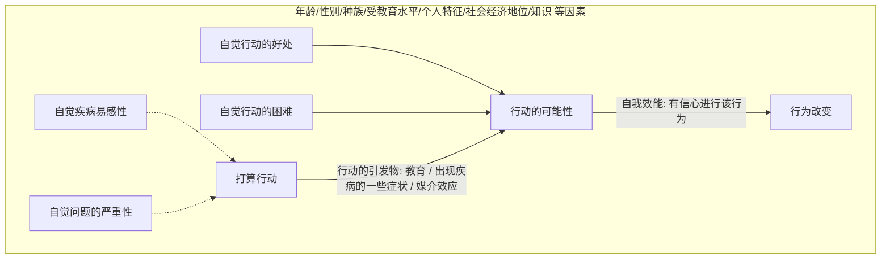

# 第九章 健康行为干预

## 第一节 健康行为及其影响因素

<table>

</table>

> **行为对健康的影响**
>
> 2011年9月，第66届联大预防和控制非传染性疾病问题高级别会议达成共识：人们的生活条件和生活方式影响其健康和生活质量是导致非传染性疾病发生率和流行率上升的因素。
> 世界卫生组织估计，全球三分之一以上的死亡可归因于烟草使用、酗酒、不健康饮食等十种行为危险因素。
> 事实已经证明，建立健康行为是降低慢性病风险的重要措施。美国历经30年，使心血管疾病的死亡率下降一半，该项成就的2/3归因于健康相关行为的改善，由此可见行为方式对于提升人群健康水平的重要性。
>
> **问题**
>
> 首先我们了解，什么是健康行为？我们身边的健康相关行为有哪些？

### 一、行为与健康行为的概念

#### 1. 健康行为（health behavior）

健康行为不仅包括个体或群体可观察到的、外显的行动，也包括人的思想活动和情感状态。  
David Gochmant 将健康行为定义为「与促进、维护或恢复健康相关的个体心理、情感状态和外显的行为模式」。

##### 健康行为定义

与促进、维护或恢复健康相关的个体心理、情感状态和外显的行为模式。

##### 常见健康行为分类

- 日常生活中有益于健康的基本行为；
- 预警行为，预防事故发生以及事故发生后的正确处置；
- 正确合理的利用卫生保健服务的行为；
- 避开环境危害等行为，以避免生活、工作的中的环境健康有害因素等，如在空气严重污染时减少外出活动等。

### 二、影响健康行为的因素

> 知识、信念、价值观
> 行为所必需的技术和资源
> 同伴、长辈
> 政策、法律
> ……

1. **倾向因素**：产生某种行为的动机或愿望，或者诱发产生行为的因素。包括知识、信念、态度、价值观、动机和行为意向。如吸烟危害的知识宣传。
2. **强化因素**：实施某行为后所得到的加强或减弱该行为的因素。如戒烟后的家人的支持。
3. **促成因素**：实施某行为必需的技术、资源或其他社会因素。如戒烟门诊、戒烟药物。

事实上，无论是倾向、促成抑或强化因素，都反映了人的行为受到多个层次上不同因素的影响。
例如，倾向因素往往和个体的认知、态度等有关，但也会受到家庭和社会环境的影响。强化可以来自自我激励，可以来自家庭或组织。
促成因素可能更多来自与社会资源。

在绪论中，我们谈到了健康生态学模型，即个人和人群的健康受到不同水平的因素的影响。同理，健康行为的生态学模型认为，健康行为的发生发展受到多个水平的因素影响：个体水平、家庭、朋友等人际水平；组织、群组水平；以及社区、社会水平。同时，在这些因素和水平间存在相互联系和相互作用。

为什么我们现在提倡综合干预？这是因为在多个水平干预贯穿环境的不同层次，可能取得最佳效果。

## 第二节 常用健康行为改变理论

> 江山易改，本性难移。其实当一种行为经过成百上千次的重复并固化为习惯的时候，改变也是需要策略的， 需要具体理论的指导。

健康生态学模型由于涉及到不同水平，需要多学科、多部门、多项目间的合作。 以控烟为例， 媒体传播烟草控制的信息，提高知识，强化无烟态度，针对的是倾向因素；家庭成员对于吸烟者戒烟的支持，属于人际水平，主要是是强化因素；社区医务人员提供的戒烟咨询和药物则是促成因素；而立法部门可以通过法律和政策等方式保护非吸烟者的权利，保证室内公共区域无烟作用于整个人群，保证无烟环境的实现，则主要是促成因素。

生态学模型是一个宏观模型，强调的是一种思维方式，是行为改变的基本框架，但在改变具体的健康相关行为时，还必须有一些理论的指导。

**行为改变的理论和模式**

- 按用途分
  - 解释行为的理论
  - 指导行为改变的理论
- 按作用对象来分
  - 个体水平的行为改变理论
    - 健康信念模式（health belief model，HBM）
    - 自我效能理论
    - 阶段变化理论（transtheoretical model and stage of change，TTM）
  - 人际水平的行为改变理论
    - 社会认知理论（social cognitive theory，SCT）
  - 群组水平的行为改变理论
    - 社区组织模型（community organization model）
    - 社区发展理论

### （一）健康信念模式（Health Belief Model，HBM）

> **你周围有这样的例子吗？**
>
> - 吸烟可能会致癌，但我没那么倒霉。
> - 体检是很重要，但最近太忙，这次不去了。
>
> **当然也有正面的例子：**
>
> 医生说吸烟会导致冠心病，我必须戒烟。
> 只要我想做，就一定能做到！

HBM 是由美国的 Hochbaum、Kegeles、Leventhal 和 Rosenstock 于 20 世纪 50 年代初提出来的。用于解释为什么人们不接受「疾病预防性筛检」（人们不愿意接受 X 线检查来筛检结核病）。
20 世纪 50 年代和 60 年代，美国卫生部门非常强调提高人们对新的医疗技术、服务和设备的使用

健康信念模式应用了心理学的概念来解释人们的健康有关行为。它认为 **健康信念** 是人们接受劝导、改变不良行为、采纳健康行为的关键。
HBM 认为，健康行为是由个体对疾病的自觉易感性、自觉疾病的严重程度、采取特定行为的自觉好处和可能障碍决定的。

#### 1. 健康信念模式的基本内容

- **感知到威胁（perceived threat）**
  - **自觉严重程度（perceived severity）**：人们对得了疾病的严重后果或得了病不治疗的严重后果的认识。如得了病是否会死亡、残废、剧烈疼痛？得了病之后自己的工作、家庭生活、社会关系是否会受到严重影响？
  - **自觉易感性（perceived susceptibility）**：指个人内心感觉到自己健康状况面临受到损害、面临某种疾病的威胁。如某人发现自己很有可能发生癌症、癌症复发。
- **行为评价（behavioral evaluation）**
  - **自觉益处（perceived benefits）**：人们对于采取某种行为以后，能够有效地消除健康损害、避免疾病发生和减轻损害后果的主观认识。如采取某行为之后，能否有效缓解病痛。只有人主观上感觉到了行为能够带来的益处，才能主动采取这种行为。
  - **自觉可能障碍（Perceived Barriers）**：人们对采取某种健康行为可能遇到的客观困难或自己心理上的障碍的主观认识。人们在考虑行为好处的同时，也在判断该行为风险（副作用）、不愉快（疼痛）、花费过多等。
- **自我效能（Self-efficacy）**：是人们对自己是否有能力执行某一特定行为的自信程度。自信心具有很重要的作用，特别是当人们感觉到采取某种行为会面临许多困难时，需要坚定克服困难的信心，才能最后建立起这种行为。自我效能（自信心）对于改变人们长期形成的生活习惯和饮食习惯，如吸烟、饮酒、缺乏锻炼等行为时尤为重要。
- **行动的引发物（cues to action）**：促使某种行为发生的「导火线」，如某一突发事件或因素。

> **HBM 中的基本概念小结**
>
> - 威胁
>   - 自觉疾病的易感性(如可 能患癌症)
>   - 自觉疾病的严重性（如死亡）
> - 结果的预期
>   - 自觉特定行为的益处
>   - 自觉执行行为的可能障碍
> - 效能预期：对自己有能力完成所推荐行为的自信程度（自我效能）
>
> 另外：社会人口学因素， 如教育、 年龄、性别等也以间接地影响行为的改变

